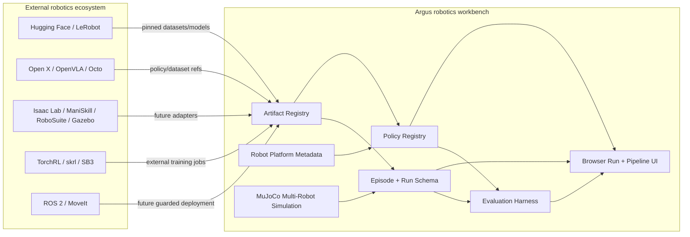

# HuggingFace/PyTorch for Robotics: Future Directions for Argus

## Executive Summary

The phrase “HuggingFace for Robotics” is not just a call for a model zoo. In current practice it points to an artifact-centered robotics ecosystem: shared robot datasets, reusable policy checkpoints, standardized episode formats, model/dataset cards, benchmark collections, teleoperation/data-collection tools, interactive demos, and community contribution loops. Hugging Face LeRobot is the clearest concrete example because it combines PyTorch policies, Hub-hosted datasets and models, a `LeRobotDataset` format, robot APIs, training/evaluation commands, visualization/annotation spaces, and hardware tutorials in one open workflow [1][2][3].

The adjacent phrase “PyTorch for Robotics” means a developer-native robotics ML substrate: Python-first, tensor-aware, modular, reproducible, and usable across data collection, simulation, training, evaluation, and deployment. But robotics is not NLP or computer vision with motors attached. Robot learning artifacts are inseparable from embodiment, sensors, coordinate frames, action spaces, timing, safety limits, simulator assumptions, and hardware availability. That is why the ecosystem is still fragmented across LeRobot, Open X-Embodiment/RT-X, OpenVLA, Octo, Isaac Lab, ManiSkill, RoboSuite/RoboMimic/RoboCasa, ROS 2, MoveIt 2, Gazebo, and newer simulation efforts such as Genesis [4][5][6][7][8][9][10][11][12][13][14][15].

For Argus, the strategic lesson is sharper than “become a global robotics hub.” That lane is already crowded and depends on network effects Argus does not need to win. The high-fit opportunity is to become a local robotics experiment workbench: make policies, datasets, robot platforms, simulation scenarios, perception pipelines, and evaluation runs first-class, typed, inspectable, reproducible artifacts inside Argus’s existing MuJoCo/browser/control-stack boundary. In short: Argus should be the place where a robotics team can collect or import episodes, inspect data quality, register policies, run seeded scenario matrices, compare failures, export LeRobot-compatible datasets, and preserve provenance.

## 1. What “HuggingFace for Robotics” Means

The most credible interpretation is a hub-and-workflow flywheel:

1. **Affordable hardware or simulation produces robot episodes.** Teleoperation tools, low-cost arms, quadrupeds, humanoids, and simulators make data collection repeatable.
2. **Standardized datasets make episodes reusable.** Episode formats need synchronized videos/images, state, action, timing, task labels, robot metadata, and calibration or frame semantics.
3. **Pretrained policies make new users productive faster.** Policies become downloadable artifacts with declared observation/action requirements, not just scripts in a lab repository.
4. **Benchmarks and eval harnesses make progress comparable.** The field lacks one universal “robot GLUE,” so workbenches need benchmark registries, task taxonomies, and run manifests.
5. **Community distribution compounds the flywheel.** Hugging Face-style publishing, Spaces, cards, tutorials, and collections reduce the cost of reuse.

LeRobot is the reference implementation of this pattern. Its docs and repository describe “models, datasets, and tools for real-world robotics in PyTorch,” including dataset collection, policy training, evaluation, robot APIs, and Hub integration [1][2][3]. The LeRobot ecosystem also hosts models, datasets, Spaces, and collections under Hugging Face namespaces, making robotics assets look more like modern ML artifacts [3].

The important product insight is that the hub is only valuable when paired with usable recipes and artifact contracts. In robotics, a checkpoint without action-space semantics, camera assumptions, rate limits, and robot compatibility is not equivalent to an NLP model checkpoint.

## 2. What “PyTorch for Robotics” Means

“PyTorch for Robotics” is less about a single library and more about a developer experience:

- Python-first APIs for robot data, policies, environments, and adapters.
- Tensor-native inference/training for policy models and differentiable robotics utilities.
- Gymnasium-style environment seams for RL and evaluation tooling.
- Reusable policy abstractions for ACT, diffusion policies, transformer policies, VLA models, RL algorithms, and custom controllers.
- Dataset and replay-buffer abstractions that hide storage details without hiding semantics.
- Clear separation between training/evaluation APIs and deployment/safety adapters.

This substrate is emerging, but not consolidated. LeRobot covers the Hub-native PyTorch workflow [1][2]. TorchRL, Stable-Baselines3, and skrl cover general RL primitives [16][17][18]. PyTorch Kinematics covers differentiable batched FK/Jacobian/IK over URDF/SDF/MJCF models [19]. Isaac Lab and ManiSkill cover high-throughput simulation and robot-learning workflows, but with different simulator dependencies and hardware assumptions [8][9]. ROS 2, MoveIt 2, and Gazebo remain deployment/system-integration substrates rather than ML-native policy hubs [12][13][14].

The likely outcome is not one universal PyTorch-for-robotics package. It is a layered ecosystem with adapters. Argus should therefore avoid hard-coding one external framework as “the answer.” The durable abstraction is typed artifacts plus adapters.

## 3. Ecosystem Map

| Layer | Representative projects | What they prove | Caveat for Argus |
|---|---|---|---|
| Hub-native robot learning | LeRobot, Hugging Face Hub, SmolVLA | Robotics assets can be distributed as datasets, models, Spaces, and recipes [1][2][3][20] | Hub network effects belong to HF; Argus should interoperate, not clone |
| Cross-embodiment data/models | Open X-Embodiment/RT-X, Octo, OpenVLA | Multi-robot data mixtures and open VLA policies are becoming reusable primitives [4][5][6][7] | Generalization claims depend on action/observation compatibility |
| Frontier generalist policies | Physical Intelligence π0/π0.5, NVIDIA GR00T family | Industry is investing in generalist robot policies [21][22][23] | Some frontier systems are not open artifacts; wrappers may be needed |
| Manipulation simulation/demos | RoboSuite, RoboMimic, RoboCasa, RLBench, CALVIN, LIBERO | Benchmarks, demonstrations, imitation-learning workflows, and task suites are mature enough to register and compare [10][11][24][25][26][27] | Mostly manipulation-centric; not identical to Argus’s multi-robot exploration/perception wedge |
| GPU simulation and synthetic data | Isaac Lab, ManiSkill, Genesis | Simulation throughput and synthetic data are major scaling paths [8][9][15] | GPU-first stacks can violate Argus’s CPU-first/local assumptions if made core |
| Deployment middleware | ROS 2, MoveIt 2, Gazebo | Real robot integration still relies on robotics middleware [12][13][14] | Deployment adapters need safety, timing, frames, and command bounds |
| RL/PyTorch primitives | TorchRL, skrl, Stable-Baselines3, PyTorch Kinematics | Reusable RL and differentiable robotics components exist [16][17][18][19] | These are primitives, not complete robotics workbenches |

## 4. Why Robotics Is Harder Than NLP/CV Hubs

The Hugging Face analogy transfers well at the level of artifacts, recipes, and community distribution. It breaks down when it ignores embodiment.

Critical differences:

1. **A robot model has a body.** A policy is tied to robot morphology, actuator limits, sensors, camera calibration, control rate, action representation, and safety envelope.
2. **Datasets are not just rows.** Robot episodes contain synchronized media, proprioception, commands/actions, task labels, reward/success signals, environment metadata, and timing assumptions.
3. **Benchmarks are not interchangeable.** LIBERO, Meta-World, ManiSkill, RLBench, CALVIN, Habitat, AI2-THOR, BEHAVIOR, RoboCasa, and Argus-style multi-robot scenarios evaluate different capabilities [24][25][26][27][28][29][30][31].
4. **Simulation transfer is uncertain.** High-throughput simulation helps, but physics fidelity, sensors, domain randomization, and environment realism differ across stacks [8][9][15].
5. **Deployment is safety-critical.** A bad text model emits bad text; a bad policy controls motion. Even simulation policies should carry command bounds and failure semantics.
6. **Licensing and provenance matter more.** Robotics artifacts can include model weights, datasets of real spaces, robot URDF/MJCF/USD assets, simulator licenses, vendor SDKs, and hardware-specific drivers.

This is where Argus can differentiate. Generic hubs will host artifacts. A workbench can make those artifacts honest: compatible or not, pinned or not, safe or not, comparable or not.

## 5. Argus’s Starting Point

Argus is already a simulation-native robotics research workbench rather than a single demo. The repository describes it as a MuJoCo-based multi-robot autonomy workbench with browser command-and-control, pluggable SLAM/perception/coordination backends, and reproducible benchmark harnesses (`README.md:7-24`; `docs/ARCHITECTURE.md:3-12`).

Local architecture evidence shows several primitives that map directly onto a HuggingFace/PyTorch-for-robotics direction:

- **Registry-backed pluggability.** Argus already uses Protocol/registry patterns for SLAM, detection, lifting, tracking, and merge strategies (`docs/adr/0006-use-protocol-registry-pattern-for-pluggable-backends.md:15-32`).
- **Typed visual pipeline editing.** The React Flow pipeline editor and server-backed node catalog already make algorithm components discoverable and configurable (`docs/adr/0014-use-react-flow-typed-dag-for-pipeline-editing.md:15-32`; `src/coordination/pipeline_builder.py:186-260`).
- **Pinned model artifacts.** Argus already requires CPU-viable model tiers, pinned checkpoints, local prefetch, and offline/CI behavior (`docs/adr/0011-use-cpu-viable-model-tiers-and-pinned-offline-checkpoints.md:15-32`; `models/README.md:1-55`).
- **Torch inference discipline.** The perception protocol isolates heavy imports, exposes backend capabilities and parameter schemas, and provides a `TorchBackendMixin` for `eval()` and `torch.inference_mode()` (`src/perception/protocol.py:1-24`, `src/perception/protocol.py:157-207`).
- **Benchmark artifact discipline.** The locomotion harness follows Gymnasium-style reset/step patterns and writes manifests, step logs, summaries, and comparisons (`src/locomotion/env.py:39-183`; `docs/locomotion-benchmark.md:100-110`).
- **Robot platform abstraction.** Argus has a proposed platform abstraction covering model assets, actuator mapping, sensor mapping, command modes, reset/state extraction, footprint, and failure detection (`docs/adr/0015-introduce-robot-platform-abstraction.md:15-56`).

The existing constraints are equally important. Argus is currently MuJoCo/CPU/local-first; fake metrics are forbidden; heavy/crashy backends should be isolated; ROS 2 and hardware deployment are future architecture work; RL policy training was explicitly out of scope for the current milestone (`docs/ARCHITECTURE.md:84-94`; `.planning/PROJECT.md:58-60`). Those constraints point away from “become Isaac Lab” or “train frontier VLA models locally” and toward artifact-centered evaluation, inspection, and interoperability.

## 6. Strategic Wedge for Argus

Argus should not compete with Hugging Face on global hosting, NVIDIA on GPU simulation infrastructure, or ROS on deployment middleware. Its credible wedge is:

> **A local, reproducible robotics experiment workbench that makes robot policies, datasets, scenarios, perception pipelines, and evaluation runs inspectable and comparable under controlled simulation.**

That wedge fits Argus because it already has:

- a live browser command center;
- registry-backed backend selection;
- typed pipeline editing;
- MuJoCo simulation;
- multi-robot perception/coordination focus;
- pinned model artifact discipline;
- benchmark output artifacts;
- ADR-backed architectural boundaries.

The missing layer is not “more AI” in the abstract. It is **artifact/data/policy structure**.

## 7. Ranked Future Directions for Argus

### 1. Argus Policy/Data Workbench v1

**Recommendation:** Make the next major direction a policy/data workbench, not a training platform.

**Shape:** Argus should evaluate and inspect learned policy artifacts, export simulation rollouts as robot-learning episodes, and compare policies across seeded scenario matrices. Training can remain external at first through LeRobot, TorchRL, skrl, Stable-Baselines3, or custom scripts [1][16][17][18].

**Why this is first:** It extends existing Argus strengths without violating current constraints. Argus already has an evaluation harness, browser UI, registries, pinned artifacts, and controlled simulation.

**Implementation implications:**

- Define `PolicyRef`, `DatasetRef`, `Episode`, `EvalRun`, and `RobotPlatformMetadata` as explicit schemas.
- Keep policy loading separate from controller logic.
- Require observation/action compatibility checks before a policy can run.
- Treat GPU-only policies as optional and clearly unavailable on CPU.
- Keep manifests as the source of truth for comparisons.

### 2. LeRobot-Compatible Episode Export/Import

**Recommendation:** Start with export of Argus rollouts into a LeRobot-compatible or LeRobot-adjacent episode format; add import/replay after the schema stabilizes.

**Shape:** Export synchronized RGB/depth frames, robot state, commands/actions, scenario metadata, robot platform metadata, active pipeline graph, detections, maps/coverage summaries, success/failure labels, and provenance. LeRobot’s Parquet plus MP4/images approach is the practical external target [1][2].

**Why it matters:** Dataset interoperability is the central “HF for Robotics” primitive. Argus-generated episodes become usable outside Argus, and external datasets become inspectable inside Argus later.

**Risks:** Schema decisions are sticky. Coordinate frames, depth conventions, timing, action semantics, and generated-vs-observed labels must be explicit from day one.

### 3. Policy Artifact Registry and Evaluator

**Recommendation:** Add a first-class policy registry parallel to, not merged with, perception/backend registries.

**Shape:** A policy artifact declares:

- source: local path, Hugging Face repo, or external service;
- revision/hash;
- robot platform compatibility;
- observation schema;
- action schema and command bounds;
- runtime backend;
- normalization/preprocessing;
- expected control rate and latency;
- safety/failure behavior;
- evaluation history.

**Why it matters:** A robotics checkpoint is unsafe and often unusable without its embodiment contract. OpenVLA, Octo, LeRobot policies, and future VLA policies become practical only when this metadata is explicit [6][7][1].

**Risks:** Do not let the registry become a loose YAML graveyard. Enforce validation before runtime.

### 4. Browser Run/Dataset/Policy Comparison UI

**Recommendation:** Extend the browser workbench with a run browser and comparison surface.

**Shape:** Users should browse eval runs, manifests, scenario/seed matrices, videos, per-step traces, policy metadata, dataset summaries, and comparison scorecards. The frontend should render server-produced metrics rather than recomputing robotics metrics client-side.

**Why it matters:** Argus’s differentiator is not just running simulations; it is making robotics behavior observable. A run browser turns the existing artifact discipline into a product surface.

**Risks:** Large media and JSONL files can overload the UI. The backend should provide indexed read models and summaries.

### 5. Dataset Recorder/Replay Nodes in the Pipeline Editor

**Recommendation:** Extend the typed DAG with concrete dataset and evaluation nodes.

**Shape:** New node categories could include `record_episode`, `replay_episode`, `policy`, `safety_filter`, `evaluator`, and `artifact_exporter`. The graph should show real Argus runtime/dataflow, not become a generic workflow engine.

**Why it matters:** The React Flow editor is already an Argus-native way to make complex robotics systems inspectable. Extending it to episodes and policies makes the workbench visual.

**Risks:** Visual programming overreach. Keep lifecycle semantics explicit: live-only, restart-required, offline-only, replay-only.

### 6. Policy-Ready Robot Platform Metadata

**Recommendation:** Evolve the robot platform abstraction to include policy compatibility metadata.

**Shape:** Each platform should declare observation spaces, action modes, actuator names, command limits, frame conventions, sensor streams, camera specs, control rates, safety constraints, and compatibility tags.

**Why it matters:** Cross-embodiment robotics is impossible to reason about if robot bodies are implicit. Open X-Embodiment-style work depends on normalized action/observation contracts [4][5].

**Risks:** Overgeneralization. Follow the existing Go2/X2 platform needs before abstracting for every robot class.

### 7. Pinned Hugging Face/Hub Artifact Adapter

**Recommendation:** Generalize Argus’s existing pinned model-download discipline to all external robotics artifacts.

**Shape:** A resolver accepts `repo_id@revision`, downloads to immutable local artifact directories, records source URL, commit/revision, license, hashes, expected files, and compatibility metadata, and blocks unpinned runtime downloads by default.

**Why it matters:** Hub interoperability is useful only if it preserves reproducibility. This matches Argus’s existing model invariants and avoids cloud-dependent runtime behavior.

**Risks:** License metadata and model cards may be incomplete. Treat missing license/provenance as a warning or block depending on use.

### 8. Training Adapters Later, Not First

**Recommendation:** Do not make native RL/VLA training the next center of gravity.

**Shape:** First support externally trained policy import, dataset export, and evaluation. Later add optional job adapters that call LeRobot/TorchRL/skrl/SB3 training pipelines in subprocesses or isolated jobs [1][16][17][18].

**Why it matters:** Training introduces GPU dependencies, long-running jobs, nondeterminism, logging complexity, and dependency sprawl. Argus’s current product value is controlled evaluation and observability.

**Risks:** If training becomes core too early, Argus will become a weaker version of several existing frameworks instead of a sharper workbench.

## 8. Suggested Architecture Shape



**Figure 1.** Proposed Argus role: not the global hub or simulator monopoly, but the local workbench that validates, runs, records, compares, and exports robotics artifacts. The diagram is synthesized from the ecosystem/tooling survey and local Argus architecture evidence.

Minimum internal contracts:

```yaml
DatasetRef:
  id: string
  source_backend: lerobot|rlds|robomimic|open_x|argus|custom
  source_url: string|null
  revision: string|null
  license: string|null
  schema_version: string
  robot_platform: RobotPlatformRef
  observation_schema: map
  action_schema: ActionSchema
  episodes: list[EpisodeRef]

PolicyRef:
  id: string
  source_url: string|null
  revision: string|null
  runtime_backend: torch|onnx|external|custom
  robot_platforms: list[RobotPlatformRef]
  observation_schema: map
  action_schema: ActionSchema
  control_rate_hz: number|null
  command_bounds: map
  required_artifacts: list[string]
  evaluation_history: list[EvalRunRef]

EvalRun:
  id: string
  scenario_matrix: map
  seeds: list[int]
  policy: PolicyRef|null
  dataset: DatasetRef|null
  pipeline_graph: string
  git_commit: string
  artifact_revisions: map
  metrics: map
  outputs: list[ArtifactRef]
```

These contracts should be versioned immediately. They are product APIs, not implementation details.

## 9. Suggested Roadmap

### Phase A: ADR + Schemas

- Write an ADR for Argus Policy/Data Workbench v1.
- Define versioned schemas for `Episode`, `DatasetRef`, `PolicyRef`, `EvalRun`, and `RobotPlatformMetadata`.
- Specify coordinate-frame, timing, media, and action-semantics requirements.
- Define what is evaluation-only versus training/deployment scope.

### Phase B: Policy Evaluation Without Training

- Add `PolicyProtocol` and `PolicyRegistry`.
- Support local/pinned Torch policy artifacts first.
- Validate observation/action compatibility against Go2 platform metadata.
- Extend locomotion evaluation matrices with `policy_id`.
- Compare learned policies against analytical baselines.

### Phase C: Episode Export

- Add an Argus episode writer from simulation rollouts.
- Export media, state, actions, metrics, maps/coverage summaries, and provenance.
- Provide LeRobot-compatible export where feasible; otherwise provide a documented converter boundary.
- Add schema validation tests with tiny sample episodes.

### Phase D: Browser Run Workbench

- Add backend APIs for run discovery, manifest loading, summaries, and replay metadata.
- Add UI views for saved runs, videos, traces, metrics, policy metadata, and scenario matrices.
- Avoid client-side metric invention; render server-produced summaries.

### Phase E: Import/Replay + External Adapters

- Add LeRobot dataset import/replay.
- Add Hub artifact resolver with pinned/offline semantics.
- Add optional wrappers for LeRobot evaluation/training jobs.
- Only then consider ROS/MoveIt or hardware deployment adapters under a separate ADR.

## 10. Open Questions

1. **How stable is LeRobot’s dataset schema?** Argus should assume versioned converters, not permanent schema stability [1][2].
2. **What should be the first policy family?** A small local Torch policy for locomotion fits Argus constraints better than a large VLA model.
3. **Should Argus export exactly LeRobot format or an Argus-native format with LeRobot converters?** Exact compatibility improves ecosystem fit; an Argus-native schema may better preserve multi-robot maps, coverage, detections, and pipeline graphs.
4. **How far should Argus go toward training?** The evidence favors evaluation/export/import first. Training should be an adapter, not the core, until the artifact contracts are stable.
5. **What is the safety model for policy execution?** Even in simulation, command limits, failure detection, emergency stop semantics, and provenance should be explicit.
6. **How should multi-robot episodes map into mostly single-robot external schemas?** This is a genuine product design gap and a possible Argus differentiation area.

## 11. Bottom Line

The “HuggingFace/PyTorch for Robotics” trend is real, but it is still early and fragmented. The durable direction is not one magic framework; it is artifact-centered robotics: datasets, policies, robot platforms, simulators, tasks, metrics, and runs become typed, reusable, versioned objects.

Argus already has the right bones for this: registries, typed DAGs, pinned models, MuJoCo simulation, browser observability, platform abstraction, and benchmark artifacts. The next strategic step is to add the missing policy/data/evaluation artifact layer. Done well, Argus becomes the local workbench that makes robotics AI artifacts trustworthy enough to compare, debug, export, and eventually deploy.

## Sources

[1] Hugging Face LeRobot GitHub repository. https://github.com/huggingface/lerobot  
[2] Hugging Face LeRobot documentation. https://huggingface.co/docs/lerobot/index  
[3] Hugging Face LeRobot organization. https://huggingface.co/lerobot  
[4] Open X-Embodiment / RT-X project page. https://robotics-transformer-x.github.io/  
[5] Open X-Embodiment paper. https://arxiv.org/abs/2310.08864  
[6] OpenVLA project page. https://openvla.github.io/  
[7] Octo project page. https://octo-models.github.io/  
[8] NVIDIA Isaac Lab documentation. https://isaac-sim.github.io/IsaacLab/main/index.html  
[9] ManiSkill documentation. https://maniskill.readthedocs.io/en/latest/  
[10] RoboSuite documentation. https://robosuite.ai/docs/index.html  
[11] RoboMimic documentation. https://robomimic.github.io/docs/introduction/overview.html  
[12] ROS 2 GitHub repository. https://github.com/ros2/ros2  
[13] MoveIt 2 documentation. https://moveit.picknik.ai/main/index.html  
[14] Gazebo Sim documentation. https://gazebosim.org/docs/latest/getstarted/  
[15] Genesis GitHub repository. https://github.com/Genesis-Embodied-AI/Genesis  
[16] TorchRL documentation. https://docs.pytorch.org/rl/stable/index.html  
[17] skrl documentation. https://skrl.readthedocs.io/en/latest/  
[18] Stable-Baselines3 documentation. https://stable-baselines3.readthedocs.io/en/master/  
[19] PyTorch Kinematics GitHub repository. https://github.com/UM-ARM-Lab/pytorch_kinematics  
[20] Hugging Face SmolVLA blog. https://huggingface.co/blog/smolvla  
[21] Physical Intelligence π0 blog. https://www.pi.website/blog/pi0  
[22] Physical Intelligence π0.5 blog. https://www.pi.website/blog/pi05  
[23] NVIDIA Robotics platform page. https://www.nvidia.com/en-us/industries/robotics/  
[24] LIBERO GitHub repository. https://github.com/Lifelong-Robot-Learning/LIBERO  
[25] Meta-World project page. https://meta-world.github.io/  
[26] RLBench project page. https://sites.google.com/view/rlbench  
[27] CALVIN GitHub repository. https://github.com/mees/calvin  
[28] Habitat project page. https://aihabitat.org/  
[29] AI2-THOR project page. https://ai2thor.allenai.org/  
[30] BEHAVIOR benchmark page. https://behavior.stanford.edu/  
[31] RoboCasa website. https://robocasa.ai/

## Claim Sweep

- The definition of “HuggingFace for Robotics” is grounded primarily in LeRobot docs/repo/Hub evidence [1][2][3] and ecosystem triangulation from Open X, OpenVLA, Octo, and SmolVLA [4][6][7][20].
- The claim that robotics lacks one universal benchmark is grounded by the diversity of benchmark/task sources [24][25][26][27][28][29][30][31].
- The claim that Argus should not become a global hub is an inference from ecosystem positioning and Argus local architecture constraints; it is labeled as strategic synthesis rather than a source-stated fact.
- The ranked Argus directions are recommendations synthesized from external research and local code/docs evidence; they are not claims that external sources prescribe Argus’s roadmap.
- The provided X inspiration URL was not used as evidence because it was inaccessible during the research round.
