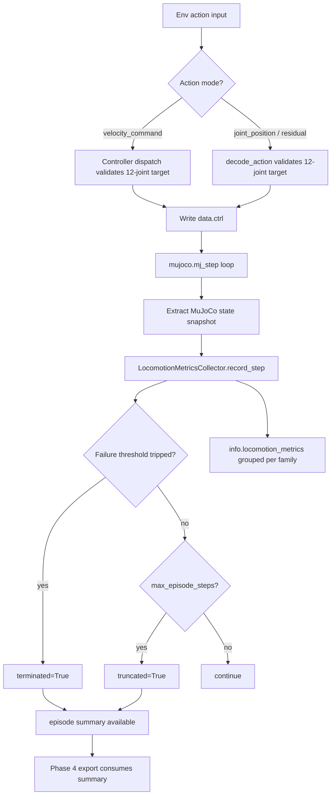

# Phase 3: locomotion-metrics-instrumentation - Research

**Researched:** 2026-04-30  
**Domain:** MuJoCo/Gymnasium locomotion metrics instrumentation for Unitree Go2 benchmark harness  
**Confidence:** HIGH for local integration points and test strategy; MEDIUM for default numeric thresholds until calibrated against live runs

<user_constraints>
## User Constraints (from CONTEXT.md)

### Locked Decisions

## Implementation Decisions

### Metric Surfaces
- **D-01:** Use a hybrid metrics surface: the environment owns or reuses a locomotion metrics collector, emits compact per-step metrics through Gymnasium `info`, and exposes episode-level aggregates for Phase 4 to export.
- **D-02:** Per-step `info` must use a nested `info["locomotion_metrics"]` payload grouped by metric family: command tracking, stability, action quality, and contact/terrain proxies. Do not scatter metric keys across top-level `info`.
- **D-03:** `reset()` starts a fresh episode metric buffer while preserving any explicit baseline/reference snapshot, matching the existing metrics-tracker pattern where baseline comparisons survive ordinary state resets.
- **D-04:** Phase 3 must define both per-step metric records and episode summaries now; Phase 4 should consume/export these definitions instead of redefining aggregation semantics.

### Failure Thresholds and Success Semantics
- **D-05:** Use a conservative locomotion failure gate: excessive roll/pitch, base height below threshold, or no meaningful progress/recovery after disturbance should count as failure.
- **D-06:** Failure thresholds should terminate the Gymnasium episode immediately by returning `terminated=True`, so distance-before-failure and failure counts are unambiguous.
- **D-07:** Scenario success rate in Phase 3 means surviving until episode truncation/max steps without triggering a failure threshold. Distance traveled and command-tracking quality remain separate metrics, not part of the success boolean.
- **D-08:** Roll, pitch, base-height, progress, and tolerance thresholds must live in configurable defaults through a metrics config/dataclass and be overridable through environment configuration. Do not hardcode them as unchangeable module constants.

### Contact and Terrain Proxies
- **D-09:** Contact metrics require an explicit validated Go2 foot/body/site/geom mapping. The planner should treat missing or ambiguous foot mapping as a clear implementation/test failure, not silently degrade to best-effort heuristics.
- **D-10:** Foot slip must be reported as per-foot world-frame XY velocity while the foot is in contact, plus aggregate slip summaries for the episode.
- **D-11:** Foot clearance must use swing-phase minimum and maximum clearance relative to a terrain/floor estimate, with per-foot records and episode aggregates.
- **D-12:** Contact timing must expose per-foot contact phase/boolean history, duty factor per foot, and aggregate gait symmetry/timing summaries at the episode level.

### Action Quality Metrics
- **D-13:** Action smoothness must include both per-step action delta norm and a second-difference/jerk proxy over 12-joint position targets, with per-step values and episode aggregates.
- **D-14:** Effort/energy must be implemented as a position-servo effort proxy using control-target movement, joint velocity, and optionally actuator control magnitude. It must be labeled as a non-torque proxy, not physical torque energy.
- **D-15:** Joint-limit violations must count both commanded targets outside configured joint limits and observed joint state (`qpos`) outside limits/tolerance, grouped per joint and summarized per episode.
- **D-16:** Actuator saturation must be interpreted as a near-limit position-servo proxy: targets near joint/action bounds and repeated clipping count toward saturation, clearly labeled as a proxy rather than torque actuator saturation.

### Claude's Discretion
- Exact module names and dataclass field names are open, but planning should prefer the existing local style: `src.*` absolute imports, dataclass configs, collector objects with bounded histories, and focused pytest coverage.
- The planner may choose the exact numeric default thresholds for roll/pitch/base-height/progress/saturation after code/research review, provided they are configurable and documented in tests.

### Deferred Ideas (OUT OF SCOPE)

## Deferred Ideas

None — discussion stayed within phase scope.
</user_constraints>

<phase_requirements>
## Phase Requirements

| ID | Description | Research Support |
|----|-------------|------------------|
| LOC-METRICS-01 | Evaluation captures command tracking error for forward velocity, lateral velocity, and yaw rate. [VERIFIED: `/home/prannayag/pragnition/robotics/argus/.planning/REQUIREMENTS.md`] | Use `ArgusGo2Env._command`, world-frame base pose deltas over simulation time for measured vx/vy, wrapped yaw-angle deltas over simulation time for measured yaw rate, and per-step collector records. [VERIFIED: code read `src/locomotion/env.py`, `src/locomotion/observations.py`; CITED: Context7 `/google-deepmind/mujoco`] |
| LOC-METRICS-02 | Evaluation captures stability metrics: fall rate, roll/pitch bounds, base height deviation, and distance before failure. [VERIFIED: `/home/prannayag/pragnition/robotics/argus/.planning/REQUIREMENTS.md`] | Add configurable `LocomotionMetricsConfig` thresholds, compute orientation/height/distance from freejoint state, and set `terminated=True` on failure. [VERIFIED: code read `src/locomotion/env.py`; CITED: Gymnasium Env API via Context7] |
| LOC-METRICS-03 | Evaluation captures control-quality metrics: action smoothness, joint-limit violations, energy/effort proxy, and actuator saturation. [VERIFIED: `/home/prannayag/pragnition/robotics/argus/.planning/REQUIREMENTS.md`] | Reuse validated action targets from `dispatch_controller`/`decode_action`, Go2 joint limits from `src/locomotion/actions.py` and `go2.xml`, and label effort/saturation as position-servo proxies. [VERIFIED: code read `src/locomotion/actions.py`, `src/locomotion/controller_dispatch.py`, `models/unitree_go2/go2.xml`] |
| LOC-METRICS-04 | Evaluation captures terrain/contact proxies: foot slip, foot clearance, contact timing/duty factor, and scenario success rate. [VERIFIED: `/home/prannayag/pragnition/robotics/argus/.planning/REQUIREMENTS.md`] | Validate explicit Go2 foot geom mapping (`FL`, `FR`, `RL`, `RR`) and compute contact/clearance from MuJoCo `data.contact`, `data.geom_xpos`, concrete terrain-height helper output, and scenario outcome. [VERIFIED: `models/unitree_go2/go2.xml`; CITED: Context7 `/google-deepmind/mujoco`] |
</phase_requirements>

## Project Constraints (from CLAUDE.md)

- The root project `CLAUDE.md` only contains placeholder text: `Add your project-specific Claude instructions here.` [VERIFIED: `/home/prannayag/pragnition/robotics/argus/CLAUDE.md`]
- The project-local `.claude/CLAUDE.md` also only contains the same placeholder text. [VERIFIED: `/home/prannayag/pragnition/robotics/argus/.claude/CLAUDE.md`]
- No actionable project-specific directives beyond existing repository conventions were found in either project instruction file. [VERIFIED: direct file reads]
- A project skill exists at `.claude/skills/desloppify/SKILL.md`, but it is a code-health workflow skill and does not impose implementation conventions for this metrics phase. [VERIFIED: `.claude/skills/desloppify/SKILL.md`]

## Summary

Phase 3 should add a dedicated locomotion metrics collector, not scatter metrics through `ArgusGo2Env.step()`. [VERIFIED: Phase 3 CONTEXT.md D-01/D-02; VERIFIED: local metrics tracker patterns in `src/metrics/metrics_tracker.py` and `src/metrics/detection_metrics_tracker.py`] The environment should remain the owner of MuJoCo stepping and Gymnasium return semantics, while the collector receives copied state snapshots: desired command, measured base pose/velocity, validated 12-joint target, joint positions/velocities, contacts, scenario id, and termination outcome. [VERIFIED: `src/locomotion/env.py`; VERIFIED: `src/locomotion/controller_dispatch.py`; CITED: Context7 Gymnasium Env API]

The strictest planning risk is contact/foot identity, not arithmetic. [VERIFIED: Phase 3 CONTEXT.md D-09; VERIFIED: `models/unitree_go2/go2.xml`] The Go2 XML defines four collision foot geoms named `FL`, `FR`, `RL`, and `RR`, while actuator/joint names follow 12-element order `FL_hip`, `FL_thigh`, `FL_calf`, `FR_hip`, ... `RR_calf`. [VERIFIED: `models/unitree_go2/go2.xml`] Metrics should validate those names against the loaded MuJoCo model at reset and fail fast if any are missing, duplicated, renamed by scene generation, or not actually foot geoms. [VERIFIED: existing fail-fast mapping pattern in `src/metrics/mujoco_gt.py`; CITED: Context7 MuJoCo named access / `mj_name2id`]

**Primary recommendation:** Implement `src/locomotion/metrics.py` (or `src/metrics/locomotion_metrics.py`) with `LocomotionMetricsConfig`, `Go2FootMapping`, `LocomotionMetricStep`, `LocomotionEpisodeSummary`, and `LocomotionMetricsCollector`; wire it into `ArgusGo2Env.reset()`/`step()` so `info["locomotion_metrics"]` is compact per-step data and `info["locomotion_metrics_summary"]` appears at termination/truncation and `ArgusGo2Env.last_locomotion_metrics_summary` exposes a read-only copy of the latest completed summary until the next episode completes. [VERIFIED: Phase 3 CONTEXT.md; VERIFIED: code reads of env and metrics patterns]

## Architectural Responsibility Map

| Capability | Primary Tier | Secondary Tier | Rationale |
|------------|--------------|----------------|-----------|
| Command tracking metrics | API / Backend simulation environment | Database / Storage later in Phase 4 | Desired commands and measured base motion are available in `ArgusGo2Env`/MuJoCo state; export/storage is deferred to Phase 4. [VERIFIED: `src/locomotion/env.py`; VERIFIED: ROADMAP Phase 4] |
| Stability/failure termination | API / Backend simulation environment | — | Gymnasium `terminated` must be returned by `ArgusGo2Env.step()` when failure thresholds trip. [VERIFIED: Phase 3 CONTEXT.md D-06; CITED: Gymnasium Env API] |
| Action-quality metrics | API / Backend controller/env seam | — | Validated action targets pass through `dispatch_controller` or `decode_action` before MuJoCo control writes. [VERIFIED: `src/locomotion/controller_dispatch.py`; VERIFIED: `src/locomotion/actions.py`] |
| Contact/terrain proxies | API / Backend simulation environment | MuJoCo physics engine | Contacts and foot positions live in MuJoCo `mjData`; collectors should consume copied state, not own physics stepping. [VERIFIED: `src/locomotion/env.py`; CITED: Context7 MuJoCo state/contact docs] |
| Per-step info surface | API / Backend Gymnasium env | Phase 4 CLI runner later | `info` is the Gymnasium diagnostic channel; JSONL/CSV export is explicitly Phase 4. [CITED: Gymnasium Env API; VERIFIED: ROADMAP Phase 4] |
| Episode aggregation | API / Backend collector | Phase 4 CLI runner later | Phase 3 defines summary semantics; Phase 4 consumes them. [VERIFIED: Phase 3 CONTEXT.md D-04] |

## Standard Stack

### Core

| Library / Module | Version | Purpose | Why Standard |
|------------------|---------|---------|--------------|
| Python | Project supports `>=3.10,<3.13`; local venv is 3.12.13 | Runtime for environment and tests | Project already targets Python 3.10-3.12 and MuJoCo integration tests skip outside that range. [VERIFIED: `pyproject.toml`; VERIFIED: `.venv/bin/python --version`; VERIFIED: tests `test_argus_go2_env_contract.py`] |
| `mujoco` | `>=3.0.0` in `pyproject.toml`; local venv 3.6.0 | Physics state, contacts, geom/body/joint access | Existing simulation and benchmark env use MuJoCo `MjModel`, `MjData`, `mj_step`, `mj_forward`, contacts, and named access. [VERIFIED: `pyproject.toml`; VERIFIED: local venv import metadata; CITED: Context7 `/google-deepmind/mujoco`] |
| `gymnasium` | `>=1.3.0` in `pyproject.toml`; local venv 1.3.0; Context7 docs fetched for v1.2.3 API | `reset`/`step` contract and `info` diagnostics | Existing `ArgusGo2Env` subclasses `gymnasium.Env`; step returns observation, reward, terminated, truncated, info. [VERIFIED: `src/locomotion/env.py`; VERIFIED: local venv import metadata; CITED: Context7 `/websites/gymnasium_farama`] |
| `numpy` | `>=1.26.0` in `pyproject.toml`; local venv 2.4.3 | Vector math, norms, ring-buffer aggregates | Existing action, observation, controller, and metrics modules use NumPy arrays. [VERIFIED: `pyproject.toml`; VERIFIED: code reads] |
| `pytest` + `pytest-timeout` | dev dependency `pytest>=8.0.0`; local venv pytest 9.0.2 and pytest-timeout 2.4.0 | Unit and integration tests | Existing locomotion tests use pytest and fake MuJoCo objects; timeout is installed in local venv. [VERIFIED: `pyproject.toml`; VERIFIED: local venv import metadata; VERIFIED: tests reads] |

### Supporting

| Library / Module | Version | Purpose | When to Use |
|------------------|---------|---------|-------------|
| `collections.deque` | stdlib | Bounded per-step histories | Use for collector histories, matching existing `MetricsTracker` and `DetectionMetricsTracker`. [VERIFIED: `src/metrics/metrics_tracker.py`; VERIFIED: `src/metrics/detection_metrics_tracker.py`] |
| `dataclasses` | stdlib | Config and record types | Use for `LocomotionMetricsConfig`, step record, episode summary, and foot mapping. [VERIFIED: local dataclass style in `src/locomotion/env.py`, `src/locomotion/controllers.py`] |
| `src.bridge.sensor_types.quat_to_rotation_matrix` | local | Quaternion-to-matrix conversion | Use directly or wrap for roll/pitch/yaw extraction from MuJoCo freejoint quaternion; validate quaternion ordering `(w,x,y,z)`. [VERIFIED: `src/bridge/sensor_types.py`] |
| `src.locomotion.actions` joint limit arrays | local private constants today | Joint target bounds and saturation thresholds | Prefer exposing public helpers/constants instead of duplicating arrays in metrics. [VERIFIED: `src/locomotion/actions.py`] |

### Alternatives Considered

| Instead of | Could Use | Tradeoff |
|------------|-----------|----------|
| Dedicated collector | Direct arithmetic inside `ArgusGo2Env.step()` | Direct arithmetic is faster to write but violates existing collector pattern and makes Phase 4 export semantics harder to reuse. [VERIFIED: Phase 3 CONTEXT.md; VERIFIED: `src/metrics/*` patterns] |
| MuJoCo contacts + foot geoms | Heuristic foot height threshold only | Height threshold can supplement clearance but cannot provide strict contact timing/duty factor from MuJoCo contacts. [CITED: Context7 MuJoCo contact docs; VERIFIED: Phase 3 D-09/D-12] |
| Position-servo proxy metrics | Physical torque-energy metric | Current controls are joint-position targets, not torque commands; physical energy would be misleading. [VERIFIED: Phase 3 D-14; VERIFIED: `src/locomotion/xml_patcher.py` referenced by prior research] |

**Installation:** No new runtime dependency is required for Phase 3 if implemented with existing Python, MuJoCo, Gymnasium, NumPy, and pytest stack. [VERIFIED: `pyproject.toml`; VERIFIED: code reads]

```bash
# No new package install expected.
# Use the existing project venv for validation:
/home/prannayag/pragnition/robotics/argus/.venv/bin/python -m pytest tests/locomotion tests/metrics -q
```

**Version verification:** Local venv versions were verified with `importlib.metadata`: Python 3.12.13, MuJoCo 3.6.0, Gymnasium 1.3.0, NumPy 2.4.3, pytest 9.0.2, pytest-timeout 2.4.0. [VERIFIED: Bash local venv audit] The global Python is 3.14.4 and outside the project support range, so planners should run tests through `.venv/bin/python`. [VERIFIED: Bash environment audit; VERIFIED: `pyproject.toml`]

## Architecture Patterns

### System Architecture Diagram



This flow preserves environment ownership of action decoding, MuJoCo stepping, and Gymnasium return values while isolating metric histories/aggregations in a collector. [VERIFIED: `src/locomotion/env.py`; VERIFIED: Phase 3 CONTEXT.md]

### Recommended Project Structure

```text
src/
├── locomotion/
│   ├── metrics.py              # LocomotionMetricsConfig, terrain-height helper, foot mapping, collector, records
│   ├── env.py                  # Wire collector reset/recording/termination/info surface
│   ├── actions.py              # Expose public joint/action bounds helper if needed
│   └── observations.py         # Optional helper reuse only; no metric histories here
└── metrics/
    └── ...                     # Existing SLAM/detection trackers remain unchanged

tests/
├── locomotion/
│   ├── test_locomotion_metrics_collector.py
│   ├── test_locomotion_metrics_foot_mapping.py
│   └── test_argus_go2_env_metrics.py
└── metrics/
    └── existing tests unchanged
```

Use `src/locomotion/metrics.py` if metrics are tightly tied to `ArgusGo2Env` and Go2 locomotion; use `src/metrics/locomotion_metrics.py` only if the planner wants all metric collectors under one package. [ASSUMED]

### Pattern 1: Collector Object with Bounded Histories

**What:** A collector owns per-episode state, step records, bounded histories, summaries, and reset semantics. [VERIFIED: `src/metrics/metrics_tracker.py`; VERIFIED: `src/metrics/detection_metrics_tracker.py`]  
**When to use:** All Phase 3 per-step and per-episode metric calculations. [VERIFIED: Phase 3 CONTEXT.md]

**Example:**

```python
# Source: local pattern verified in src/metrics/metrics_tracker.py and detection_metrics_tracker.py
from collections import deque
from dataclasses import dataclass, field

@dataclass
class LocomotionMetricsConfig:
    history_size: int = 1000
    max_abs_roll_rad: float = 0.8
    max_abs_pitch_rad: float = 0.8
    min_base_height_m: float = 0.18

class LocomotionMetricsCollector:
    def __init__(self, config: LocomotionMetricsConfig | None = None) -> None:
        self.config = config or LocomotionMetricsConfig()
        self._steps = deque(maxlen=self.config.history_size)
        self._baseline = None

    def reset_episode(self) -> None:
        self._steps.clear()  # preserve baseline/reference snapshots
```

### Pattern 2: Fail-Fast Foot Mapping

**What:** Validate all required MuJoCo foot geom names at reset before recording contact metrics. [VERIFIED: Phase 3 D-09; VERIFIED: `models/unitree_go2/go2.xml`; VERIFIED: fail-fast mapping in `src/metrics/mujoco_gt.py`]  
**When to use:** Before enabling `foot_slip`, `foot_clearance`, and `duty_factor`. [VERIFIED: LOC-METRICS-04]

**Example:**

```python
# Source: Context7 MuJoCo named access/mj_name2id docs + local mujoco_gt.py fail-fast style
import mujoco

FOOT_GEOM_NAMES = ("FL", "FR", "RL", "RR")

def resolve_foot_geom_ids(model) -> dict[str, int]:
    ids = {}
    for name in FOOT_GEOM_NAMES:
        gid = mujoco.mj_name2id(model, mujoco.mjtObj.mjOBJ_GEOM, name)
        if gid < 0:
            raise ValueError(f"Missing required Go2 foot geom '{name}'")
        ids[name] = gid
    if len(set(ids.values())) != len(ids):
        raise ValueError(f"Duplicate Go2 foot geom ids resolved: {ids}")
    return ids
```

### Pattern 3: Nested Gymnasium Info Payload

**What:** Emit compact grouped per-step metrics under `info["locomotion_metrics"]`; include summaries only when needed. [VERIFIED: Phase 3 D-02/D-04; CITED: Gymnasium Env API info diagnostics]  
**When to use:** Every `ArgusGo2Env.step()` call after metrics are recorded. [VERIFIED: `src/locomotion/env.py`]

**Example:**

```python
# Source: Gymnasium Env.step API via Context7 + Phase 3 CONTEXT.md D-02
info = self._info()
info["locomotion_metrics"] = collector.latest_info_payload()
if terminated or truncated:
    info["locomotion_metrics_summary"] = collector.episode_summary()
return observation, reward, terminated, truncated, info
```

### Pattern 4: Position-Servo Proxy Labeling

**What:** Name effort and saturation fields as proxies, not physical torque metrics. [VERIFIED: Phase 3 D-14/D-16; VERIFIED: ADR-0019]  
**When to use:** Action quality metrics and summaries. [VERIFIED: LOC-METRICS-03]

Suggested field names: `position_servo_effort_proxy`, `position_target_saturation_proxy`, `clipped_target_count`, `near_joint_limit_count`. [ASSUMED]

### Anti-Patterns to Avoid

- **Top-level info key sprawl:** Do not add `info["vx_error"]`, `info["fall_rate"]`, etc.; use `info["locomotion_metrics"][family][field]`. [VERIFIED: Phase 3 D-02]
- **Controller-specific metrics:** Do not read `AnalyticalTrotController` internals or gait phase for metrics; use desired command, validated action target, and MuJoCo state. [VERIFIED: Phase 3 phase boundary; VERIFIED: Phase 2 CONTEXT.md D-01/D-02]
- **Silent contact fallback:** Do not guess foot names from substrings if strict mapping fails. [VERIFIED: Phase 3 D-09]
- **Physical-energy claims from position controls:** Do not call `sum(torque * velocity)` unless true torque data is available and validated. [VERIFIED: Phase 3 D-14; VERIFIED: ADR-0019]
- **Using wall-clock time for metrics:** Use simulation time/step counts, not `time.time()`, matching existing detection metrics warning about sim-clock freshness. [VERIFIED: `src/metrics/detection_metrics_tracker.py`]
- **Changing Phase 4 scope:** Do not implement JSONL/CSV export, scenario matrix CLI, aggregate comparison tables, or baseline regression runner in Phase 3. [VERIFIED: ROADMAP Phase 4; VERIFIED: REQUIREMENTS LOC-METRICS-05/LOC-EVAL]

## Don't Hand-Roll

| Problem | Don't Build | Use Instead | Why |
|---------|-------------|-------------|-----|
| Physics state/contact access | XML string heuristics or hand-maintained geometry transforms | MuJoCo `data.qpos`, `data.qvel`, `data.contact`, `data.geom_xpos`, named access / `mj_name2id` | MuJoCo already populates world-frame state after `mj_forward`/`mj_step`; duplicating kinematics is error-prone. [CITED: Context7 `/google-deepmind/mujoco`] |
| Env termination semantics | A custom `done_reason` only | Gymnasium `terminated` for failure and `truncated` for max episode steps | Gymnasium separates terminal state from time-limit truncation. [CITED: Gymnasium Env API and TimeLimit docs] |
| Metric history storage | Raw unbounded lists everywhere | `deque(maxlen=history_size)` inside a collector | Existing metrics trackers use bounded histories to avoid unbounded growth. [VERIFIED: `src/metrics/metrics_tracker.py`; VERIFIED: `src/metrics/detection_metrics_tracker.py`] |
| Joint/action validation | Ad hoc shape/range checks in each metric | Existing action bounds and controller target validation helpers | The project already validates 12-target shape/finite values before physics writes. [VERIFIED: `src/locomotion/actions.py`; VERIFIED: `src/locomotion/controller_dispatch.py`] |
| Foot identity inference | Substring scanning with best-effort fallback | Explicit `Go2FootMapping` resolved and validated at reset | The user locked strict mapping as a failure condition. [VERIFIED: Phase 3 D-09] |
| Physical torque energy | Custom torque estimator from position targets | Label a position-servo effort proxy | Current controls are position targets; physical torque energy would be false precision. [VERIFIED: Phase 3 D-14; VERIFIED: ADR-0019] |

**Key insight:** The project already has the seams Phase 3 needs: `ArgusGo2Env` owns the step loop, `dispatch_controller`/`decode_action` produce validated controls, MuJoCo owns state/contact truth, and existing metrics modules show collector/reset/history patterns. [VERIFIED: code reads] The plan should compose these seams, not invent a new evaluation framework. [VERIFIED: ADR-0018; VERIFIED: Phase 3 CONTEXT.md]

## Common Pitfalls

### Pitfall 1: Foot Mapping Breaks Under Scene Prefixing or XML Changes

**What goes wrong:** Contact metrics record the wrong foot, silently mark all feet airborne, or crash only in integration tests. [VERIFIED: Phase 3 D-09; VERIFIED: Go2 foot names in XML]  
**Why it happens:** Multi-robot scene builders prefix names in other code paths; Phase 3 env currently loads a single Go2 scenario XML, but future reuse could encounter prefixed names. [VERIFIED: `01-PATTERNS.md` scene-builder prefixing; VERIFIED: `src/locomotion/env.py` single env loading]  
**How to avoid:** Validate `FL`, `FR`, `RL`, `RR` against the actual loaded `MjModel` at reset; keep prefix support out of Phase 3 unless planner explicitly scopes it. [VERIFIED: Phase 3 D-09; ASSUMED: prefix support deferral]  
**Warning signs:** Contact payload has all-zero duty factors while robot is visibly on ground; `data.ncon > 0` but no foot geom id appears in contacts. [ASSUMED]

### Pitfall 2: Command Tracking Uses Desired Action Instead of Measured Base Motion

**What goes wrong:** Tracking error is reported as zero because it compares command to command or action to action. [ASSUMED]
**Why it happens:** `velocity_command` actions become `_command`, while measured base motion lives in MuJoCo `qvel`/pose deltas. [VERIFIED: `src/locomotion/env.py`; VERIFIED: `src/locomotion/observations.py`]  
**How to avoid:** Compute desired `(vx, vy, yaw_rate)` from `_command`; compute measured forward/lateral velocity from world-frame base pose deltas over simulation time, and measured yaw rate from wrapped yaw-angle delta over the same simulation-time interval after stepping. Do not use `data.qvel` as an alternative convention for these three command-tracking fields. [CITED: Context7 MuJoCo state docs; ASSUMED: exact qvel frame convention must be verified in implementation]  
**Warning signs:** Error metrics remain exactly zero across rough terrain and push scenarios. [ASSUMED]

### Pitfall 3: Failure Termination Is Calculated After Info Without Affecting `terminated`

**What goes wrong:** Summary says failure happened but Gymnasium returns `terminated=False`, making distance-before-failure ambiguous. [VERIFIED: Phase 3 D-06]
**Why it happens:** Current `ArgusGo2Env.step()` hardcodes `terminated = False`. [VERIFIED: `src/locomotion/env.py`]  
**How to avoid:** Record metrics and evaluate failure before constructing final info and return tuple; set `terminated=True` immediately on threshold failure. [CITED: Gymnasium Env API]
**Warning signs:** Tests can force low base height/large pitch and still receive `terminated=False`. [ASSUMED]

### Pitfall 4: Effort Proxy Gets Misrepresented as Torque Energy

**What goes wrong:** Reports imply physical energy consumption even though actuators are position servos. [VERIFIED: Phase 3 D-14; VERIFIED: ADR-0019]
**Why it happens:** `data.ctrl` is interpreted as torque, but the Go2 XML is patched to position controls in this stack. [VERIFIED: prior research and ADR-0018; VERIFIED: `src/locomotion/actions.py` uses joint-position targets]
**How to avoid:** Use field names and docs containing `proxy`, and compute from control-target movement, joint velocity, and optional actuator control magnitude only. [VERIFIED: Phase 3 D-14]
**Warning signs:** Field names like `energy_joules`, `torque_energy`, or `power_watts` appear in Phase 3 code. [ASSUMED]

### Pitfall 5: Reset Clears Baseline/Reference State

**What goes wrong:** Baseline/reference comparisons disappear after ordinary episode resets. [VERIFIED: Phase 3 D-03; VERIFIED: `MetricsTracker.reset()` preserves `_baseline`]
**Why it happens:** A collector reset clears all internal fields rather than only per-episode buffers. [VERIFIED: `src/metrics/metrics_tracker.py`]
**How to avoid:** Provide separate `reset_episode()` and optional `capture_baseline()`/`reset_baseline()` methods if baseline snapshots are needed. [VERIFIED: existing metrics pattern]
**Warning signs:** Calling `reset()` makes `collector.baseline` become `None` despite a captured baseline. [VERIFIED: analogous behavior in `MetricsTracker`]

## Code Examples

### MuJoCo State and Contact Access

```python
# Source: Context7 /google-deepmind/mujoco state/contact docs
qpos = data.qpos.copy()
qvel = data.qvel.copy()
for i in range(data.ncon):
    contact = data.contact[i]
    geom1 = int(contact.geom1)
    geom2 = int(contact.geom2)
    contact_pos_world = contact.pos.copy()
```

### Gymnasium Termination/Truncation Surface

```python
# Source: Context7 /websites/gymnasium_farama Env.step and TimeLimit docs
obs, reward, terminated, truncated, info = env.step(action)
if terminated:
    # failure terminal state; reset before next episode
    ...
if truncated:
    # time-limit / max-steps condition; reset before next episode
    ...
```

### Local Fake-Data Testing Pattern

```python
# Source: tests/locomotion/test_argus_go2_env_contract.py
class _FakeData:
    def __init__(self) -> None:
        self.qpos = np.zeros(19, dtype=np.float64)
        self.qvel = np.ones(18, dtype=np.float64)
        self.ctrl = _FakeCtrl(12)
        self.xfrc_applied = np.zeros((1, 6), dtype=np.float64)
        self.time = 0.0
```

## Concrete Integration Points

| File | Required Change | Confidence |
|------|-----------------|------------|
| `src/locomotion/env.py` | Add `metrics_config` to `ArgusGo2EnvConfig`, create/reset collector in `__init__`/`reset`, record after `mj_step`, set `terminated`, add nested `info["locomotion_metrics"]`, expose summary accessor or terminal summary. [VERIFIED: code read] | HIGH |
| `src/locomotion/metrics.py` or `src/metrics/locomotion_metrics.py` | New collector/config/records/foot mapping module. [VERIFIED: Phase 3 needs; ASSUMED: exact module path] | HIGH |
| `src/locomotion/actions.py` | Expose public joint/action bounds helper to avoid duplicating private `_JOINT_LOW/_JOINT_HIGH`. [VERIFIED: private arrays exist] | MEDIUM |
| `src/locomotion/observations.py` | Likely no required change; collector can consume `data` directly and copied observation if useful. [VERIFIED: current observation contents] | MEDIUM |
| `tests/locomotion/test_locomotion_metrics_collector.py` | Unit tests for command tracking, stability, action quality, summaries, reset behavior. [VERIFIED: test patterns] | HIGH |
| `tests/locomotion/test_locomotion_metrics_foot_mapping.py` | Unit/fake-model and integration tests for `FL/FR/RL/RR` mapping and contact classification. [VERIFIED: XML foot names; CITED: MuJoCo docs] | HIGH |
| `tests/locomotion/test_argus_go2_env_metrics.py` | Env wiring tests using fake data and patched `mujoco.mj_step`; one integration smoke test gated by Python/MuJoCo availability. [VERIFIED: existing env test style] | HIGH |

## Metric Definition Recommendations

| Family | Per-Step Fields | Episode Summary Fields | Source / Confidence |
|--------|-----------------|------------------------|---------------------|
| Command tracking | desired `vx/vy/yaw_rate`, measured `vx/vy/yaw_rate`, signed and absolute errors | mean/RMSE/max absolute errors per component | Required by LOC-METRICS-01 [VERIFIED]; exact RMSE inclusion [ASSUMED] |
| Stability | roll, pitch, base_height, base_height_error, distance_xy, failure_reason | fall_count/fall_rate, max_abs_roll, max_abs_pitch, min_base_height, distance_before_failure, success | Required by LOC-METRICS-02 and D-05/D-07 [VERIFIED] |
| Action quality | action_delta_norm, action_jerk_proxy_norm, commanded_joint_limit_violations, observed_joint_limit_violations, position_servo_effort_proxy, saturation_proxy | means/max/counts per metric and per-joint violation counts | Required by LOC-METRICS-03 and D-13/D-16 [VERIFIED] |
| Contact/terrain | per-foot contact bool, foot_xy_velocity_when_contact, foot_clearance, swing min/max clearance, contact transition flags | duty factor per foot, slip mean/max per foot, clearance min/max per foot, gait symmetry/timing summary, scenario_success | Required by LOC-METRICS-04 and D-09/D-12 [VERIFIED] |

Default thresholds should be conservative and configurable; suggested starting points are `max_abs_roll_rad≈0.8`, `max_abs_pitch_rad≈0.8`, `min_base_height_m≈0.18`, saturation margin ≈5% of joint range, and progress grace windows for push recovery. [ASSUMED] These values must be tested as overrideable defaults, not treated as calibrated science. [VERIFIED: Phase 3 D-08]

## State of the Art

| Old Approach | Current Approach | When Changed | Impact |
|--------------|------------------|--------------|--------|
| Visual demo / ad hoc logs | Gymnasium-style benchmark with per-step/per-episode metrics | v4.0 roadmap / ADR-0018 on 2026-04-30 | Phase 3 must make metrics first-class, not incidental debug output. [VERIFIED: ADR-0018; VERIFIED: ROADMAP] |
| Controller-specific evaluation | Controller protocol/registry + env-owned metrics | Phase 2 completed 2026-04-30 | Metrics must remain controller-agnostic and use controller id only for attribution. [VERIFIED: Phase 2 CONTEXT.md; VERIFIED: `src/locomotion/controllers.py`] |
| Torque-energy claims | Position-servo effort/saturation proxies | v4.0 decisions / ADR-0019 | Phase 3 must label action-quality metrics honestly. [VERIFIED: Phase 3 D-14/D-16; VERIFIED: ADR-0019] |
| Best-effort contact names | Strict validated foot mapping | Phase 3 discussion decisions | Missing or ambiguous foot identity is an implementation failure. [VERIFIED: Phase 3 D-09] |

**Deprecated/outdated:**
- `done`-only Gym API is deprecated for this project; use `terminated` and `truncated`. [CITED: Gymnasium migration/Env API via Context7]
- Physical torque-control metrics are out of scope for the current position-servo stack. [VERIFIED: ADR-0019; VERIFIED: Phase 3 D-14]
- Phase 4 export definitions must not be invented independently after Phase 3; Phase 3 defines summary semantics now. [VERIFIED: Phase 3 D-04]

## Assumptions Log

| # | Claim | Section | Risk if Wrong |
|---|-------|---------|---------------|
| A1 | Use `src/locomotion/metrics.py` rather than `src/metrics/locomotion_metrics.py` if planner prefers colocating env-specific logic. | Recommended Project Structure | Low; only affects file path/import organization. |
| A2 | Field names such as `position_servo_effort_proxy` and `position_target_saturation_proxy` are acceptable. | Architecture Patterns | Low; names can be adjusted if tests lock a different schema. |
| A3 | Prefix support for multi-robot foot mappings should be deferred unless scoped. | Common Pitfalls | Medium; if planner wants bridge reuse, multi-robot prefixes need explicit mapping support. |
| A4 | Warning signs for bad tracking/contact metrics are inferred from expected behavior. | Common Pitfalls | Low; tests should encode concrete cases instead. |
| A5 | RESOLVED: measured base velocity/yaw-rate use world-frame pose deltas over simulation time and wrapped yaw delta over simulation time, not `data.qvel`. | Common Pitfalls | Low if the focused fake-data test proves vx/vy/yaw_rate from pose/time deltas. |
| A6 | Suggested default thresholds are reasonable starting points. | Metric Definition Recommendations | Medium; thresholds affect termination frequency and should be overrideable/tested, then calibrated later. |

## Open Questions (RESOLVED)

1. **RESOLVED: measured command-tracking convention**
   - Use world-frame pose deltas over simulation time for measured forward/lateral velocity: `(base_xy_after - base_xy_before) / max(sim_time_after - sim_time_before, dt_floor)`. [VERIFIED: `src/locomotion/env.py` exposes `data.qpos[:2]` and `data.time`; required by revision]
   - Use wrapped yaw-angle delta over the same simulation-time interval for measured yaw rate. Extract yaw from the freejoint quaternion in `qpos[3:7]`, wrap the delta into `[-pi, pi]`, then divide by simulation-time delta. [required by revision]
   - Do not use unresolved `data.qvel` versus pose-delta alternatives for LOC-METRICS-01. `data.qvel` may still feed joint velocity/action-quality metrics, but not measured vx/vy/yaw_rate command tracking. [required by revision]
   - Required test: `test_measured_command_tracking_uses_world_pose_deltas_and_wrapped_yaw` with fake before/after pose/time data proving vx, vy, and yaw_rate are computed from this exact convention.
2. **RESOLVED: terrain-height convention for clearance**
   - Add a concrete terrain-height helper contract, e.g. `terrain_height_at(sample: ScenarioSample | None, x: float, y: float) -> float`, consumed by contact/clearance metrics before computing `foot_clearance_m = foot_z - terrain_height_m`. [required by revision]
   - Return `0.0` for flat, low-friction, and push-disturbance plane terrain. [VERIFIED: `src/locomotion/scenarios.py` terrain_kind `plane`]
   - For slope terrain, derive height from the scenario slope plane parameters already present in `ScenarioSample.terrain_parameters`: `terrain_kind == "slope"`, `slope_radians`, marker `pos="0 0 -0.04"`, and `euler="0 {slope} 0"`. Use the same plane convention consistently in tests; at minimum, assert nonzero height for a nonzero slope and nonzero x coordinate so D-11 is not hardcoded to zero. [VERIFIED: `src/locomotion/scenarios.py` `_add_slope_marker`]
   - For rough heightfield terrain, derive height from `heightfield_data`, `heightfield_size`, and rough hfield extents equivalent to the generated `hfield size="5 5 ..."`, using nearest or bilinear lookup from world XY into the sampled grid. Tests must prove rough values are not hardcoded to zero. [VERIFIED: `src/locomotion/scenarios.py` `_add_rough_heightfield`]
   - If implementation discovers missing metadata, explicitly add env/scenario metadata plumbing in `src/locomotion/scenarios.py` and `src/locomotion/env.py` rather than degrading to flat clearance.
3. **RESOLVED: episode summary accessor**
   - Terminal or truncated `info` must include `info["locomotion_metrics_summary"]`. [required by revision]
   - `ArgusGo2Env` must expose read-only property `last_locomotion_metrics_summary` returning a defensive copy or `None`. The property survives ordinary `reset()` calls until the next completed episode replaces it; `reset()` only starts a new active episode buffer. [required by revision]

## Environment Availability

| Dependency | Required By | Available | Version | Fallback |
|------------|-------------|-----------|---------|----------|
| `.venv/bin/python` | Running supported project tests | yes | 3.12.13 | Use this instead of global Python 3.14.4. [VERIFIED: Bash audit] |
| Global `python` / `python3` | Ad hoc commands | no for project support | 3.14.4 | Do not use for MuJoCo/Gymnasium integration tests because project supports `<3.13`. [VERIFIED: Bash audit; VERIFIED: `pyproject.toml`] |
| MuJoCo Python package | Integration tests and real contacts | yes in venv | 3.6.0 | Unit/fake tests can cover most logic if MuJoCo unavailable. [VERIFIED: local venv import metadata; VERIFIED: existing skip pattern] |
| Gymnasium | Env API | yes in venv | 1.3.0 | None needed; already dependency. [VERIFIED: local venv import metadata] |
| pytest | Validation | yes in venv and global | 9.0.2 | Use `.venv/bin/python -m pytest` to keep dependencies consistent. [VERIFIED: Bash audit] |
| Go2 MJCF | Foot mapping integration | yes | `models/unitree_go2/go2.xml` exists | Unit fake model for non-integration tests. [VERIFIED: file read] |

**Missing dependencies with no fallback:** None identified for Phase 3 if tests run through the project venv. [VERIFIED: environment audit]

**Missing dependencies with fallback:** Global Python environment lacks MuJoCo/Gymnasium, but the project venv has them; planner should always use `.venv/bin/python`. [VERIFIED: Bash audit]

## Validation Architecture

### Test Framework

| Property | Value |
|----------|-------|
| Framework | pytest 9.0.2 with pytest-timeout 2.4.0 in project venv. [VERIFIED: local venv import metadata] |
| Config file | `pyproject.toml`; existing pytest markers are minimal, and tests also use local skip helpers for MuJoCo/Python support. [VERIFIED: `pyproject.toml`; VERIFIED: `tests/locomotion/test_argus_go2_env_contract.py`] |
| Quick run command | `/home/prannayag/pragnition/robotics/argus/.venv/bin/python -m pytest tests/locomotion/test_locomotion_metrics_collector.py tests/locomotion/test_locomotion_metrics_foot_mapping.py tests/locomotion/test_argus_go2_env_metrics.py -q` |
| Full suite command | `/home/prannayag/pragnition/robotics/argus/.venv/bin/python -m pytest tests/locomotion tests/metrics tests/bridge/test_sim_bridge.py tests/bridge/test_multi_bridge.py -q` |

### Phase Requirements → Test Map

| Req ID | Behavior | Test Type | Automated Command | File Exists? |
|--------|----------|-----------|-------------------|--------------|
| LOC-METRICS-01 | Desired vs measured forward/lateral/yaw tracking errors are recorded per step and aggregated. | unit + fake-env | `.venv/bin/python -m pytest tests/locomotion/test_locomotion_metrics_collector.py::test_records_command_tracking_errors -q` | No — Wave 0 |
| LOC-METRICS-02 | Roll/pitch/base-height thresholds terminate episodes and summarize fall/distance/success. | unit + env fake | `.venv/bin/python -m pytest tests/locomotion/test_argus_go2_env_metrics.py::test_failure_threshold_sets_terminated_true -q` | No — Wave 0 |
| LOC-METRICS-03 | Action delta, jerk proxy, joint-limit violations, effort proxy, and saturation proxy are recorded. | unit | `.venv/bin/python -m pytest tests/locomotion/test_locomotion_metrics_collector.py::test_records_action_quality_metrics -q` | No — Wave 0 |
| LOC-METRICS-04 | Foot mapping validates, contact bool/duty/slip/clearance/success summary are recorded. | unit + integration smoke | `.venv/bin/python -m pytest tests/locomotion/test_locomotion_metrics_foot_mapping.py -q` | No — Wave 0 |
| All | Nested `info["locomotion_metrics"]` groups command/stability/action_quality/contact_terrain and terminal summary is present. | env fake | `.venv/bin/python -m pytest tests/locomotion/test_argus_go2_env_metrics.py::test_step_info_contains_nested_locomotion_metrics -q` | No — Wave 0 |

### Sampling Rate

- **Per task commit:** `/home/prannayag/pragnition/robotics/argus/.venv/bin/python -m pytest tests/locomotion/test_locomotion_metrics_collector.py tests/locomotion/test_argus_go2_env_metrics.py -q` [ASSUMED]
- **Per wave merge:** `/home/prannayag/pragnition/robotics/argus/.venv/bin/python -m pytest tests/locomotion tests/metrics -q` [ASSUMED]
- **Phase gate:** `/home/prannayag/pragnition/robotics/argus/.venv/bin/python -m pytest tests/locomotion tests/metrics tests/bridge/test_sim_bridge.py tests/bridge/test_multi_bridge.py -q` before `/gsd-verify-work`. [VERIFIED: Phase 2 state references bridge/locomotion gate]

### Wave 0 Gaps

- [ ] `tests/locomotion/test_locomotion_metrics_collector.py` — covers LOC-METRICS-01/02/03 aggregation and reset semantics. [ASSUMED]
- [ ] `tests/locomotion/test_locomotion_metrics_foot_mapping.py` — covers LOC-METRICS-04 strict Go2 foot mapping and contact classification. [ASSUMED]
- [ ] `tests/locomotion/test_argus_go2_env_metrics.py` — covers env wiring, nested info payload, and `terminated=True` failure thresholds. [ASSUMED]
- [ ] Public action-bound helper or test-only imported expected limits — covers LOC-METRICS-03 joint-limit/saturation checks without private constant duplication. [ASSUMED]

## Security Domain

### Applicable ASVS Categories

| ASVS Category | Applies | Standard Control |
|---------------|---------|------------------|
| V2 Authentication | no | No auth/session feature in Phase 3. [VERIFIED: phase scope] |
| V3 Session Management | no | No web session change. [VERIFIED: phase scope] |
| V4 Access Control | no | No user authorization boundary. [VERIFIED: phase scope] |
| V5 Input Validation | yes | Validate actions, metric config thresholds, foot mapping names/ids, finite arrays, and summary payload types. [VERIFIED: existing validation patterns in `src/locomotion/actions.py`, `src/locomotion/controller_dispatch.py`] |
| V6 Cryptography | no | No cryptographic operation. [VERIFIED: phase scope] |
| V8 Data Protection | low | Metrics are simulation telemetry; no secrets should be included in info/summary. [ASSUMED] |
| V12 File and Resources | low | Phase 3 should not add export files; Phase 4 handles artifacts. [VERIFIED: ROADMAP Phase 4] |

### Known Threat Patterns for Python/MuJoCo Metrics Stack

| Pattern | STRIDE | Standard Mitigation |
|---------|--------|---------------------|
| Malformed action/config values corrupting simulation state | Tampering | Validate finite shapes/ranges before `data.ctrl` writes; validate thresholds at config construction. [VERIFIED: existing action/dispatch validation] |
| Misleading physical-energy labels | Repudiation / Integrity | Use explicit proxy names and summary docs; tests assert field names include proxy semantics. [VERIFIED: Phase 3 D-14/D-16] |
| Unbounded metric history causing memory growth | Denial of Service | Use `deque(maxlen=history_size)` and compact per-step info. [VERIFIED: existing metrics tracker patterns] |
| Foot mapping ambiguity producing false benchmark results | Integrity | Fail fast on missing/duplicate foot ids; no heuristic fallback. [VERIFIED: Phase 3 D-09] |
| Info payload leaking huge arrays | Information Disclosure / DoS | Keep per-step `info["locomotion_metrics"]` compact; store fuller records inside collector for Phase 4. [VERIFIED: Phase 3 D-02] |

## Sources

### Primary (HIGH confidence)

- `/home/prannayag/pragnition/robotics/argus/.planning/phases/03-locomotion-metrics-instrumentation/03-CONTEXT.md` — locked Phase 3 decisions D-01 through D-16. [VERIFIED]
- `/home/prannayag/pragnition/robotics/argus/.planning/REQUIREMENTS.md` — LOC-METRICS-01 through LOC-METRICS-04. [VERIFIED]
- `/home/prannayag/pragnition/robotics/argus/.planning/ROADMAP.md` — Phase 3/4 boundary and success criteria. [VERIFIED]
- `/home/prannayag/pragnition/robotics/argus/.planning/PROJECT.md` and `.planning/STATE.md` — v4.0 milestone constraints and current state. [VERIFIED]
- `/home/prannayag/pragnition/robotics/argus/src/locomotion/env.py` — reset/step/info integration point. [VERIFIED]
- `/home/prannayag/pragnition/robotics/argus/src/locomotion/actions.py` and `controller_dispatch.py` — action bounds and validated target application. [VERIFIED]
- `/home/prannayag/pragnition/robotics/argus/src/metrics/metrics_tracker.py`, `detection_metrics_tracker.py`, `mujoco_gt.py` — collector/history/fail-fast mapping patterns. [VERIFIED]
- `/home/prannayag/pragnition/robotics/argus/models/unitree_go2/go2.xml` — Go2 foot geom and joint/actuator naming. [VERIFIED]
- Context7 `/google-deepmind/mujoco` — MuJoCo named access, state arrays, contacts, `mj_name2id`. [CITED]
- Context7 `/websites/gymnasium_farama` — Gymnasium `Env.step`, `terminated`/`truncated`, `info`. [CITED]

### Secondary (MEDIUM confidence)

- `/home/prannayag/pragnition/robotics/argus/outputs/locomotion-rd-systems.md` and provenance — confirms analytical gait + position-servo baseline and deferred advanced controllers. [VERIFIED]
- ADR-0018 and ADR-0019 — harness and benchmark-before-controller-sophistication rationale. [VERIFIED]
- Prior phase pattern maps `01-PATTERNS.md` and `02-PATTERNS.md` — local style and established seams. [VERIFIED]

### Tertiary (LOW confidence)

- Suggested default numeric thresholds and exact metric field names are planner/implementation starting points, not calibrated benchmark science. [ASSUMED]

## Metadata

**Confidence breakdown:**
- Standard stack: HIGH — current dependencies, local venv versions, and docs were verified. [VERIFIED]
- Architecture: HIGH — env/controller/metrics integration points were read directly and align with locked decisions. [VERIFIED]
- Pitfalls: MEDIUM — contact mapping and termination risks are verified; exact velocity frame and threshold choices need implementation validation. [VERIFIED + ASSUMED]

**Research date:** 2026-04-30  
**Valid until:** 2026-05-30 for local integration patterns; 2026-05-07 for MuJoCo/Gymnasium API details if dependencies change.
