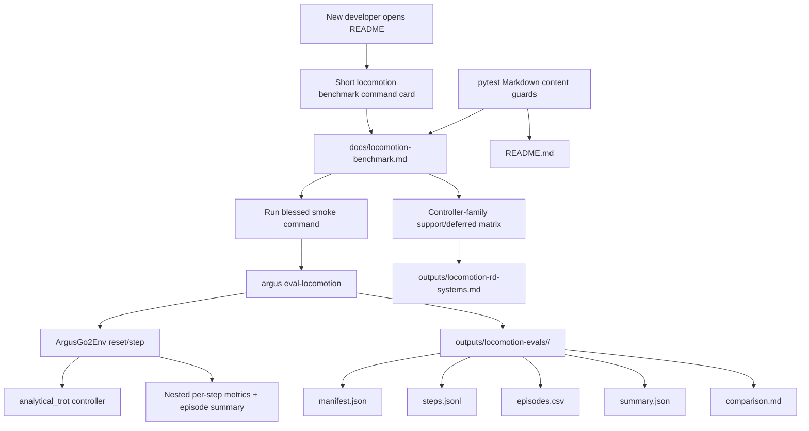

# Phase 05: harness-docs-and-comparison-matrix - Research

**Researched:** 2026-05-01 [VERIFIED: system currentDate]  
**Domain:** Documentation, pytest content guards, locomotion benchmark harness onboarding [VERIFIED: /home/prannayag/pragnition/robotics/argus/.planning/phases/05-harness-docs-and-comparison-matrix/05-CONTEXT.md]  
**Confidence:** HIGH [VERIFIED: codebase reads + project planning docs]

<user_constraints>
## User Constraints (from CONTEXT.md)

### Locked Decisions
## Implementation Decisions

### Guide Placement
- **D-01:** Create a focused `docs/locomotion-benchmark.md` harness guide as the canonical user-facing document for Phase 5.
- **D-02:** Add a short README command card that links to `docs/locomotion-benchmark.md`, shows the blessed smoke benchmark command, and names the main artifact outputs. Do not turn the already-long README into the full guide.

### Smoke Benchmark Workflow
- **D-03:** The guide's first runnable benchmark must use explicit flags so defaults are visible: `uv run argus eval-locomotion --controller analytical_trot --scenario flat_ground --seed 101 --seed 202`.
- **D-04:** After the blessed smoke command, include one JSON matrix-config example and one saved-run regeneration example using `--from-run-dir`.
- **D-05:** The guide must explain where outputs land and what each artifact is for: `manifest.json`, `steps.jsonl`, `episodes.csv`, `summary.json`, and `comparison.md` under `outputs/locomotion-evals/<timestamp>/`.

### Controller-Family Matrix
- **D-06:** Use hard-boundary language in the controller-family matrix: analytical gait is supported now; residual RL, direct RL, MPC, WBC, ROS/hardware, and perception-conditioned locomotion are deferred/unavailable in v4.0 unless the code already exposes a placeholder seam.
- **D-07:** The matrix columns should be: controller family, status now, Argus hook/seam, why supported/deferred, prerequisite to unlock, and R&D rationale link.
- **D-08:** Include concrete controller ids/placeholders where they exist, current action modes/seams, and the `argus eval-locomotion` path. Avoid listing every internal class/function name in the matrix; implementation detail references belong in prose or canonical refs, not brittle table cells.
- **D-09:** The matrix must accurately summarize the current Argus method as analytical trot plus MuJoCo position actuators, grounded in `outputs/locomotion-rd-systems.md` and ADR-0019.

### Documentation Verification
- **D-10:** Add lightweight pytest-based documentation checks under `tests/` that read Markdown files and assert required content exists.
- **D-11:** The doc checks should assert at minimum: the README links the harness guide; the guide includes the explicit smoke command; artifact names are documented; the controller-family matrix includes analytical gait, residual RL, direct RL, MPC, WBC, ROS/hardware, and perception-conditioned locomotion; and `outputs/locomotion-rd-systems.md` is linked as rationale.
- **D-12:** Do not make documentation tests execute the smoke benchmark. Runtime benchmark behavior is already covered by Phase 4 evaluation tests and the baseline regression gate; Phase 5 checks should remain fast content guards.

### Claude's Discretion
- Exact section titles, prose tone, Markdown table formatting, test filename, and exact assert strings are open to planner/executor discretion, provided the guide stays concise, the README remains a short pointer, and the hard support/deferred boundary remains unambiguous.

### Deferred Ideas (OUT OF SCOPE)
## Deferred Ideas

None — discussion stayed within phase scope.
</user_constraints>

<phase_requirements>
## Phase Requirements

| ID | Description | Research Support |
|----|-------------|------------------|
| LOC-REPORT-01 | Developer can read a concise harness guide explaining observation space, action modes, reward/metric definitions, and scenario catalog. [VERIFIED: /home/prannayag/pragnition/robotics/argus/.planning/REQUIREMENTS.md] | Use `docs/locomotion-benchmark.md`; document `ArgusGo2Env` reset/step, observation keys, action modes, reward placeholder, metrics families, scenario catalog, and CLI smoke flow from code surfaces. [VERIFIED: /home/prannayag/pragnition/robotics/argus/src/locomotion/env.py; /home/prannayag/pragnition/robotics/argus/src/locomotion/observations.py; /home/prannayag/pragnition/robotics/argus/src/locomotion/actions.py; /home/prannayag/pragnition/robotics/argus/src/locomotion/scenarios.py; /home/prannayag/pragnition/robotics/argus/src/locomotion/metrics.py] |
| LOC-REPORT-02 | Developer can see an explicit comparison matrix explaining which controller families are supported now versus intentionally deferred. [VERIFIED: /home/prannayag/pragnition/robotics/argus/.planning/REQUIREMENTS.md] | Matrix must map analytical gait to supported `analytical_trot`, residual/direct/MPC/WBC to registered unavailable placeholders, and ROS/hardware plus perception-conditioned locomotion to future milestones without current runnable ids. [VERIFIED: /home/prannayag/pragnition/robotics/argus/src/locomotion/controllers.py; /home/prannayag/pragnition/robotics/argus/.planning/phases/05-harness-docs-and-comparison-matrix/05-CONTEXT.md] |
| LOC-REPORT-03 | Developer can use the final report from `outputs/locomotion-rd-systems.md` as the rationale link for milestone scope. [VERIFIED: /home/prannayag/pragnition/robotics/argus/.planning/REQUIREMENTS.md] | Link `outputs/locomotion-rd-systems.md`, summarize Argus as velocity command → analytical trot → 12 Go2 joint-position targets → MuJoCo position actuators, and cite ADR-0019 for benchmark-before-controller-sophistication scope. [VERIFIED: /home/prannayag/pragnition/robotics/argus/outputs/locomotion-rd-systems.md; /home/prannayag/pragnition/robotics/argus/docs/adr/0019-benchmark-locomotion-before-adding-new-controller-families.md] |
</phase_requirements>

## Project Constraints (from CLAUDE.md)

- Root `CLAUDE.md` contains only the placeholder text “Add your project-specific Claude instructions here,” so it contributes no actionable project-specific directives. [VERIFIED: /home/prannayag/pragnition/robotics/argus/CLAUDE.md]
- `.claude/CLAUDE.md` also contains only the same placeholder text, so it contributes no additional actionable directives. [VERIFIED: /home/prannayag/pragnition/robotics/argus/.claude/CLAUDE.md]
- Project skill discovery found `.claude/skills/desloppify`, but that skill applies to code health scanning/refactoring workflows, not this documentation phase unless the user asks for technical-debt cleanup. [VERIFIED: /home/prannayag/pragnition/robotics/argus/.claude/skills/desloppify/SKILL.md]

## Summary

Phase 5 is a docs-and-content-tests phase, not an implementation phase. [VERIFIED: /home/prannayag/pragnition/robotics/argus/.planning/phases/05-harness-docs-and-comparison-matrix/05-CONTEXT.md] The planner should create a canonical `docs/locomotion-benchmark.md`, add only a compact README command card, and add fast pytest documentation checks that read Markdown content without executing MuJoCo or the smoke benchmark. [VERIFIED: /home/prannayag/pragnition/robotics/argus/.planning/phases/05-harness-docs-and-comparison-matrix/05-CONTEXT.md]

The guide should document facts from the code surfaces rather than restating planning aspirations. [VERIFIED: codebase reads] `ArgusGo2Env` uses Gymnasium reset/step semantics, returns reward `0.0` currently, exposes observation keys `qpos`, `qvel`, `command`, and `previous_action`, supports action modes `velocity_command`, `joint_position`, and `residual_baseline`, and emits locomotion metrics through nested `info["locomotion_metrics"]` plus terminal `info["locomotion_metrics_summary"]`. [VERIFIED: /home/prannayag/pragnition/robotics/argus/src/locomotion/env.py; /home/prannayag/pragnition/robotics/argus/src/locomotion/observations.py; /home/prannayag/pragnition/robotics/argus/src/locomotion/actions.py]

The controller-family matrix is the real governance artifact. [VERIFIED: /home/prannayag/pragnition/robotics/argus/.planning/phases/05-harness-docs-and-comparison-matrix/05-CONTEXT.md] It should state that v4.0 supports analytical gait via `analytical_trot`, exposes unavailable placeholders for residual policy, direct policy, MPC, and WBC, and defers ROS/hardware plus perception-conditioned locomotion to future milestones. [VERIFIED: /home/prannayag/pragnition/robotics/argus/src/locomotion/controllers.py; /home/prannayag/pragnition/robotics/argus/.planning/REQUIREMENTS.md]

**Primary recommendation:** Plan one docs task for the canonical guide and README card, one docs task for the controller-family matrix content, and one test task for fast Markdown content guards. [VERIFIED: phase scope + existing test patterns]

## Architectural Responsibility Map

| Capability | Primary Tier | Secondary Tier | Rationale |
|------------|--------------|----------------|-----------|
| Harness user guide | Documentation | CLI / Backend | The phase adds explanatory Markdown that describes existing backend and CLI behavior without changing runtime semantics. [VERIFIED: /home/prannayag/pragnition/robotics/argus/.planning/phases/05-harness-docs-and-comparison-matrix/05-CONTEXT.md] |
| README command card | Documentation | CLI | README should show the blessed `uv run argus eval-locomotion ...` command and point to the canonical guide, not become the implementation surface. [VERIFIED: /home/prannayag/pragnition/robotics/argus/.planning/phases/05-harness-docs-and-comparison-matrix/05-CONTEXT.md] |
| Controller-family boundary matrix | Documentation / Architecture governance | Backend registry | The matrix documents which controller registry entries are supported/unavailable now and which families have no v4.0 runtime implementation. [VERIFIED: /home/prannayag/pragnition/robotics/argus/src/locomotion/controllers.py] |
| Documentation content guards | Test suite | Documentation | Pytest content checks should read Markdown files and assert required strings/links; they should not execute benchmark runtime behavior. [VERIFIED: /home/prannayag/pragnition/robotics/argus/.planning/phases/05-harness-docs-and-comparison-matrix/05-CONTEXT.md; CITED: https://docs.pytest.org/en/stable/how-to/assert.html] |

## Standard Stack

### Core
| Library / Tool | Version | Purpose | Why Standard |
|----------------|---------|---------|--------------|
| Markdown files in `docs/` and `README.md` | Project convention | User-facing guide and command card | Existing project docs live in `docs/`, and Phase 5 locked `docs/locomotion-benchmark.md` plus a README pointer. [VERIFIED: /home/prannayag/pragnition/robotics/argus/.planning/phases/05-harness-docs-and-comparison-matrix/05-CONTEXT.md; VERIFIED: /home/prannayag/pragnition/robotics/argus/README.md] |
| pytest | 9.0.2 installed in `.venv` | Fast Markdown content checks | Project test infrastructure is pytest-based, and official pytest docs support plain `assert` checks. [VERIFIED: importlib.metadata in local `.venv`; VERIFIED: /home/prannayag/pragnition/robotics/argus/pytest.ini; CITED: https://docs.pytest.org/en/stable/how-to/assert.html] |
| Python stdlib `pathlib` | Python 3.12.13 `.venv` | Read Markdown files in tests | No extra dependency is needed for file-content assertions. [VERIFIED: local `.venv/bin/python --version`; ASSUMED] |

### Supporting
| Library / Tool | Version | Purpose | When to Use |
|----------------|---------|---------|-------------|
| `uv` | 0.10.10 | Document user-facing CLI invocation as `uv run argus ...` | Use in README/guide commands because Phase 5 locked the smoke command and existing README already uses `uv run argus`. [VERIFIED: local `uv --version`; VERIFIED: /home/prannayag/pragnition/robotics/argus/README.md; VERIFIED: /home/prannayag/pragnition/robotics/argus/.planning/phases/05-harness-docs-and-comparison-matrix/05-CONTEXT.md] |
| Gymnasium docs | Current fetched page | Explain reset/step terminology accurately | Cite only for the general `reset`/`step` contract; project-specific observation/action details come from code. [CITED: https://gymnasium.farama.org/api/env/; VERIFIED: /home/prannayag/pragnition/robotics/argus/src/locomotion/env.py] |

### Alternatives Considered
| Instead of | Could Use | Tradeoff |
|------------|-----------|----------|
| pytest Markdown content guards | A Markdown lint plugin or doc runner | Not needed; Phase 5 requires simple content presence checks, and introducing a new docs test dependency would be gratuitous. [VERIFIED: /home/prannayag/pragnition/robotics/argus/.planning/phases/05-harness-docs-and-comparison-matrix/05-CONTEXT.md; ASSUMED] |
| Focused guide in `docs/locomotion-benchmark.md` | Expand README into a full guide | Rejected by locked decision D-02 because README is already long and should remain a short command card. [VERIFIED: /home/prannayag/pragnition/robotics/argus/.planning/phases/05-harness-docs-and-comparison-matrix/05-CONTEXT.md; VERIFIED: /home/prannayag/pragnition/robotics/argus/README.md] |

**Installation:** No new packages should be installed for Phase 5. [VERIFIED: phase locked docs/tests scope; VERIFIED: /home/prannayag/pragnition/robotics/argus/pyproject.toml]

**Version verification:** `pytest 9.0.2`, `gymnasium 1.3.0`, `mujoco 3.6.0`, and `numpy 2.4.3` are installed in the local `.venv`; `uv 0.10.10` is available. [VERIFIED: local environment probe]

## Architecture Patterns

### System Architecture Diagram


[VERIFIED: /home/prannayag/pragnition/robotics/argus/.planning/phases/05-harness-docs-and-comparison-matrix/05-CONTEXT.md; VERIFIED: /home/prannayag/pragnition/robotics/argus/src/main.py; VERIFIED: /home/prannayag/pragnition/robotics/argus/src/locomotion/evaluation.py]

### Recommended Project Structure

```text
README.md                                      # Add compact command card and link only. [VERIFIED: phase D-02]
docs/
└── locomotion-benchmark.md                    # Canonical Phase 5 harness guide. [VERIFIED: phase D-01]
tests/
└── test_locomotion_benchmark_docs.py          # Fast Markdown content guards. [VERIFIED: phase D-10/D-12]
```

### Pattern 1: Canonical Guide + README Pointer
**What:** Put detailed harness explanation in `docs/locomotion-benchmark.md`, and put only a short command card in README. [VERIFIED: /home/prannayag/pragnition/robotics/argus/.planning/phases/05-harness-docs-and-comparison-matrix/05-CONTEXT.md]  
**When to use:** Use for Phase 5 because the README is already a broad project overview and the user explicitly rejected turning it into the full guide. [VERIFIED: /home/prannayag/pragnition/robotics/argus/README.md; VERIFIED: /home/prannayag/pragnition/robotics/argus/.planning/phases/05-harness-docs-and-comparison-matrix/05-CONTEXT.md]

### Pattern 2: Facts From Runtime Surfaces, Rationale From ADR/Report
**What:** Document CLI flags/artifacts from `src/main.py` and `src/locomotion/evaluation.py`; document observation/action/scenario/metric surfaces from `src/locomotion/*`; document why advanced controllers are deferred from ADR-0019 and the R&D report. [VERIFIED: codebase reads; VERIFIED: /home/prannayag/pragnition/robotics/argus/docs/adr/0019-benchmark-locomotion-before-adding-new-controller-families.md; VERIFIED: /home/prannayag/pragnition/robotics/argus/outputs/locomotion-rd-systems.md]  
**When to use:** Use whenever docs could drift from implementation, especially CLI examples and artifact descriptions. [VERIFIED: phase canonical refs]

### Pattern 3: Content Guard Tests, Not Runtime Tests
**What:** Read Markdown files with `Path.read_text()` and assert required commands, filenames, controller-family names, and rationale links exist. [VERIFIED: phase D-10/D-12; CITED: https://docs.pytest.org/en/stable/how-to/assert.html]  
**When to use:** Use for Phase 5 because runtime benchmark behavior is already covered by Phase 4 tests. [VERIFIED: /home/prannayag/pragnition/robotics/argus/tests/locomotion/test_locomotion_evaluation_exports.py; /home/prannayag/pragnition/robotics/argus/tests/locomotion/test_locomotion_evaluation_runner.py; /home/prannayag/pragnition/robotics/argus/tests/locomotion/test_locomotion_baseline_regression.py]

### Anti-Patterns to Avoid
- **Executing the smoke benchmark in documentation tests:** This violates D-12 and would make content tests depend on MuJoCo runtime. [VERIFIED: /home/prannayag/pragnition/robotics/argus/.planning/phases/05-harness-docs-and-comparison-matrix/05-CONTEXT.md]
- **Inventing new CLI defaults or command shapes:** The implemented CLI is `argus eval-locomotion` with repeated `--controller`, `--scenario`, `--seed`, optional `--matrix-config`, and optional `--from-run-dir`. [VERIFIED: /home/prannayag/pragnition/robotics/argus/src/main.py]
- **Calling position-servo proxies torque/energy measurements:** The stack uses MuJoCo position actuators, and Phase 3/4 labels effort/saturation as position-servo proxies. [VERIFIED: /home/prannayag/pragnition/robotics/argus/outputs/locomotion-rd-systems.md; VERIFIED: /home/prannayag/pragnition/robotics/argus/src/locomotion/metrics.py; VERIFIED: /home/prannayag/pragnition/robotics/argus/src/locomotion/evaluation.py]
- **Making deferred controller families sound partially supported:** Placeholder controllers fail availability checks before simulation, and ROS/hardware/perception-conditioned locomotion are future requirements rather than v4.0 runtime features. [VERIFIED: /home/prannayag/pragnition/robotics/argus/src/locomotion/controllers.py; /home/prannayag/pragnition/robotics/argus/.planning/REQUIREMENTS.md]

## Don't Hand-Roll

| Problem | Don't Build | Use Instead | Why |
|---------|-------------|-------------|-----|
| Documentation testing | A custom Markdown parser or benchmark runner | `pytest` + stdlib `pathlib` text assertions | Required checks are string/link presence guards, not semantic Markdown rendering. [VERIFIED: phase D-10/D-12; ASSUMED] |
| CLI examples | A new docs-only wrapper command | Existing `uv run argus eval-locomotion ...` | The installed script is `argus = src.main:main`, and `eval-locomotion` is implemented under that entry point. [VERIFIED: /home/prannayag/pragnition/robotics/argus/pyproject.toml; VERIFIED: /home/prannayag/pragnition/robotics/argus/src/main.py] |
| Controller support matrix | A generated table from registry only | Hand-authored matrix grounded in registry + ADR/report | ROS/hardware and perception-conditioned locomotion do not have current registry ids, so a registry-only table would omit required deferred families. [VERIFIED: /home/prannayag/pragnition/robotics/argus/src/locomotion/controllers.py; VERIFIED: /home/prannayag/pragnition/robotics/argus/.planning/REQUIREMENTS.md] |
| Artifact glossary | A new artifact schema | Existing `manifest.json`, `steps.jsonl`, `episodes.csv`, `summary.json`, `comparison.md` | Phase 4 centralized artifact names in evaluation code and tests. [VERIFIED: /home/prannayag/pragnition/robotics/argus/src/locomotion/evaluation.py; VERIFIED: /home/prannayag/pragnition/robotics/argus/tests/locomotion/test_locomotion_evaluation_exports.py] |

**Key insight:** Phase 5 should codify the already-built harness rather than create new runtime behavior; custom machinery would increase drift risk without satisfying any requirement. [VERIFIED: phase scope and requirements]

## Common Pitfalls

### Pitfall 1: Documentation Drift From Code
**What goes wrong:** The guide documents old defaults, wrong action modes, missing artifact names, or obsolete controller ids. [ASSUMED]  
**Why it happens:** Documentation is often written from memory instead of current implementation. [ASSUMED]  
**How to avoid:** Pull CLI flags from `src/main.py`, artifact names from `src/locomotion/evaluation.py`, and env/action/scenario/metric facts from `src/locomotion/*`. [VERIFIED: codebase reads]  
**Warning signs:** Docs mention `done` instead of `terminated`/`truncated`, omit `--from-run-dir`, omit `position_servo_effort_mean`, or call unavailable controllers supported. [CITED: https://gymnasium.farama.org/api/env/; VERIFIED: /home/prannayag/pragnition/robotics/argus/src/main.py; VERIFIED: /home/prannayag/pragnition/robotics/argus/src/locomotion/evaluation.py; VERIFIED: /home/prannayag/pragnition/robotics/argus/src/locomotion/controllers.py]

### Pitfall 2: Overloading README
**What goes wrong:** README becomes a second full guide and diverges from `docs/locomotion-benchmark.md`. [ASSUMED]  
**Why it happens:** README is the most visible file, so implementers may over-document there. [ASSUMED]  
**How to avoid:** README should contain the blessed smoke command, main output directory/artifacts, and one link to the guide. [VERIFIED: /home/prannayag/pragnition/robotics/argus/.planning/phases/05-harness-docs-and-comparison-matrix/05-CONTEXT.md]  
**Warning signs:** README gains a full controller matrix or long metric glossary. [VERIFIED: phase D-02]

### Pitfall 3: Soft Language Around Deferred Families
**What goes wrong:** Readers infer that residual RL, direct RL, MPC, WBC, ROS/hardware, or perception-conditioned locomotion are runnable today. [ASSUMED]  
**Why it happens:** “Future support” language is ambiguous without explicit unavailable status. [ASSUMED]  
**How to avoid:** Use hard-boundary terms such as “supported now,” “registered placeholder unavailable,” and “deferred/no runnable v4.0 implementation.” [VERIFIED: phase D-06]  
**Warning signs:** Matrix status says “planned” without prerequisites, or lists `residual_policy` without saying it fails fast as unavailable. [VERIFIED: /home/prannayag/pragnition/robotics/argus/src/locomotion/controllers.py]

### Pitfall 4: Content Tests That Are Too Brittle
**What goes wrong:** Tests assert exact prose paragraphs and fail on harmless wording edits. [ASSUMED]  
**Why it happens:** String tests are easy to overfit. [ASSUMED]  
**How to avoid:** Assert durable required tokens: guide path link, blessed command, artifact filenames, required controller-family labels, and R&D report link. [VERIFIED: phase D-11]  
**Warning signs:** A heading rename breaks tests even though the required content remains present. [ASSUMED]

## Code Examples

Verified patterns from official/project sources:

### Markdown Content Guard
```python
# Source: pytest plain assert guidance + Phase 5 D-10/D-11/D-12.
from pathlib import Path

ROOT = Path(__file__).resolve().parents[1]
README = ROOT / "README.md"
GUIDE = ROOT / "docs" / "locomotion-benchmark.md"


def test_locomotion_benchmark_docs_required_content():
    readme = README.read_text(encoding="utf-8")
    guide = GUIDE.read_text(encoding="utf-8")

    assert "docs/locomotion-benchmark.md" in readme
    assert (
        "uv run argus eval-locomotion --controller analytical_trot "
        "--scenario flat_ground --seed 101 --seed 202"
    ) in guide
    for artifact in ("manifest.json", "steps.jsonl", "episodes.csv", "summary.json", "comparison.md"):
        assert artifact in guide
    for family in (
        "analytical",
        "residual RL",
        "direct RL",
        "MPC",
        "WBC",
        "ROS/hardware",
        "perception-conditioned locomotion",
    ):
        assert family in guide
    assert "outputs/locomotion-rd-systems.md" in guide
```
[VERIFIED: /home/prannayag/pragnition/robotics/argus/.planning/phases/05-harness-docs-and-comparison-matrix/05-CONTEXT.md; CITED: https://docs.pytest.org/en/stable/how-to/assert.html]

### Matrix Config Example to Include in Guide
```json
{
  "controllers": ["analytical_trot"],
  "scenarios": ["flat_ground"],
  "seeds": [101, 202],
  "action_mode": "velocity_command",
  "max_episode_steps": 500,
  "sim_steps_per_frame": 10,
  "heightfield_size": 16
}
```
[VERIFIED: /home/prannayag/pragnition/robotics/argus/src/locomotion/evaluation.py]

### Required Smoke and Regeneration Commands
```bash
uv run argus eval-locomotion --controller analytical_trot --scenario flat_ground --seed 101 --seed 202
uv run argus eval-locomotion --matrix-config path/to/matrix.json
uv run argus eval-locomotion --from-run-dir outputs/locomotion-evals/<timestamp>/
```
[VERIFIED: /home/prannayag/pragnition/robotics/argus/.planning/phases/05-harness-docs-and-comparison-matrix/05-CONTEXT.md; VERIFIED: /home/prannayag/pragnition/robotics/argus/src/main.py]

## State of the Art

| Old Approach | Current Approach | When Changed | Impact |
|--------------|------------------|--------------|--------|
| Visual demo / ad hoc locomotion judgment | Gymnasium-style reset/step harness, named scenarios, metrics, artifacts, and regression gate | v4.0 Phases 1-4 [VERIFIED: /home/prannayag/pragnition/robotics/argus/.planning/ROADMAP.md; /home/prannayag/pragnition/robotics/argus/.planning/PROJECT.md] | Phase 5 must teach the harness workflow rather than tell users to inspect implementation. [VERIFIED: phase success criteria] |
| Hidden analytical trot in bridge behavior | Registered `analytical_trot` controller plus unavailable future-controller placeholders | v4.0 Phase 2 [VERIFIED: /home/prannayag/pragnition/robotics/argus/src/locomotion/controllers.py] | Matrix can name current ids and fail-fast unavailable seams. [VERIFIED: /home/prannayag/pragnition/robotics/argus/src/locomotion/controllers.py] |
| Single `done` Gym API terminology | `terminated` and `truncated` split | Gymnasium current API [CITED: https://gymnasium.farama.org/api/env/] | Guide should use the five-tuple terminology implemented by `ArgusGo2Env.step()`. [VERIFIED: /home/prannayag/pragnition/robotics/argus/src/locomotion/env.py] |

**Deprecated/outdated:**
- Treating Argus locomotion as MPC, WBC, RL, torque control, ROS 2 deployment, or contact-aware locomotion planning is inaccurate for v4.0. [VERIFIED: /home/prannayag/pragnition/robotics/argus/outputs/locomotion-rd-systems.md; VERIFIED: /home/prannayag/pragnition/robotics/argus/docs/adr/0019-benchmark-locomotion-before-adding-new-controller-families.md]

## Assumptions Log

| # | Claim | Section | Risk if Wrong |
|---|-------|---------|---------------|
| A1 | Python stdlib `pathlib` is the right no-dependency file reader for Markdown content tests. | Standard Stack | Very low; executor could use equivalent stdlib file reading. |
| A2 | A custom Markdown parser is unnecessary for required content checks. | Don't Hand-Roll | Low; if formatting-sensitive checks become required, planner may add a parser, but Phase 5 decisions only require presence guards. |
| A3 | Documentation drift and README overloading are likely failure modes. | Common Pitfalls | Low; they guide verification strategy rather than implementation semantics. |
| A4 | Exact-prose content tests are brittle. | Common Pitfalls | Low; this is testing practice guidance, not a project fact. |

## Open Questions

1. **Should the guide mention the local `.venv/bin/pytest` script issue?**
   - What we know: `/home/prannayag/pragnition/robotics/argus/.venv/bin/pytest` has a bad interpreter path, but `/home/prannayag/pragnition/robotics/argus/.venv/bin/python -m pytest` can import pytest 9.0.2. [VERIFIED: local environment probe]
   - What's unclear: Whether this is a transient local environment issue or a repo setup issue. [ASSUMED]
   - Recommendation: Use `.venv/bin/python -m pytest ...` for validation commands in plans, not direct `.venv/bin/pytest`. [VERIFIED: local environment probe]

2. **Should docs use exact metric field names or conceptual metric families first?**
   - What we know: Phase 5 requires concise reward/metric definitions, and code exports concrete fields like `tracking_rmse`, `position_servo_effort_mean`, and `foot_slip_mean`. [VERIFIED: /home/prannayag/pragnition/robotics/argus/.planning/REQUIREMENTS.md; VERIFIED: /home/prannayag/pragnition/robotics/argus/src/locomotion/evaluation.py]
   - What's unclear: The preferred balance between onboarding prose and exhaustive schema reference. [ASSUMED]
   - Recommendation: Use metric families in the main guide and include artifact/field examples only where they help a new developer inspect outputs. [ASSUMED]

## Environment Availability

| Dependency | Required By | Available | Version | Fallback |
|------------|-------------|-----------|---------|----------|
| `uv` | User-facing smoke command | ✓ | 0.10.10 | Use `.venv/bin/python -m src.main eval-locomotion ...` only for local debugging, but docs must show locked `uv run argus ...`. [VERIFIED: local environment probe; VERIFIED: phase D-03] |
| Python `.venv` | Tests and project CLI | ✓ | 3.12.13 | None needed. [VERIFIED: local environment probe] |
| pytest package | Documentation content checks | ✓ | 9.0.2 | Run via `.venv/bin/python -m pytest` because direct `.venv/bin/pytest` has a bad interpreter. [VERIFIED: local environment probe] |
| Gymnasium | Env contract reference/runtime dependency | ✓ | 1.3.0 | None needed. [VERIFIED: local package probe] |
| MuJoCo | Runtime smoke benchmark | ✓ | 3.6.0 | Phase 5 tests should not require it; Phase 4 runtime tests cover benchmark execution. [VERIFIED: local package probe; VERIFIED: phase D-12] |

**Missing dependencies with no fallback:** None found for Phase 5 documentation/content-test work. [VERIFIED: local environment probe]

**Missing dependencies with fallback:** Direct `.venv/bin/pytest` entry point is broken; use `.venv/bin/python -m pytest`. [VERIFIED: local environment probe]

## Validation Architecture

### Test Framework
| Property | Value |
|----------|-------|
| Framework | pytest 9.0.2 installed in `.venv` [VERIFIED: local package probe] |
| Config file | `/home/prannayag/pragnition/robotics/argus/pytest.ini` [VERIFIED: /home/prannayag/pragnition/robotics/argus/pytest.ini] |
| Quick run command | `/home/prannayag/pragnition/robotics/argus/.venv/bin/python -m pytest tests/test_locomotion_benchmark_docs.py -q` [VERIFIED: local `.venv/bin/python`; ASSUMED test filename] |
| Full suite command | `/home/prannayag/pragnition/robotics/argus/.venv/bin/python -m pytest tests/locomotion tests/bridge/test_sim_bridge.py tests/bridge/test_multi_bridge.py tests/test_main_args.py -q` [VERIFIED: /home/prannayag/pragnition/robotics/argus/.planning/STATE.md; adjusted for python -m pytest due environment probe] |

### Phase Requirements → Test Map
| Req ID | Behavior | Test Type | Automated Command | File Exists? |
|--------|----------|-----------|-------------------|--------------|
| LOC-REPORT-01 | Guide explains observation space, action modes, reward/metric definitions, scenario catalog, and CLI workflow. [VERIFIED: /home/prannayag/pragnition/robotics/argus/.planning/REQUIREMENTS.md] | content/unit | `/home/prannayag/pragnition/robotics/argus/.venv/bin/python -m pytest tests/test_locomotion_benchmark_docs.py::test_locomotion_benchmark_guide_required_content -q` | ❌ Wave 0 |
| LOC-REPORT-02 | Guide includes hard-boundary controller-family matrix with all required families. [VERIFIED: /home/prannayag/pragnition/robotics/argus/.planning/REQUIREMENTS.md; VERIFIED: phase D-11] | content/unit | `/home/prannayag/pragnition/robotics/argus/.venv/bin/python -m pytest tests/test_locomotion_benchmark_docs.py::test_controller_family_matrix_required_content -q` | ❌ Wave 0 |
| LOC-REPORT-03 | Guide links `outputs/locomotion-rd-systems.md` and summarizes current Argus method accurately. [VERIFIED: /home/prannayag/pragnition/robotics/argus/.planning/REQUIREMENTS.md; VERIFIED: phase D-09/D-11] | content/unit | `/home/prannayag/pragnition/robotics/argus/.venv/bin/python -m pytest tests/test_locomotion_benchmark_docs.py::test_locomotion_rationale_link_and_current_method -q` | ❌ Wave 0 |

### Sampling Rate
- **Per task commit:** `/home/prannayag/pragnition/robotics/argus/.venv/bin/python -m pytest tests/test_locomotion_benchmark_docs.py -q` [ASSUMED test filename]
- **Per wave merge:** `/home/prannayag/pragnition/robotics/argus/.venv/bin/python -m pytest tests/test_locomotion_benchmark_docs.py tests/test_main_args.py -q` [VERIFIED: test_main_args exists; ASSUMED new doc test filename]
- **Phase gate:** `/home/prannayag/pragnition/robotics/argus/.venv/bin/python -m pytest tests/locomotion tests/bridge/test_sim_bridge.py tests/bridge/test_multi_bridge.py tests/test_main_args.py tests/test_locomotion_benchmark_docs.py -q` [VERIFIED: existing paths from state/tests; ASSUMED new doc test filename]

### Wave 0 Gaps
- [ ] `/home/prannayag/pragnition/robotics/argus/docs/locomotion-benchmark.md` — covers LOC-REPORT-01, LOC-REPORT-02, LOC-REPORT-03. [VERIFIED: phase D-01]
- [ ] `/home/prannayag/pragnition/robotics/argus/tests/test_locomotion_benchmark_docs.py` — Markdown content guards for README and guide. [VERIFIED: phase D-10/D-11]
- [ ] README command-card update in `/home/prannayag/pragnition/robotics/argus/README.md` — discoverability link to guide. [VERIFIED: phase D-02]

## Security Domain

### Applicable ASVS Categories

| ASVS Category | Applies | Standard Control |
|---------------|---------|------------------|
| V2 Authentication | no | Phase 5 does not touch authentication. [VERIFIED: phase scope] |
| V3 Session Management | no | Phase 5 does not touch sessions. [VERIFIED: phase scope] |
| V4 Access Control | no | Phase 5 does not change authorization or protected resources. [VERIFIED: phase scope] |
| V5 Input Validation | yes | Keep docs/tests checking explicit command strings, filenames, and links; no user input handling is added. [VERIFIED: phase D-10/D-12] |
| V6 Cryptography | no | Phase 5 does not add cryptography. [VERIFIED: phase scope] |

### Known Threat Patterns for Documentation/CLI Examples

| Pattern | STRIDE | Standard Mitigation |
|---------|--------|---------------------|
| Misleading documentation causes unsafe or unsupported controller use | Tampering / Repudiation | Hard-boundary matrix with unavailable/deferred statuses and rationale links. [VERIFIED: phase D-06/D-09] |
| CSV formula injection in exported artifacts | Tampering | Already handled in Phase 4 exporter by prefixing formula-like CSV strings; docs should avoid recommending manual CSV edits as authoritative benchmark data. [VERIFIED: /home/prannayag/pragnition/robotics/argus/src/locomotion/evaluation.py; VERIFIED: /home/prannayag/pragnition/robotics/argus/tests/locomotion/test_locomotion_evaluation_exports.py] |
| Accidental heavy runtime in content tests | Denial of Service | Do not execute smoke benchmark in doc tests; keep checks as file reads. [VERIFIED: phase D-12] |

## Sources

### Primary (HIGH confidence)
- `/home/prannayag/pragnition/robotics/argus/.planning/phases/05-harness-docs-and-comparison-matrix/05-CONTEXT.md` — locked Phase 5 decisions, canonical refs, scope, and doc-test requirements. [VERIFIED]
- `/home/prannayag/pragnition/robotics/argus/.planning/REQUIREMENTS.md` — LOC-REPORT-01/02/03 definitions and future/out-of-scope boundaries. [VERIFIED]
- `/home/prannayag/pragnition/robotics/argus/.planning/PROJECT.md` — milestone scope, current state, key decisions, and out-of-scope items. [VERIFIED]
- `/home/prannayag/pragnition/robotics/argus/.planning/STATE.md` — current phase status, historical decisions, and regression command. [VERIFIED]
- `/home/prannayag/pragnition/robotics/argus/src/main.py` — `argus eval-locomotion` parser, smoke flags, matrix config, saved-run regeneration, output root, and CLI printing. [VERIFIED]
- `/home/prannayag/pragnition/robotics/argus/src/locomotion/evaluation.py` — matrix config schema, artifact names, CSV/JSON/Markdown exports, summary directions, and regeneration behavior. [VERIFIED]
- `/home/prannayag/pragnition/robotics/argus/src/locomotion/env.py` — `ArgusGo2Env` reset/step, reward, info, metrics, termination/truncation, controller metadata, and scenario reset facts. [VERIFIED]
- `/home/prannayag/pragnition/robotics/argus/src/locomotion/actions.py` — action mode ids and bounds. [VERIFIED]
- `/home/prannayag/pragnition/robotics/argus/src/locomotion/observations.py` — observation keys and shapes. [VERIFIED]
- `/home/prannayag/pragnition/robotics/argus/src/locomotion/scenarios.py` — scenario ids and deterministic sampling metadata. [VERIFIED]
- `/home/prannayag/pragnition/robotics/argus/src/locomotion/metrics.py` — metric families, thresholds, summaries, and position-servo proxy labels. [VERIFIED]
- `/home/prannayag/pragnition/robotics/argus/src/locomotion/controllers.py` — supported analytical controller and unavailable residual/direct/MPC/WBC placeholders. [VERIFIED]
- `/home/prannayag/pragnition/robotics/argus/outputs/locomotion-rd-systems.md` — current Argus classification and future controller-family rationale. [VERIFIED]
- `/home/prannayag/pragnition/robotics/argus/docs/adr/0018-use-reproducible-gymnasium-style-locomotion-benchmark-harness.md` — harness architecture decision. [VERIFIED]
- `/home/prannayag/pragnition/robotics/argus/docs/adr/0019-benchmark-locomotion-before-adding-new-controller-families.md` — benchmark-before-controller-sophistication decision. [VERIFIED]

### Secondary (MEDIUM confidence)
- `https://gymnasium.farama.org/api/env/` — official Gymnasium Env reset/step API terminology. [CITED]
- `https://docs.pytest.org/en/stable/how-to/assert.html` — official pytest plain-assert testing guidance. [CITED]

### Tertiary (LOW confidence)
- Assumptions in the Assumptions Log about docs testing ergonomics and likely drift pitfalls. [ASSUMED]

## Metadata

**Confidence breakdown:**
- Standard stack: HIGH — dependencies and versions were checked locally; no new packages are recommended. [VERIFIED: local environment probe]
- Architecture: HIGH — phase scope and docs locations are locked by CONTEXT.md and project files. [VERIFIED: /home/prannayag/pragnition/robotics/argus/.planning/phases/05-harness-docs-and-comparison-matrix/05-CONTEXT.md]
- Pitfalls: MEDIUM — implementation-specific pitfalls are verified, but general documentation/testing failure modes include assumptions. [VERIFIED + ASSUMED]

**Research date:** 2026-05-01 [VERIFIED: system currentDate]  
**Valid until:** 2026-05-31 for Phase 5 docs planning, or until CLI/evaluation code changes. [ASSUMED]
