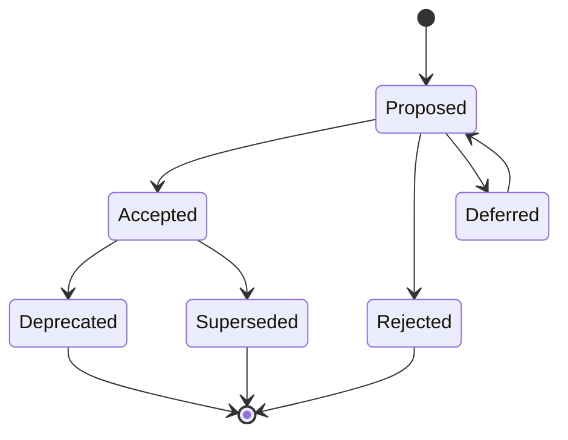

# Architecture Decision Records

This directory is the canonical record of architectural decisions for Argus.

## Lifecycle



## Status Definitions

- **Proposed** — under discussion; not yet binding.
- **Accepted** — binding for future work until superseded or deprecated.
- **Rejected** — considered and intentionally not chosen.
- **Deferred** — valid question, but not decided now.
- **Deprecated** — previously accepted, no longer recommended for new work.
- **Superseded** — replaced by a newer ADR.

## Transition Rules

- Proposed ADRs can become Accepted, Rejected, or Deferred.
- Accepted ADRs are immutable as historical records; create a new ADR to reverse or materially change one.
- Superseding ADRs must reference the ADR they replace.
- Deprecated ADRs should explain what changed and what current work should do instead.

## File Naming

Use:

```text
NNNN-kebab-case-title.md
```

Examples:

- `0001-use-architecture-decision-records.md`
- `0008-isolate-heavy-and-crashy-backends-in-subprocesses.md`

## Principles

- One decision per ADR.
- Record the forces and consequences, not just the outcome.
- Be honest about negative consequences.
- Prefer references to source documents, code, or research over vague memory.
- Do not rewrite accepted ADR history; supersede it.

## Index

| ADR | Title | Status | Category |
|-----|-------|--------|----------|
| [0001](0001-use-architecture-decision-records.md) | Use Architecture Decision Records | Accepted | Process / Workflow |
| [0002](0002-use-mujoco-cpu-simulation-as-the-platform-boundary.md) | Use MuJoCo CPU Simulation as the Platform Boundary | Accepted | Technology Choice |
| [0003](0003-use-ground-truth-world-poses-to-remove-map-alignment-as-a-variable.md) | Use Ground-Truth World Poses to Remove Map Alignment as a Variable | Accepted | Architecture Pattern |
| [0004](0004-use-in-process-transport-for-local-coordination.md) | Use In-Process Transport for Local Coordination | Accepted | Integration Strategy |
| [0005](0005-use-browser-based-command-and-control-with-websocket-streaming.md) | Use Browser-Based Command and Control with WebSocket Streaming | Accepted | Architecture Pattern |
| [0006](0006-use-protocol-registry-pattern-for-pluggable-backends.md) | Use Protocol and Registry Pattern for Pluggable Backends | Accepted | Architecture Pattern |
| [0007](0007-split-2d-detection-from-3d-lifting.md) | Split 2D Detection from 3D Lifting | Accepted | Architecture Pattern |
| [0008](0008-isolate-heavy-and-crashy-backends-in-subprocesses.md) | Isolate Heavy and Crashy Backends in Subprocesses | Accepted | Integration Strategy |
| [0009](0009-use-newest-wins-per-robot-workers-for-perception.md) | Use Newest-Wins Per-Robot Workers for Perception | Accepted | Architecture Pattern |
| [0010](0010-use-canonical-server-owned-obb-wire-format.md) | Use Canonical Server-Owned OBB Wire Format | Accepted | Data Model |
| [0011](0011-use-cpu-viable-model-tiers-and-pinned-offline-checkpoints.md) | Use CPU-Viable Model Tiers and Pinned Offline Checkpoints | Accepted | Technology Choice |
| [0012](0012-forbid-fake-map-and-use-mujoco-ground-truth-metrics.md) | Forbid Fake mAP and Use MuJoCo Ground-Truth Metrics | Accepted | Testing Strategy |
| [0013](0013-use-server-owned-geometry-and-single-projection-path.md) | Use Server-Owned Geometry and a Single Projection Path | Accepted | Data Model |
| [0014](0014-use-react-flow-typed-dag-for-pipeline-editing.md) | Use React Flow Typed DAG for Pipeline Editing | Accepted | Architecture Pattern |
| [0015](0015-introduce-robot-platform-abstraction.md) | Introduce Robot Platform Abstraction | Proposed | Architecture Pattern |
| [0016](0016-use-mujoco-first-for-agibot-x2-simulation.md) | Use MuJoCo First for AGIBOT X2 Simulation | Proposed | Technology Choice |
| [0017](0017-treat-x2-locomotion-as-external-walking-policy-boundary.md) | Treat X2 Locomotion as External Walking Policy Boundary | Proposed | API Design |
| [0018](0018-use-reproducible-gymnasium-style-locomotion-benchmark-harness.md) | Use Reproducible Gymnasium-Style Locomotion Benchmark Harness | Proposed | Architecture Pattern |
| [0019](0019-benchmark-locomotion-before-adding-new-controller-families.md) | Benchmark Locomotion Before Adding New Controller Families | Proposed | Process / Workflow |
