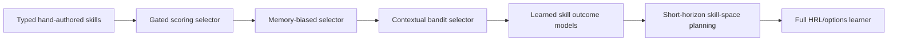

# Exploration Skill Learning Design

Date: 2026-05-14

## Summary

Argus should add skill-based learning for exploration as a gated online policy layer. The first version chooses, sequences, and tunes named exploration skills during live simulation while keeping path planning, locomotion, SLAM, perception, and safety checks behind their existing subsystem boundaries.

The literature review in `outputs/navigation-skill-adaptation.md` supports this direction. The right v1 is not end-to-end low-level RL. It is an auditable policy-over-skills: define each exploration skill as an option-like contract, record decision/outcome traces, compare against deterministic baselines, and leave a staged path toward contextual bandits, learned skill-effect models, SkiMo-style skill-space planning, and full HRL/options learning later.

Important paper positioning:

- arXiv:2207.07560 is **SkiMo / Skill-based Model-based Reinforcement Learning**. It is central to the future model-based skill-planning path.
- arXiv:2411.02998 is **FraCOs / Accelerating Task Generalisation with Multi-Level Skill Hierarchies**. It belongs in the future hierarchy/generalization path, not as the v1 design anchor.

## Goals

- Improve exploration behavior through bounded online control over named exploration skills.
- Optimize a balanced, decomposed score that reflects coverage speed, robustness, efficiency, recovery, map quality, and coordination behavior.
- Preserve Argus's simulation-first, benchmark-backed discipline.
- Produce logs and interfaces that support replay, audit, contextual bandits, learned skill-outcome models, and future RL/options learners.
- Keep deterministic baseline exploration alive as fallback, regression oracle, and promotion comparator.

## Non-goals

- No new low-level locomotion policy training in v1.
- No direct joint, motor, actuator, SLAM, perception, or map-fusion control from the learner.
- No GPU-required or model-download default path.
- No unbounded parameter mutation during live simulation.
- No opaque skill commands without preconditions, typed proposals, termination conditions, and telemetry.
- No claim of improvement without deterministic scenario/seed evidence and no-regression guardrail checks.

## Architectural Boundary

The learner sits above `src/exploration/` and below `src/coordination/` as an orchestration policy. The coordinator asks it what exploration skill to apply at bounded decision points. Existing exploration, path planning, recovery, collision/stuck checks, and locomotion code remain responsible for execution.

The learner does not own SLAM, perception, map fusion, path planning, collision handling, or low-level control. It selects among registered high-level exploration skills and approved parameter profiles. Baseline exploration must remain runnable without the learner.

The v1 learner is a conservative policy-over-options. Its authority is to:

- choose a skill;
- choose an approved parameter profile;
- choose a short bounded skill sequence;
- choose team-level assignments for skills that explicitly support them;
- fall back to baseline when confidence, preconditions, progress, or guardrails fail.

## Core Components

### Skill Registry

The registry defines available exploration skills as option-like contracts. Each skill declares:

- stable skill id and version;
- semantic purpose;
- initiation/precondition predicates;
- parameter schema;
- typed proposal schema;
- authority level;
- expected outcome window;
- expected effects;
- termination conditions;
- failure modes and cooldown behavior;
- required telemetry fields;
- metrics required for scoring and audit.

Initial skill candidates:

- `frontier_pursuit` — choose and pursue a high-value frontier;
- `coverage_sweep` — prefer moves that improve coverage density;
- `replan` — force a new frontier/path evaluation;
- `stuck_recovery` — invoke existing recovery behavior;
- `viewpoint_shift` — move to improve map/perception angle before committing;
- `robot_deconflict` — reduce overlap or redundant work between robots;
- `relay_or_rendezvous` — improve communication/team topology when exploration health depends on it;
- `loop_closure_probe` — revisit a candidate region when map/topology quality benefits from closure.

### Typed Skill Proposals

A skill does not return an opaque command. It emits one or more candidate proposals containing:

- skill id and version;
- candidate target, region, frontier cluster, or robot allocation;
- predicted coverage/information gain;
- predicted frontier or entropy delta;
- travel/time/effort cost;
- risk/safety estimate;
- expected communication/connectivity impact;
- expected map/topology effect;
- minimum dwell or commitment window;
- cancellation and termination triggers;
- confidence and reason codes.

Team-level skills may emit assignment proposals rather than single-robot targets. The selector must be able to compare single-robot and team-level proposals without flattening away duplicate-coverage, idle-time, or connectivity costs.

### Skill State Encoder

The state encoder converts live coordinator/exploration state into a compact deterministic `SkillState`. It should not expose raw simulator or map internals indiscriminately. Inputs include:

- coverage percentage and recent coverage delta;
- frontier count, distance, size, and quality summaries;
- map entropy or uncertainty summaries where available;
- per-robot pose, progress, and current assignment;
- stuck, oscillation, blocked-path, and no-progress indicators;
- map growth and voxel deltas;
- path success/failure history;
- robot overlap, redundancy, idle time, and assignment churn;
- communication/connectivity health;
- localization/map-quality health where available;
- recent skill decisions, termination reasons, and outcomes;
- scenario id, seed, robot count, and configuration metadata.

The state must be serializable so decisions can be replayed from logs.

### Online Skill Selector

The selector chooses a `SkillDecision` containing:

- selected skill id;
- selected proposal or bounded proposal sequence;
- approved parameter profile;
- confidence;
- reason codes;
- fallback behavior if preconditions fail;
- rejected candidate summary when useful for audit.

The v1 selector should be a gated online selector, starting with hand-authored scoring and optionally moving to memory-biased scoring or contextual-bandit-style updates. It should not be a full RL policy yet. It may learn from recent outcomes during a run, but its authority is constrained by hard gates, promotion stages, and fallback rules.

Recommended selector progression:

1. hand-coded gated selector;
2. case/memory-biased selector over similar prior decision traces;
3. contextual bandit over skill/proposal choices;
4. learned per-skill outcome models;
5. short-horizon skill-space planning;
6. full HRL/options learner.

### Skill Executor

The executor applies the selected skill through existing exploration/coordinator APIs. It does not bypass path planning, stuck checks, collision checks, or controller boundaries. If a skill's preconditions are not met, the executor rejects the decision and falls back to baseline exploration.

The executor enforces:

- bounded skill duration;
- minimum dwell time unless safety or precondition invalidation forces termination;
- cooldown after repeated skill failure;
- explicit termination reason;
- no-progress watchdogs;
- baseline fallback on repeated failure or oscillation.

### Outcome Recorder

Every decision creates an outcome window. The recorder stores:

- run id, scenario, seed, robot ids, robot count, and git/runtime metadata;
- selector version and skill-library version;
- `SkillState` before the decision;
- available candidate skills and gate results;
- selected skill, proposal, sequence, and parameters;
- rejected/vetoed candidates where useful;
- confidence and reason codes;
- predicted outcome vector;
- execution status;
- termination reason;
- observed outcome vector;
- balanced score projection;
- audit metrics;
- fallback, override, or recovery events.

Failures are training evidence, not exceptions to hide.

### Promotion Gate

The promotion gate controls whether learned behavior is allowed to keep controlling online or be treated as experimental. It compares skill-selector runs against baseline exploration across deterministic scenarios and seeds.

A learned policy or parameter profile should not be promoted unless it improves exploration performance without unacceptable regressions in efficiency, robustness, safety, recovery, map quality, or coordination metrics.

Promotion stages:

1. **Offline replay** over logged episodes: evaluate what the selector would have chosen without control authority.
2. **Shadow mode** alongside baseline: log disagreements and predicted outcomes while baseline controls.
3. **Constrained online simulation**: allow active selection with fallback, cooldowns, and risk vetoes.
4. **Stress testing**: held-out scenarios, procedural maps, noise, failures, multi-robot scaling, and communication constraints.
5. **Release gate**: robust aggregate statistics plus no-regression checks against baseline.

## Decision Flow

The coordinator consults the learner only at bounded exploration decision points:

- new frontier evaluation;
- coverage plateau;
- stuck detection;
- robot conflict or redundant overlap;
- failed path;
- connectivity or assignment health change;
- localization/map-quality health trigger;
- periodic exploration rescan.

Flow:

1. Coordinator detects a decision trigger.
2. State encoder builds `SkillState`.
3. Skill registry produces eligible proposals and gate results.
4. Selector returns `SkillDecision`.
5. Executor validates preconditions and applies the skill or fallback.
6. Recorder tracks an outcome window.
7. Outcome vector and balanced score are computed.
8. Selector updates its online evidence if allowed.
9. Promotion gate consumes aggregate evidence outside the live control loop.

## Outcome Vector and Balanced Score

Each skill outcome should produce a bounded vector, not only one scalar score:

- coverage or map gain;
- entropy or frontier delta;
- path length, time, and command effort;
- safety events;
- stuck/recovery events;
- duplicate coverage or overlap;
- communication/connectivity change;
- map-quality or audit metric;
- terminal success/failure;
- termination reason;
- fallback or override flag;
- future-affordance creation, such as newly reachable frontiers, better viewpoints, loop-closure candidates, safer routes, or improved robot staging.

The balanced score is a configurable projection of this vector. The projection is useful for selection, but dashboards, artifacts, tests, and promotion reports must expose the decomposed vector so regressions and reward hacking are visible.

The first scoring model should combine:

- coverage gain;
- coverage gain per distance or command effort;
- frontier quality improvement;
- recovery from stuck or failed-path states;
- robot overlap reduction;
- communication/connectivity health;
- map-quality audit metric where available;
- path success/failure;
- time or step budget.

Online reward and offline audit metrics must stay separate. For example, if the selector scores estimated information gain online, promotion should also audit simulator-derived reachable coverage and map correctness.

## Termination Taxonomy

Every skill completion should report one of these termination classes:

- success termination;
- failure termination;
- timeout termination;
- economic termination because marginal gain is too low;
- coordination termination because another robot made the action redundant;
- safety termination;
- precondition-invalidated termination;
- baseline fallback termination;
- operator or scripted-oracle override.

Termination is part of the skill contract. It is not merely recorder bookkeeping.

## Guardrails

The v1 learner must obey these invariants:

- no direct joint, motor, or actuator control;
- no bypassing path planning, collision, stuck, recovery, or map-health checks;
- no unbounded live parameter mutation;
- no silent fallback;
- no GPU-required or model-download default path;
- every decision must be logged with enough state for replay;
- every skill switch must have a reason code;
- low confidence or failed preconditions fall back to baseline exploration;
- repeated failure, oscillation, or skill thrashing degrades control to baseline for the rest of the episode;
- deterministic baseline exploration remains available and tested.

Anti-thrashing controls:

- minimum dwell time for non-safety skill switches;
- hysteresis before switching between similar skills;
- cooldown after repeated skill failure;
- switch-rate metric in evaluation artifacts;
- no-progress watchdog over coverage/map-growth windows.

Intervention-style events to log:

- no frontier reached within timeout;
- map gain below threshold for a fixed window;
- repeated frontier invalidation;
- near-collision or local planner recovery;
- connectivity violation;
- robot stuck or spinning;
- excessive duplicate coverage;
- operator/scripted-oracle override in simulation.

## Testing Strategy

Unit tests should cover:

- registry validation;
- option-like skill contract validation;
- typed proposal validation;
- state encoder determinism and serialization;
- selector fallback behavior;
- executor precondition rejection;
- outcome-vector and balanced-score calculation;
- termination classification;
- anti-thrashing and cooldown logic;
- promotion-gate threshold logic.

Integration tests should cover:

- learner disabled path preserves baseline exploration;
- learner enabled path produces decision, proposal, termination, and outcome logs;
- failed skill preconditions fall back without crashing the run;
- repeated failure degrades to baseline for the rest of the episode;
- deterministic scenario/seed runs produce reproducible decision traces where inputs are unchanged;
- shadow mode records candidate decisions without changing baseline behavior.

Benchmark tests should compare selector runs against baseline exploration across a scenario/seed matrix before any promotion claim.

Minimum benchmark suite:

- smoke maps for fast regression;
- curated topology maps with loops, cul-de-sacs, narrow passages, open areas, and deceptive frontiers;
- procedural maps with train/validation/held-out splits;
- multi-robot stress cases for overlap, idleness, assignment churn, and communication limits;
- sensor/pose/actuation noise cases;
- recovery scenarios for blocked paths, stale maps, degraded localization, and failed skills;
- locked promotion set with frozen manifests.

Each promotion report should include baseline/candidate versions, scenario split, number of maps/episodes/seeds/robots, metric definitions, aggregate score with variability, no-regression guardrail table, failure taxonomy counts, and paths to traces/manifests.

## Future RL/Options Path

The v1 design intentionally leaves a path to full hierarchical RL/options learning:

- `SkillState` can become the high-level observation;
- typed skill proposals can become the action/options candidates;
- outcome vectors can become reward candidates;
- termination taxonomy can become option termination data;
- outcome windows can become semi-Markov option transitions;
- promotion gates can become policy evaluation criteria;
- decision logs can become offline training data.

Recommended future progression:

SkiMo-style model-based skill planning belongs around the learned outcome model and short-horizon skill-space planning stages. FraCOs-style multi-level hierarchy learning belongs at the later full HRL/options stage.

Full RL/options learning should be a later milestone after the v1 state, action, reward, logging, and benchmark contracts are stable. That future work should get its own ADR because it changes training infrastructure, reproducibility requirements, model artifact handling, promotion criteria, and possibly simulator throughput assumptions.

## Advice Process

Single-contributor mode applies: the affected areas are currently authored by Prannaya Gupta in git history. The design was still checked against the affected architectural contexts:

- Coordination: exploration control and multi-robot orchestration change.
- Simulation: MuJoCo-first reproducibility and metric discipline remain the boundary.
- Web C2: future observability may expose learner decisions and scores.
- Governance: a future ADR should record the autonomy boundary before implementation.

Alternatives considered:

1. Gated online selector now — selected because it gives online control while preserving benchmark gates.
2. Full hierarchical RL/options learner now — deferred because the environment, reward, artifact, and promotion contracts need to stabilize first.
3. Offline-only experience mining — rejected for v1 because it does not satisfy the desired online-control direction.

## Research Review

The deep research workflow produced:

- `outputs/navigation-skill-adaptation.md` — final cited synthesis;
- `outputs/navigation-skill-adaptation.provenance.md` — provenance and verification summary;
- `outputs/navigation-skill-adaptation-research-foundations.md`;
- `outputs/navigation-skill-adaptation-research-model-based.md`;
- `outputs/navigation-skill-adaptation-research-navigation.md`;
- `outputs/navigation-skill-adaptation-research-evaluation.md`.

Spec changes from the literature review:

- sharpened skills into option-like contracts;
- added typed skill proposals;
- added termination taxonomy;
- replaced scalar-only scoring with bounded outcome vectors plus balanced-score projection;
- added anti-thrashing and intervention-style event logging;
- added offline replay, shadow mode, constrained online control, stress testing, and release promotion gates;
- corrected SkiMo and FraCOs positioning in the future path.
