# Agent-Friendly World Representations for Multi-Robot Swarms

## Executive Summary

The point of a 3D digital twin is not that an LLM-like agent will directly “understand” a raw point cloud, NeRF, or Gaussian splat. The point is that a 3D world model gives the autonomy stack a persistent, queryable spatial substrate: localization, free-space estimation, collision checking, route feasibility, map fusion, simulation, operator visualization, and coordination all need world state that survives beyond the current camera frame. Classical representations such as occupancy maps and ESDFs are directly useful because they answer planner questions like “is this space free?” and “how far is the nearest obstacle?” [OctoMap](https://doi.org/10.1007/s10514-012-9321-0), [Voxblox](https://arxiv.org/abs/1611.03631). Neural and rendering-oriented representations such as NeRFs and Gaussian splats are useful for dense reconstruction, localization, and view synthesis, but they usually need wrappers or derived layers before they become useful to planners or agents [NeRF](https://arxiv.org/abs/2003.08934), [3D Gaussian Splatting](https://arxiv.org/abs/2308.04079), [SplaTAM](https://arxiv.org/abs/2312.02126).

The representation that is “friendly” to agentic AI is usually not the raw 3D asset. It is the interface built on top of it: semantic maps, topological graphs, 3D scene graphs, object and affordance graphs, value maps, planner predicates, belief states, resource reservations, and tool APIs. Recent robotics systems support this pattern: 3D Dynamic Scene Graphs and Hydra convert spatial perception into object/place/room/human/relationship graphs for planning and long-term autonomy [3D Dynamic Scene Graphs](https://arxiv.org/abs/2002.06289), [Hydra](https://arxiv.org/abs/2201.13360); LLM robotics systems such as SayCan, Code as Policies, VoxPoser, VLMaps, ConceptGraphs, and LLM+P mostly mediate between language models and the physical world through skills, affordance functions, APIs, value maps, semantic maps, scene graphs, or PDDL rather than raw geometry [SayCan](https://arxiv.org/abs/2204.01691), [Code as Policies](https://arxiv.org/abs/2209.07753), [VoxPoser](https://arxiv.org/abs/2307.05973), [VLMaps](https://arxiv.org/abs/2210.05714), [ConceptGraphs](https://arxiv.org/abs/2309.16650), [LLM+P](https://arxiv.org/abs/2304.11477).

For multi-robot swarms, the right architecture is a layered, belief-aware world model: local robots maintain dense metric maps; the swarm exchanges sparse constraints, submaps, frontiers, object/place updates, and commitments; agentic systems query a semantic-topological-belief interface rather than reading raw 3D. This matters because swarms face partial observability, stale and inconsistent beliefs, bandwidth limits, heterogeneous capabilities, dynamic obstacles, and shared-resource conflicts. Systems such as Kimera-Multi, Swarm-SLAM, COVINS, Open-RMF, decentralized belief-space planning, and time-ordered resource sharing point toward a hybrid design: local autonomy and local dense geometry, plus shared sparse world-state and commitment layers for coordination [Kimera-Multi](https://arxiv.org/abs/2106.14386), [Swarm-SLAM](https://arxiv.org/abs/2301.06230), [COVINS](https://arxiv.org/abs/2108.05756), [Open-RMF](https://www.open-rmf.org/), [Action-Consistent Decentralized Belief Space Planning](https://arxiv.org/abs/2403.05962), [Time-Ordered Resource Sharing](https://arxiv.org/abs/2408.07942).

## 1. The Core Answer: Agents Should Not Read Raw 3D

Your confusion is justified: if a system builds a giant 3D digital twin and then hands that raw structure to an LLM, the loop is badly designed. Most useful systems do not do that. They use 3D representations as evidence and infrastructure, then expose task-relevant abstractions.

A useful analogy is a database. A database may store bytes, indexes, logs, and pages. A business application does not reason over disk blocks; it queries tables, views, constraints, and transactions. Similarly, a robot may store point clouds, splats, voxels, meshes, TSDFs, ESDFs, pose graphs, or radiance fields. A planner or LLM-like agent should query views over that state:

- “Which rooms remain unexplored?”
- “Which route is traversable for robot B?”
- “What objects are likely in this region?”
- “Which doorway is blocked, who observed it, and how stale is that observation?”
- “Can this manipulator reach the target without colliding?”
- “Which robot has the capability and battery to inspect frontier F?”

The research consensus is therefore not “make the LLM understand Gaussian splats.” It is “maintain grounded spatial state, then expose the right abstraction to the reasoning layer.” Occupancy maps and ESDFs expose free-space and distance queries [OctoMap](https://doi.org/10.1007/s10514-012-9321-0), [Voxblox](https://arxiv.org/abs/1611.03631). Scene graphs expose entities and relations [3D Dynamic Scene Graphs](https://arxiv.org/abs/2002.06289), [Hydra](https://arxiv.org/abs/2201.13360). LLM robotics systems expose skills, APIs, symbolic state, value maps, or semantic maps [SayCan](https://arxiv.org/abs/2204.01691), [Code as Policies](https://arxiv.org/abs/2209.07753), [VoxPoser](https://arxiv.org/abs/2307.05973), [LLM+P](https://arxiv.org/abs/2304.11477).

## 2. What 3D Representations Are Actually For

### 2.1 Persistent spatial memory

A swarm cannot coordinate from per-frame perception. Robots need persistent state: obstacles, free space, explored/unknown regions, robot poses, local map uncertainty, semantic detections, and task history. OctoMap’s core contribution is compact probabilistic 3D occupancy mapping, giving robots a way to store and update free/occupied/unknown volume [OctoMap](https://doi.org/10.1007/s10514-012-9321-0). Voxblox adds an ESDF layer that planners can query for distance-to-obstacle during onboard MAV planning [Voxblox](https://arxiv.org/abs/1611.03631).

### 2.2 Grounding for planning and control

A high-level agent may decide “inspect the storage room,” but local planning still needs geometry. Motion planners need collision volumes, clearances, traversability, and dynamic constraints. Manipulation planners need object poses, support surfaces, and collision geometry. A 3D twin supplies the grounded state behind those feasibility checks; the agent consumes the check result, not necessarily the mesh or point cloud itself.

### 2.3 Shared evidence for multi-robot fusion

Multi-robot systems need to combine local observations into a shared belief. COVINS uses a centralized server for collaborative visual-inertial SLAM and global optimization [COVINS](https://arxiv.org/abs/2108.05756). Kimera-Multi and Swarm-SLAM push toward distributed/decentralized multi-robot SLAM, emphasizing robust inter-robot loop-closure handling and communication-aware sharing [Kimera-Multi](https://arxiv.org/abs/2106.14386), [Swarm-SLAM](https://arxiv.org/abs/2301.06230). These systems show why shared 3D state matters, but they also show why raw all-to-all sharing is the wrong abstraction: the useful shared products are often pose-graph constraints, keyframes, submaps, semantic summaries, and deltas.

### 2.4 Simulation, prediction, and safety

A digital twin can support “what-if” queries: simulate a route, check a collision, reserve a corridor, test a task sequence, predict congestion, or expose a situation to a human supervisor. Open-RMF is a practical example of a coordination layer above heterogeneous robot fleets and shared infrastructure; its value lies in resource/task coordination, not in making one monolithic geometry object the mind of the fleet [Open-RMF](https://www.open-rmf.org/). Time-ordered resource sharing similarly models shared resources as temporal commitments between independent agents [Time-Ordered Resource Sharing](https://arxiv.org/abs/2408.07942).

### 2.5 Visualization and human/agent supervision

Photorealistic or dense 3D views are often more useful for humans, teleoperation, debugging, and inspection than for LLM reasoning. NeRFs and Gaussian splats are strongest when dense visual reconstruction, novel-view rendering, or map visualization matters [NeRF](https://arxiv.org/abs/2003.08934), [3D Gaussian Splatting](https://arxiv.org/abs/2308.04079). That does not make them useless for autonomy; it means autonomy should consume them through derived query layers.

## 3. Representation Ladder: From Raw Geometry to Agent-Readable State

| Layer | Examples | Good for | Bad as | Agent-friendly interface |
|---|---|---|---|---|
| Raw sensor / reconstruction | RGB-D, LiDAR scans, point clouds | Registration, detection, map updates | Long-horizon reasoning substrate | Perception detections, submaps, uncertainty updates |
| Metric occupancy / distance | Occupancy grids, OctoMap, TSDF/ESDF | Free-space, collision, trajectory optimization | Task semantics | `is_free(region)`, `nearest_obstacle(pose)`, `frontiers()` [OctoMap](https://doi.org/10.1007/s10514-012-9321-0), [Voxblox](https://arxiv.org/abs/1611.03631) |
| Rendering/neural scene | NeRFs, 3D Gaussian splats | Novel views, dense reconstruction, localization, visualization | Symbolic task model | render/depth/visibility queries, extracted surfaces, semantic overlays [NeRF](https://arxiv.org/abs/2003.08934), [3D Gaussian Splatting](https://arxiv.org/abs/2308.04079), [SplaTAM](https://arxiv.org/abs/2312.02126) |
| Semantic map | Open-vocabulary labels, objects, regions | Language grounding, search, semantic navigation | Full physical feasibility model | `find(object)`, `regions_matching(text)`, category-conditioned traversability [VLMaps](https://arxiv.org/abs/2210.05714) |
| Topological map | Places, rooms, doors, corridors, frontiers | Coordination, routing, exploration allocation | Low-level collision safety | `neighbors(room)`, `unexplored_frontiers()`, edge costs/confidence [Hydra](https://arxiv.org/abs/2201.13360) |
| Scene graph | Objects, rooms, humans, relations, containment | Queryable spatial semantics, planning, HRI | Guaranteed perception truth | graph queries over entities/relations/provenance [3D Dynamic Scene Graphs](https://arxiv.org/abs/2002.06289), [ConceptGraphs](https://arxiv.org/abs/2309.16650) |
| Belief/provenance | Confidence, source robot, timestamp, frame, version, conflict state | Distributed coordination under stale/partial observations | Pretty visualization | `claim_confidence`, `who_observed`, `is_stale`, `conflicts()` [Action-Consistent Decentralized Belief Space Planning](https://arxiv.org/abs/2403.05962) |
| Task/action layer | Skills, PDDL, behavior trees, bids, reservations | Agent planning and execution contracts | Raw perception replacement | `available_skills`, `check_preconditions`, `allocate_task`, `reserve_resource` [SayCan](https://arxiv.org/abs/2204.01691), [LLM+P](https://arxiv.org/abs/2304.11477), [Open-RMF](https://www.open-rmf.org/) |

The main design principle is that each layer should hide irrelevant complexity from the layer above while preserving enough grounding to avoid hallucinated or infeasible actions.

## 4. Why Point Clouds, NeRFs, and Gaussian Splats Are Not Useless

### 4.1 Point clouds and meshes

Point clouds are not friendly to language agents, but they are highly useful as intermediate geometry. They support registration, obstacle detection, surface reconstruction, object segmentation, and map updates. The agent-facing product is usually not “the point cloud”; it is a derived occupancy map, surface, object pose, obstacle region, or traversability estimate.

### 4.2 NeRFs

NeRFs represent scenes as continuous radiance and density fields for view synthesis [NeRF](https://arxiv.org/abs/2003.08934). This is powerful for dense appearance memory and novel-view rendering, but the native representation is not a planner state. A robot usually needs to render views, extract depth/occupancy, attach semantic features, or convert to other planning structures before using it for action.

### 4.3 Gaussian splats

3D Gaussian splatting is more explicit than a NeRF because the map is a set of spatial Gaussian primitives optimized for real-time rendering [3D Gaussian Splatting](https://arxiv.org/abs/2308.04079). Robotics SLAM work such as SplaTAM and compact 3DGS systems uses splats for tracking, mapping, reconstruction, and efficient dense visual SLAM [SplaTAM](https://arxiv.org/abs/2312.02126), [Compact 3D Gaussian Splatting for Dense Visual SLAM](https://arxiv.org/abs/2403.11247). That makes splats closer to a useful robot map than a pure implicit field, but raw splats still do not encode object identity, traversability, affordances, task predicates, or resource commitments. They remain a substrate.

### 4.4 The real downstream consumers

The downstream consumers of 3D representations are usually modules, not monolithic agents:

- SLAM and localization.
- Collision checking and motion planning.
- Semantic segmentation and object tracking.
- View planning and active perception.
- Fleet coordination and task allocation.
- Simulation and safety validation.
- Human/operator visualization.
- Agent-facing world-query APIs.

This is why 3D twins can matter even if an LLM never sees the raw twin.

## 5. What LLM/VLM Agents Can Actually Consume Today

### 5.1 Skill and affordance interfaces

SayCan demonstrates a core pattern: an LLM proposes semantically plausible high-level actions, but a learned affordance/value function scores whether those actions are currently feasible for the robot [SayCan](https://arxiv.org/abs/2204.01691). This is a clean perception-cognition-action split: language handles task semantics; robot-specific feasibility grounds those semantics.

### 5.2 Program and tool APIs

Code as Policies makes the LLM generate code that calls perception and control APIs [Code as Policies](https://arxiv.org/abs/2209.07753). This is directly relevant to 3D twins: the agent should call tools like `get_object_pose`, `collision_check`, `sample_viewpoint`, `reserve_corridor`, or `query_scene_graph`, not reason from raw geometry tokens.

### 5.3 3D value maps

VoxPoser is important because it is neither purely symbolic nor raw 3D. It uses LLMs/VLMs to compose 3D value maps for manipulation, then a model-based planner turns those value maps into trajectories [VoxPoser](https://arxiv.org/abs/2307.05973). This suggests a strong architecture for agentic robotics: language models express constraints and goals; spatial planners optimize in grounded continuous fields.

### 5.4 Semantic maps and scene graphs

VLMaps builds language-grounded spatial maps for open-vocabulary navigation [VLMaps](https://arxiv.org/abs/2210.05714). ConceptGraphs builds open-vocabulary 3D scene graphs for perception and planning [ConceptGraphs](https://arxiv.org/abs/2309.16650). 3D Dynamic Scene Graphs and Hydra show how places, rooms, objects, humans, and geometry can be organized into a hierarchical graph [3D Dynamic Scene Graphs](https://arxiv.org/abs/2002.06289), [Hydra](https://arxiv.org/abs/2201.13360). This is the most natural interface for an LLM-like planner: entities, relations, regions, topology, and queryable metadata.

### 5.5 Symbolic planners and VLA models

LLM+P translates natural-language planning problems into PDDL, invokes a classical planner, and translates the plan back to language [LLM+P](https://arxiv.org/abs/2304.11477). RT-2 and related vision-language-action systems learn observation-to-action token mappings rather than exposing an explicit world model [RT-2](https://arxiv.org/abs/2307.15818). These represent two poles: inspectable symbolic state versus learned end-to-end action models. For safety-critical swarms, the inspectable state remains valuable even if learned models improve perception and control.

### 5.6 Direct 3D LLMs are emerging, but still mediated

3D-LLM and LEO move closer to direct 3D embodied reasoning by injecting 3D features, point-cloud-derived information, or 3D vision-language-action instruction tuning into large models [3D-LLM](https://arxiv.org/abs/2307.12981), [LEO](https://arxiv.org/abs/2311.12871). This is a real research direction. But even here, “direct” usually means learned feature mediation, multi-view features, object/scene datasets, tokenization, and alignment layers. It does not remove the need for explicit safety, uncertainty, task, and coordination interfaces in a deployed swarm.

## 6. Swarm-Specific Requirements

Single-robot mapping is not enough. A multi-robot swarm representation has to handle problems that do not appear, or appear less severely, in a single robot.

### 6.1 Partial observability and inconsistent beliefs

Each robot sees only part of the world. Under limited communication, robots may hold inconsistent beliefs. Decentralized belief-space planning work explicitly treats inconsistent local beliefs and limited data sharing as first-class constraints, with communication triggered when action consistency is threatened [Action-Consistent Decentralized Belief Space Planning](https://arxiv.org/abs/2403.05962). This argues for belief metadata in the world model: source, timestamp, confidence, frame, version, and conflict state.

### 6.2 Bandwidth limits

Dense maps do not scale well under naive all-to-all sharing. Swarm-SLAM emphasizes sparse decentralized collaborative SLAM and communication-aware loop-closure prioritization [Swarm-SLAM](https://arxiv.org/abs/2301.06230). Kimera-Multi shows distributed dense metric-semantic SLAM, but still in a system where communication strategy and robustness matter [Kimera-Multi](https://arxiv.org/abs/2106.14386). A practical swarm should exchange sparse, high-value products first: pose-graph constraints, frontier summaries, semantic deltas, blocked-edge updates, task commitments, and resource reservations.

### 6.3 Dynamic environments

Humans, doors, movable objects, blocked corridors, and changing traversability are not static mesh problems. 3D Dynamic Scene Graphs explicitly include humans and dynamic scene structure [3D Dynamic Scene Graphs](https://arxiv.org/abs/2002.06289), but robust multi-robot temporal semantic fusion remains immature. Agent-friendly world models need temporal validity: “observed 12 seconds ago by robot 3” is different from “globally true.”

### 6.4 Heterogeneous capabilities

Different robots may have different sensors, locomotion, payloads, arms, battery, compute, and communication links. A semantic-topological map should not simply say “edge traversable”; it should say “traversable for robot class X under conditions Y with confidence Z.” Open-RMF’s fleet/resource coordination pattern and time-ordered resource-sharing work reinforce the value of separating high-level resource commitments from robot-local control [Open-RMF](https://www.open-rmf.org/), [Time-Ordered Resource Sharing](https://arxiv.org/abs/2408.07942).

### 6.5 Commitments are not observations

A swarm world model should separate observed facts from promised actions. “Door D is open” is an observation; “robot B reserved corridor C from 12:00 to 12:30” is a commitment; “robot A intends to inspect room R” is an intent. Lumping these together makes reasoning brittle. Resource schedulers and task allocators need a commitment layer above the map.

## 7. Recommended Architecture Pattern

```mermaid
flowchart LR
    S[Robot sensors<br/>RGB-D, LiDAR, proprioception] --> L[Local metric map<br/>occupancy, TSDF/ESDF, mesh, splats]
    L --> P[Local perception products<br/>objects, humans, traversability, frontiers]
    P --> G[Local semantic-topological graph<br/>places, rooms, doors, objects, relations]
    G --> D[Shared swarm deltas<br/>pose constraints, submaps, graph updates, conflicts]
    D --> W[Belief-aware shared world model<br/>confidence, source, timestamp, version, provenance]
    W --> A[Agent/planner interface<br/>queries, tools, PDDL, skills, value maps, bids]
    A --> C[Commitments and constraints<br/>task allocation, resource reservations, routes]
    C --> X[Robot execution<br/>BTs, controllers, local collision avoidance]
    X --> S
```



**Figure 1. Agent-friendly representation stack for multi-robot swarms.** The diagram synthesizes evidence from occupancy/ESDF mapping [OctoMap](https://doi.org/10.1007/s10514-012-9321-0), [Voxblox](https://arxiv.org/abs/1611.03631), scene-graph systems [3D Dynamic Scene Graphs](https://arxiv.org/abs/2002.06289), [Hydra](https://arxiv.org/abs/2201.13360), multi-robot SLAM [Kimera-Multi](https://arxiv.org/abs/2106.14386), [Swarm-SLAM](https://arxiv.org/abs/2301.06230), and agent/planner interfaces [SayCan](https://arxiv.org/abs/2204.01691), [VoxPoser](https://arxiv.org/abs/2307.05973), [Open-RMF](https://www.open-rmf.org/).

The important feature is the boundary between the shared world model and the agent/planner interface. That boundary should be explicit. The agent should not be passed a raw global splat map; it should be given tools and schemas that expose task-relevant facts.

A concrete agent-facing API might look like:

```text
query_entities(text, region=None) -> objects/places with poses, confidence, source, timestamp
query_topology(region) -> place graph with costs, blocked edges, robot-specific traversability
query_free_space(region, robot_model) -> occupancy/ESDF/collision summary
query_frontiers(criteria) -> candidate exploration targets with expected value and uncertainty
check_plan(plan, robot_or_team) -> feasibility, collisions, resource conflicts, missing beliefs
allocate_task(task, candidates) -> bids, utilities, selected robot/coalition, explanation
reserve_resource(resource, time_window, robot) -> accepted/rejected/conflict alternatives
explain_conflicts() -> stale beliefs, contradictory observations, commitment collisions
```

This lets an LLM-like agent reason over a compact operational state while still being grounded in the 3D evidence below it.

## 8. Design Rules for Agent-Friendly Swarm Representations

1. **Do not expose raw dense 3D as the primary cognition interface.** Expose queryable views: objects, places, frontiers, traversability, affordances, constraints, and commitments.
2. **Keep dense geometry local by default.** Share dense products only when needed; otherwise exchange sparse constraints, graph deltas, semantic summaries, and commitments [Swarm-SLAM](https://arxiv.org/abs/2301.06230), [Kimera-Multi](https://arxiv.org/abs/2106.14386).
3. **Attach provenance to every shared claim.** Each object, edge, obstacle, or semantic label should carry source robot, timestamp, confidence, frame, and version.
4. **Separate facts, beliefs, intents, and commitments.** Observations are not reservations; reservations are not object detections; goals are not ground truth.
5. **Use scene graphs for cognition, ESDF/occupancy for safety, and resource schedules for coordination.** These solve different problems and should not be collapsed into one “map.”
6. **Let LLMs plan through tools.** The agent should call world-model APIs, planners, collision checkers, and allocators. This is the pattern behind SayCan, Code as Policies, VoxPoser, and LLM+P [SayCan](https://arxiv.org/abs/2204.01691), [Code as Policies](https://arxiv.org/abs/2209.07753), [VoxPoser](https://arxiv.org/abs/2307.05973), [LLM+P](https://arxiv.org/abs/2304.11477).
7. **Treat communication as part of representation design.** The representation should encode what is worth sending, not merely what is true locally.
8. **Preserve local autonomy for safety-critical execution.** Even if an agent allocates a task, local controllers and collision checkers must retain authority over immediate physical safety.

## 9. Failure Modes

### 9.1 Pretty twins with no planner interface

A photorealistic digital twin may impress humans but fail autonomy if it does not expose collision, topology, semantics, uncertainty, and task APIs. Rendering quality is not the same as planning utility.

### 9.2 Semantic hallucination over weak geometry

An LLM may infer “go through the doorway” from a semantic graph while the metric layer knows the doorway is blocked or too narrow. Agent-facing semantics must remain grounded in occupancy, traversability, and robot-specific feasibility.

### 9.3 Stale shared state

A global map can be worse than no map if agents treat stale or conflicting reports as current truth. Swarms need timestamps, decay, conflict handling, and action-consistency checks [Action-Consistent Decentralized Belief Space Planning](https://arxiv.org/abs/2403.05962).

### 9.4 Bandwidth collapse

Sharing dense point clouds, splats, or meshes across every robot can destroy the very coordination it is meant to improve. Share summaries and deltas first.

### 9.5 Learned direct-action opacity

Vision-language-action models such as RT-2 can map observations and instructions to actions [RT-2](https://arxiv.org/abs/2307.15818), but fully learned interfaces can hide state, confidence, and failure causes. In swarms, opacity makes debugging, safety, resource negotiation, and human supervision harder.

## 10. Open Questions and Research Gaps

1. **Distributed semantic/scene-graph fusion is less mature than pose-graph fusion.** Multi-robot SLAM has strong mechanisms for loop closures and pose consistency; object identity, room identity, relation conflicts, and semantic uncertainty are less standardized.
2. **Direct 3D foundation models are improving, but deployment interfaces are unsettled.** 3D-LLM and LEO point toward richer learned 3D reasoning [3D-LLM](https://arxiv.org/abs/2307.12981), [LEO](https://arxiv.org/abs/2311.12871), but safety-critical swarms still need inspectable belief, constraint, and commitment layers.
3. **Benchmarks often stop before end-to-end autonomy.** Many 3D representation papers evaluate rendering quality, reconstruction quality, or pose error rather than task success, collision rate, exploration efficiency, or swarm throughput.
4. **Semantic uncertainty APIs are underdeveloped.** Occupancy and SLAM uncertainty are relatively mature; uncertainty for object labels, relations, affordances, and temporal validity is less consistently exposed.
5. **Dynamic environments remain hard.** Moving humans, temporarily blocked corridors, movable objects, changing light, and evolving workspaces break assumptions behind static twins.
6. **Communication policies need to become representation policies.** A swarm representation should specify which facts are local, which are globally shared, which are sent opportunistically, and which trigger urgent communication.

## Bottom Line

A 3D digital twin is valuable in the perception-cognition-action loop when it is treated as grounded infrastructure: a spatial memory, simulation substrate, fusion target, and query engine. It is weak when treated as the thing an agent must understand directly.

For agentic AI systems, the friendly representation is a layered interface over the twin: metric safety queries, semantic entities, topological structure, scene graphs, belief/provenance metadata, task predicates, capability models, bids, reservations, and executable skills. In other words: build the 3D twin, but do not ask the LLM to stare at it. Ask the LLM to use tools whose answers are grounded in it.

## Verified Source Set

1. Hornung et al., “OctoMap: An Efficient Probabilistic 3D Mapping Framework Based on Octrees.” https://doi.org/10.1007/s10514-012-9321-0
2. Oleynikova et al., “Voxblox: Incremental 3D Euclidean Signed Distance Fields for On-Board MAV Planning.” https://arxiv.org/abs/1611.03631
3. Rosinol et al., “3D Dynamic Scene Graphs: Actionable Spatial Perception with Places, Objects, and Humans.” https://arxiv.org/abs/2002.06289
4. Hughes et al., “Hydra: A Real-time Spatial Perception System for 3D Scene Graph Construction and Optimization.” https://arxiv.org/abs/2201.13360
5. Tian et al., “Kimera-Multi: Robust, Distributed, Dense Metric-Semantic SLAM for Multi-Robot Systems.” https://arxiv.org/abs/2106.14386
6. Lajoie and Beltrame, “Swarm-SLAM: Sparse Decentralized Collaborative Simultaneous Localization and Mapping Framework for Multi-Robot Systems.” https://arxiv.org/abs/2301.06230
7. Schmuck et al., “COVINS: Visual-Inertial SLAM for Centralized Collaboration.” https://arxiv.org/abs/2108.05756
8. Mildenhall et al., “NeRF: Representing Scenes as Neural Radiance Fields for View Synthesis.” https://arxiv.org/abs/2003.08934
9. Kerbl et al., “3D Gaussian Splatting for Real-Time Radiance Field Rendering.” https://arxiv.org/abs/2308.04079
10. Keetha et al., “SplaTAM: Splat, Track & Map 3D Gaussians for Dense RGB-D SLAM.” https://arxiv.org/abs/2312.02126
11. Deng et al., “Compact 3D Gaussian Splatting For Dense Visual SLAM.” https://arxiv.org/abs/2403.11247
12. Ahn et al., “Do As I Can, Not As I Say: Grounding Language in Robotic Affordances.” https://arxiv.org/abs/2204.01691
13. Liang et al., “Code as Policies: Language Model Programs for Embodied Control.” https://arxiv.org/abs/2209.07753
14. Huang et al., “VoxPoser: Composable 3D Value Maps for Robotic Manipulation with Language Models.” https://arxiv.org/abs/2307.05973
15. Huang et al., “Visual Language Maps for Robot Navigation.” https://arxiv.org/abs/2210.05714
16. Gu et al., “ConceptGraphs: Open-Vocabulary 3D Scene Graphs for Perception and Planning.” https://arxiv.org/abs/2309.16650
17. Liu et al., “LLM+P: Empowering Large Language Models with Optimal Planning Proficiency.” https://arxiv.org/abs/2304.11477
18. Brohan et al., “RT-2: Vision-Language-Action Models Transfer Web Knowledge to Robotic Control.” https://arxiv.org/abs/2307.15818
19. Hong et al., “3D-LLM: Injecting the 3D World into Large Language Models.” https://arxiv.org/abs/2307.12981
20. Huang et al., “An Embodied Generalist Agent in 3D World.” https://arxiv.org/abs/2311.12871
21. Open-RMF project site. https://www.open-rmf.org/
22. Kundu et al., “Action-Consistent Decentralized Belief Space Planning with Inconsistent Beliefs and Limited Data Sharing.” https://arxiv.org/abs/2403.05962
23. Chakravarty et al., “Time-Ordered Ad-hoc Resource Sharing for Independent Robotic Agents.” https://arxiv.org/abs/2408.07942
