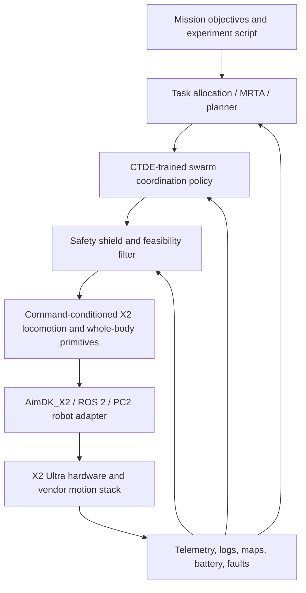
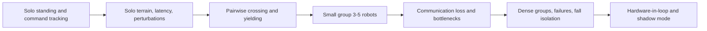

# AGIBOT X2 Swarm Control and Simulation Development

## Executive Summary

The public evidence supports **AGIBOT X2 Ultra**, not the base X2, as the realistic target for custom humanoid development. Official AGIBOT materials distinguish the base X2 from X2 Ultra: the Ultra variant is documented with 30 actuated DOF, richer sensing, Jetson Orin NX secondary-development compute, ROS 2-oriented AimDK_X2 APIs, and secondary-development support; the base X2 is described as lacking that development support [P1][P2][P3][P4]. The platform is credible as a research humanoid, but the public stack is not an off-the-shelf swarm platform. SDK package access is still mediated through after-sales support, key fault/perception modules are publicly marked as coming soon, and public docs show robot-local APIs rather than fleet orchestration [P5][P6].

The asset situation is workable but legally and technically messy. The strongest official AGIBOT simulation stack is **Genie Sim**, aimed at AgiBot G1/G2 and Isaac Sim/Isaac Lab workflows, not a public official X2 simulation release [A1][A2]. The most useful X2-specific simulation files found are third-party repositories containing URDF, MuJoCo XML/MJCF-like models, STL meshes, USD assets, ROS 2 launch files, and Isaac Lab training code [A3][A4]. These are useful for prototyping, but the most complete Isaac Lab package had no detected license, and even the Apache-2.0 X2 ROS 2 package should be audited for provenance, inertias, actuator limits, collision geometry, and redistribution rights [A3][A4].

Prior work using AGIBOT X2 specifically is thin. The clearest X2 learning/control work found is **WholeBodyVLA**, which reports an AgiBot X2 whole-body loco-manipulation setup using latent VLA plus RL motion/locomotion policies [L2]. Broader AGIBOT public work is stronger around manipulation datasets, VLA/world-model learning, and AgiBot World/GO-1-style data scaling [L1]. There was no public demonstration found of a **multi-AGIBOT-X2 humanoid swarm**. A realistic research program should therefore treat swarm control as a new coordination layer built on top of verified single-X2 locomotion, recovery, manipulation, and safety primitives.

The recommended architecture is layered: mission/task allocation, centralized-training/decentralized-execution multi-agent coordination, deterministic safety shielding, command-conditioned single-humanoid locomotion, and vendor/hardware adapters. This avoids the bad idea of training one end-to-end raw-joint multi-humanoid MARL policy before the single robot is even stable. Use CTDE methods such as MADDPG/MAPPO and value-decomposition baselines where appropriate, but deploy them as high-level goal/slot/velocity/task policies, not torque-level controllers [M1][M2][M3][M4]. For simulation, combine a fast massively parallel training loop with a higher-fidelity contact-audit loop, model actuator latency/saturation/contact/falls explicitly, and evaluate with hostile multi-robot scenarios: bottlenecks, packet loss, failed robots, near misses, fall cascades, and held-out team sizes [M8][M9][M10].

## 1. Scope, Evidence Quality, and Key Caveat

This study covers public information on AGIBOT X2/X2 Ultra, public assets useful for X2 humanoid simulation, prior AGIBOT and comparable humanoid learning/control work, and practical considerations for training multi-X2 policies in simulation. It does **not** assume private AGIBOT SDK access, private CAD, private fleet-control APIs, or unreleased vendor simulation packages.

Evidence quality varies sharply by topic:

- **High confidence:** official X2 Ultra specifications, onboard compute roles, sensor list, AimDK_X2 API categories, and documented operational constraints, because these come from official AGIBOT/AimDK_X2 pages [P1][P2][P3][P4][P5][P6].
- **Medium confidence:** public third-party X2 simulation assets, because file inventories are concrete, but provenance, fidelity, and licensing are uneven [A3][A4][A5][A6].
- **Medium confidence:** direct X2 learning precedent, because WholeBodyVLA is X2-specific but appears to be a single public line of evidence rather than a broad benchmark family [L2].
- **High confidence for method families, lower confidence for direct X2 transfer:** CTDE, domain randomization, actuator modeling, humanoid locomotion RL, and collision avoidance have strong literature support, but no source proves they solve a real X2 swarm out of the box [M1][M2][M3][M4][M6][M7][M8].

No credible public source found a complete, official, redistributable AGIBOT X2 swarm simulation stack. That is the load-bearing caveat.

## 2. AGIBOT X2 Platform Findings

### 2.1 X2 Ultra is the development target

Official AGIBOT materials describe the X2 series as having at least two relevant variants: X2 and X2 Ultra [P1]. The important distinction is development support. Public materials indicate that X2 Ultra provides the secondary-development pathway, richer sensors, and secondary-development compute, while the base X2 lacks secondary-development support [P1][P2][P3][P4]. For research involving custom control, simulation-to-real transfer, or robot swarm coordination, planning around base X2 would be a mistake unless AGIBOT confirms otherwise for a specific procurement.

Official AimDK_X2 documentation lists the X2 Ultra around 1.31 m tall, about 39 kg, with 30 actuated DOF: neck, arms, waist, and legs [P2]. It reports a maximum speed of 1.8 m/s, a daily-use speed limit at or below 0.8 m/s, and about two hours of walking at 0.5 m/s [P2]. Payload is posture-dependent: public docs distinguish a 3 kg maximum payload in a specific posture from a full-workspace payload of at most 1 kg, without end-effector [P2]. For swarm work, the latter is usually the number that matters.

### 2.2 Compute and robot-local development model

The public onboard-computer documentation separates compute roles into PC1 motion control, PC2 development, and PC3 interaction [P3]. PC2 is the documented secondary-development target and is listed as a Jetson Orin NX with 157 TOPS, 16 GB memory, and 512 GB storage [P3]. The docs explicitly warn that PC1 must not be used as the build/run machine [P3].

That implies a sane swarm architecture:

- PC1 remains vendor-controlled motion infrastructure.
- PC2 runs per-robot adapters, local autonomy, telemetry collection, safety interlocks, and possibly local perception.
- An external fleet coordinator handles task allocation, multi-robot planning, experiment orchestration, logging, and global policy rollout.

Do not run experimental swarm policy infrastructure on the motion-control computer.

### 2.3 Sensors and API maturity

Official sensor documentation for X2 Ultra lists a chest LiDAR, RGB-D camera, front stereo RGB, interaction RGB, rear RGB, chest/hip IMUs, and head touch sensor [P4]. The hardware set is plausible for indoor humanoid navigation and interaction. However, the public AimDK_X2 interface page marks perception/SLAM and fault/system management capabilities as coming soon [P6].

This is a serious fleet-control gap. A swarm does not merely need `walk_forward()`; it needs health state, fault isolation, E-stop semantics, map consistency, robot identity, permissioning, degraded-mode control, and structured recovery after failed motions. Public AimDK_X2 docs expose useful control, interaction, and hardware-abstraction API categories, but not a mature fleet safety system [P6].

### 2.4 Operational constraints matter for swarms

Official startup and operation docs include constraints such as sufficient battery, clear space, flat hard floor, different startup postures, and restrictions around supine-to-stand with installed dexterous hands or grippers [P7]. The FAQ and transitional documentation also indicate SDK/environment caveats, ROS/colcon issues, motor-control conflicts, service-call hangs from incomplete requests, OpenCV/cv_bridge mismatch risks, low-battery effects, and version churn [P8][P9].

A fleet manager must therefore track at least:

- robot variant and end-effector configuration;
- battery and charge mode;
- posture and startup mode;
- locomotion/control mode;
- local clearance and ground condition;
- SDK version and API feature availability;
- fault state and last successful command;
- per-robot communication link quality.

Ignoring these details will produce demos that work once and fail in a real lab.

## 3. Public Assets and Files Useful for X2 Development

### 3.1 Asset inventory

| Source | What it provides | Formats / tooling | License signal | X2 usefulness |
|---|---|---|---|---|
| AgibotTech `genie_sim` [A1] | Official AGIBOT simulation platform, G1/G2 robot configs, Isaac Sim/Isaac Lab-oriented workflows, benchmark scenes, data collection, teleop, ROS interfaces | URDF, USD/USDA-style scene assets, Python, ROS-related code, MuJoCo-related integration | README reports MPL-2.0 for major source subtrees, mixed licenses elsewhere | High ecosystem value, but not a direct X2 model |
| GenieSimAssets [A2] | 5000+ object/scene assets and G1/G2 robot folders | Sim asset dataset for Genie Sim / Isaac workflows | CC BY-NC-SA 4.0 | Useful for scenes/tasks; non-commercial/share-alike constraints |
| `wxy9446-debug/Agibot-x2_stand_train` [A3] | X2 URDF, MuJoCo XML, USD assets, Isaac Lab config, PPO standing/walking code | URDF, XML/MJCF-like files, USD, Python/Isaac Lab | No detected license | Technically very useful; legal/provenance risk |
| `Gautam1704/Agibot-X2-Humanoid` [A4] | X2 ROS 2 package, URDF/XML/STL assets, launch/RViz/world files | ROS 2, URDF, MuJoCo XML, STL, RViz/Gazebo-style files | Apache-2.0 | Best starting point if license metadata is trusted; still audit provenance |
| `sorrowfeng/aimdk` [A5] | X2 ROS 2 teleop/VR bridge, messages/services, hand teleop, URDF parsing utility | ROS 2, C++/Python, JSON examples | No detected license | Useful for interface patterns and teleop experiments; not a clean sim asset source |
| `liulhs/AGIBOT` [A6] | REST/MQTT bridge for X2 motion/control docs and generated AIMDK references | Python, Flask, MQTT, ROS 2, generated docs | No detected license | Useful for orchestration ideas; needs security and provenance review |
| Official X1 repos [A7][A8] | X1 training/inference assets and code | URDF, MJCF/XML, STL, Isaac Gym, MuJoCo, ROS 2, ONNX runtime | mixed/no detected license; X1 inference README cites Mulan PSL 2.0 | Useful as AGIBOT precedent, not X2 geometry |
| OmniHand SDK [A9] | AGIBOT hand URDF/xacro/STL and ROS 2 SDK | URDF/xacro, STL, C++/Python, ROS 2 | Mulan PSL v2 in README | Useful if X2 hand matches or a proxy hand is acceptable |

### 3.2 Recommended asset path

For near-term simulation, use a two-track approach:

1. **Legally cautious canonical X2 model:** start with the Apache-2.0 `Gautam1704/Agibot-X2-Humanoid` package as the candidate canonical public model, but audit provenance and file quality before redistributing or publishing derivative work [A4].
2. **Technical reference only:** inspect `wxy9446-debug/Agibot-x2_stand_train` for Isaac Lab/USD structure, robot variants, actuator mappings, and training setup, but treat it as reference-only unless the missing license and asset provenance are resolved [A3].

Then import or wrap the X2 model into:

- **MuJoCo** for contact debugging, controller validation, and deterministic model inspection;
- **Isaac Lab / Isaac Sim** for high-throughput RL and scene-rich training;
- **ROS 2** for namespace isolation, multi-robot launch, telemetry, and eventual PC2 adapter integration;
- **Genie Sim / GenieSimAssets** for task scenes and object-rich manipulation environments, subject to license constraints [A1][A2].

### 3.3 Asset audit checklist

Before training anything expensive, audit the robot description:

- joint names, joint order, limits, sign conventions, and axis definitions;
- mass/inertia plausibility per body segment;
- foot geometry and contact surfaces;
- collision mesh simplification and self-collision settings;
- actuator type, torque/position limits, gains, saturation, and latency;
- sensor frame locations and coordinate conventions;
- mesh scale and orientation;
- consistency between URDF, MuJoCo XML, and USD variants;
- whether variants such as `x2_ultra`, `x2_hand`, `x2_fist`, and `x2_ultra_simple_collision` are physically consistent [A3][A4].

If those checks are skipped, RL will happily optimize against a fictional robot.

## 4. Prior Work Relevant to AGIBOT X2

### 4.1 AGIBOT-specific work

**AgiBot World Colosseo** is the main public AGIBOT dataset/platform source found. It reports a large manipulation dataset with over one million trajectories, 217 tasks, and five deployment scenarios, plus GO-1 policy work around latent action representations [L1]. This is valuable for manipulation pretraining, task taxonomy, and data collection discipline. It is not, by itself, an X2 locomotion solution.

**WholeBodyVLA** is the clearest X2-specific learning/control result found. It reports a unified latent VLA approach for whole-body loco-manipulation on AgiBot X2, with low-cost action-free egocentric video and an RL motion/locomotion policy for primitives such as advancing, turning, and squatting [L2]. Treat it as the main X2-specific architectural precedent, but verify exact metric definitions, observation/action spaces, and hardware conditions before using it as a baseline.

Other AGIBOT-related VLA/world-model/inverse-dynamics works are relevant for perception/action abstraction, world modeling, and action prediction, but they should not be mistaken for low-level humanoid balance controllers [L3][L4].

### 4.2 Comparable humanoid work

The strongest transferable control patterns come from Unitree G1/H1, Booster T1, Digit, and other recent humanoid platforms:

- **HumanoidBench** provides a simulated whole-body locomotion/manipulation benchmark and shows that many whole-body tasks remain hard for standard RL [L5]. Use it to sanity-check algorithms before overfitting to X2-specific assets.
- **ALMI** separates lower-body stable walking from upper-body imitation and releases code/data for humanoid policy learning [L6]. This separation is especially useful for X2, where upper-body swarm tasks must not destabilize the gait.
- **Fast humanoid locomotion / sim-to-real work** shows that rapid locomotion policy iteration is possible with disciplined off-policy RL, high-throughput simulation, minimalist rewards, and strong randomization, but transfer remains platform-dependent [L7].
- **Teacher-student and privileged-learning methods** for Digit and humanoids support using privileged simulation state during training, then deploying policies that rely on proprioception/history and available sensors [L8][L9].
- **Retargeting, motion generation, and RL tracking** on Unitree G1/H1 and similar platforms support a pipeline of generating or retargeting feasible whole-body references, then training robust trackers [L10][L11].
- **Residual controllers** for payload or tray stabilization suggest a sane pattern for cooperative carrying: preserve locomotion and learn residual stabilization rather than retraining the full gait for every payload [L12].

The common lesson is boring and important: build robust single-robot primitives first, then coordinate them.

## 5. Swarm-Control Architecture for X2 Humanoids

### 5.1 Recommended layered architecture

**Caption:** Proposed control stack for an AGIBOT X2 swarm. The learned multi-agent policy lives above the balance-critical locomotion layer and below interpretable task allocation. This is grounded in MRTA, CTDE MARL, and legged/humanoid sim-to-real evidence [M1][M2][M3][M4][M5][M6][M7].

This architecture keeps the dangerous parts separated:

- task allocation decides who should do what;
- the swarm policy decides local coordination, formation slots, yielding, spacing, and communication behavior;
- the safety shield rejects infeasible or unsafe commands;
- the locomotion controller handles balance-critical movement;
- the AimDK_X2 adapter translates safe commands to vendor-supported robot-local APIs.

### 5.2 Why not raw-joint multi-agent RL?

End-to-end MARL over every joint of every humanoid is a research stunt unless the goal is specifically to study failure. It creates enormous sample complexity, fragile credit assignment, unstable contacts, and unsafe sim-to-real assumptions. The literature supports centralized training/decentralized execution for multi-agent coordination [M1][M2][M3][M4], but legged/humanoid locomotion transfer is its own hard problem requiring actuator modeling, latency randomization, contact robustness, and history/privileged training [M7][M8][M9]. Combine them hierarchically; do not mash them together first.

### 5.3 Method selection

| Problem | Recommended method family | Notes |
|---|---|---|
| Task assignment across robots | MRTA, auction/planner, capability-aware scheduling | Include battery, end-effector, locomotion risk, congestion, and fault state [M5] |
| Continuous local coordination | MAPPO/MADDPG-style CTDE | Good for formation, yielding, spacing, and shared local goals [M1][M2] |
| Cooperative discrete subtask decomposition | VDN/QMIX baselines | Useful when team reward is decomposable; risky for non-monotonic coordination [M3][M4] |
| Communication policy | Learned communication plus no-comm fallback | Train with packet loss, latency, bandwidth limits, stale messages [M6] |
| Collision avoidance | Deterministic shield plus learned local policy | ORCA-style methods are useful abstractions, not humanoid safety proof [M7] |
| Locomotion and recovery | Privileged teacher / history policy / robust RL | Must model actuator limits, terrain, latency, contacts, and perturbations [M8][M9][M10] |

## 6. Simulation Training Considerations

### 6.1 Simulator strategy

Use at least two simulator roles:

1. **Fast rollout simulator:** Isaac Lab/Isaac Sim or equivalent GPU-parallel training environment for policy iteration, curriculum, and domain randomization [A1][M10].
2. **Contact audit simulator:** MuJoCo or equivalent for inspecting contacts, constraints, actuator behavior, and failure cases [M9].

One simulator is not enough. High throughput can make bad physics look statistically convincing; high-fidelity single-environment debugging can be too slow for policy learning. Use both.

### 6.2 Observation and action design

For the low-level X2 controller:

- proprioception: joint positions/velocities, IMU, command history, foot/contact estimates;
- optional exteroception: depth/LiDAR/elevation/obstacle features once perception is stable;
- action: target joint positions/velocities, residual torques, or command-conditioned whole-body targets depending on actuator interface and vendor constraints;
- deployable policy should avoid privileged state except through distillation.

For the swarm layer:

- local robot state: pose estimate, velocity, battery, mode, command feasibility, fault state;
- neighbor state: relative positions/velocities, intent messages, confidence/staleness;
- environment state: local occupancy, bottlenecks, task locations, keep-out zones;
- action: velocity/pose goals, formation slots, wait/yield/stop commands, task handoff, communication messages.

Do not let the swarm layer output torques. Its job is coordination, not balance.

### 6.3 Curriculum

**Caption:** Recommended training curriculum. Each stage should gate promotion on measured falls, command tracking, collisions, near misses, energy, and recovery metrics, not reward alone [M8][M10].

### 6.4 Domain randomization and system identification

Randomize only after you know what you are randomizing around. Start with system identification, then expand:

- body segment mass/inertia;
- motor strength, torque/current limits, damping, friction, saturation;
- command latency, observation latency, dropped frames, clock skew;
- ground friction, restitution, slopes, seams, heightfields;
- IMU/encoder/contact/depth/LiDAR/RGB noise;
- robot-to-robot calibration offsets;
- communication latency, packet loss, bandwidth, message ordering, stale neighbor state [M6][M8].

Domain randomization is not a magic fog machine. Too narrow overfits; too broad prevents learning; wrong distributions create fake robustness.

### 6.5 Evaluation protocol

A credible X2 swarm simulation result should report:

- task success and time;
- per-robot falls;
- inter-robot collisions and near misses;
- minimum separation and safety-shield interventions;
- deadlocks and recovery time;
- energy/power proxy;
- communication bandwidth, packet drops, and no-communication performance;
- battery-aware task completion;
- performance across random seeds;
- held-out maps, held-out team sizes, held-out initial conditions;
- failed-robot scenarios: one robot stops, falls, drifts, sends stale messages, or ignores reciprocal assumptions.

Single-seed simulator reward is not evidence of a deployable swarm.

## 7. Practical Development Plan

### Phase 0: Vendor and legal confirmation

Before heavy engineering, obtain from AGIBOT or an authorized channel:

- exact X2/X2 Ultra SKU and development support status;
- AimDK_X2 SDK package and license terms;
- official URDF/CAD/mesh/simulation asset license;
- whether X2 simulation assets can be redistributed in papers/repos;
- supported ROS 2 distribution, Ubuntu/NVIDIA stack, and PC2 deployment workflow;
- fault, E-stop, and permission APIs;
- warranty and safety boundaries for secondary development [P5][P6][P10].

### Phase 1: Single-X2 simulation baseline

- Pick a canonical X2 model and run the asset audit.
- Load in MuJoCo and Isaac Lab.
- Validate standing, joint limits, feet contacts, collisions, and actuator response.
- Reproduce simple stand/walk/turn/squat policies before adding arms or swarms.
- Compare against WholeBodyVLA-style and comparable humanoid locomotion patterns where feasible [L2][L5][L6][L7].

### Phase 2: Robot-local adapter

- Build a PC2-side ROS 2/AimDK_X2 adapter with explicit command bounds.
- Log robot state, mode, battery, faults, sensor timestamps, command acceptance, and E-stop readiness.
- Keep the adapter simulator-compatible so the same high-level policy can run in sim, shadow mode, and hardware.

### Phase 3: Pair and small-team coordination

- Start with two robots: crossing, following, yielding, queueing, and failed-robot stop.
- Move to 3-5 robots in simple indoor layouts.
- Use CTDE training for coordination but deploy only local observations and allowed messages [M1][M2].
- Add deterministic safety shields before any hardware trial [M7].

### Phase 4: Manipulation and cooperative tasks

- Use Genie Sim/GenieSimAssets for task scenes if licensing allows [A1][A2].
- Keep locomotion frozen or slowly fine-tuned.
- Train residual stabilization for payloads or cooperative carrying rather than retraining full-body control from scratch [L12].
- Evaluate end-effector-specific startup and safety constraints [P7].

## 8. Risk Register

| Risk | Likelihood | Impact | Mitigation |
|---|---:|---:|---|
| No official public X2 simulation stack | High | High | Use public assets only after legal/provenance review; request official assets from AGIBOT |
| Third-party asset license/provenance unclear | High | High | Treat no-license repos as reference-only; document source and avoid redistribution [A3] |
| X2 SDK access gated through support | High | Medium | Engage vendor early; avoid architecture that assumes unavailable APIs [P5] |
| Fault/perception APIs immature or unavailable | Medium-high | High | Build independent fleet telemetry, watchdogs, perception modules, and safety state [P6] |
| Sim-to-real gap in humanoid contacts | High | High | System ID, contact audits, actuator/latency modeling, multi-simulator testing [M8][M9] |
| Swarm policy commands infeasible motion | Medium | High | Hierarchical interface, command bounds, feasibility filters |
| Humanoid collision model too simple | High | High | Model limb volume, support polygon, fall envelope, and near misses |
| Communication overfit | High | Medium | Train with latency/dropout/bandwidth limits and no-comm fallback [M6] |
| Dense crowd deadlock | Medium | High | Yield behavior, bottleneck curricula, task replanning, deterministic fallback |
| Fall cascade | Medium | High | Conservative spacing, fallen-robot detection, stop/yield zones |
| Reward hacking | High | Medium | Held-out scenarios, videos, contact audits, ablations, multi-seed evaluation |
| Battery and startup ignored | Medium | Medium-high | Fleet scheduler includes charging, posture, end-effector, and readiness state [P2][P7] |

## 9. Open Questions

1. **Official X2 asset license:** Is `X2_URDF-v1.3.0.zip` redistributable, and does AGIBOT provide official USD/MJCF/Isaac/MuJoCo models?
2. **SDK details:** What exact AimDK_X2 package version, ROS 2 distribution, and dependency stack are available to developers?
3. **Fault/E-stop API:** What is the supported emergency-stop and fault-management interface for secondary developers?
4. **Perception/SLAM:** Are the public “coming soon” modules now available privately through vendor support?
5. **WholeBodyVLA reproducibility:** Are the X2 environment, metrics, action spaces, and trained models public enough to reproduce?
6. **Hardware limits:** What torque/thermal/current limits and actuator control modes are exposed or abstracted away by AimDK_X2?
7. **Fleet safety:** Does AGIBOT have an official multi-robot/fleet orchestration stack not visible in public docs?
8. **Galbot relationship:** No reliable X2-relevant Galbot-specific evidence was found in the X2-focused public materials; do not conflate Galbot assets with AGIBOT X2 unless a separate source establishes compatibility.

## 10. Bottom Line

AGIBOT X2 Ultra appears technically suitable for serious humanoid research, but public evidence does not show a mature, official, open X2 swarm stack. The right research posture is therefore conservative: obtain official SDK/assets, audit public X2 robot descriptions, build robust single-X2 policies, then layer CTDE-style coordination and deterministic safety over command-conditioned locomotion. The wrong posture is to treat a third-party URDF and a generic MARL algorithm as a deployable humanoid swarm.

## References

### Platform and official AGIBOT sources

- [P1] AGIBOT X2 product page, https://www.agibot.com/products/X2
- [P2] AimDK_X2 robot specifications, https://x2-aimdk.agibot.com/en/dev/about_agibot_X2/robot_specifications.html
- [P3] AimDK_X2 onboard computer, https://x2-aimdk.agibot.com/en/dev/about_agibot_X2/onboard_computer.html
- [P4] AimDK_X2 sensor overview, https://x2-aimdk.agibot.com/en/dev/about_agibot_X2/sensor_fov.html
- [P5] AimDK_X2 get SDK, https://x2-aimdk.agibot.com/en/dev/get_sdk/index.html
- [P6] AimDK_X2 interface description, https://x2-aimdk.agibot.com/en/dev/Interface/index.html
- [P7] AimDK_X2 startup guide, https://x2-aimdk.agibot.com/en/dev/operation_guide/start_up_guide.html
- [P8] AimDK_X2 FAQ, https://x2-aimdk.agibot.com/en/dev/faq/index.html
- [P9] AimDK_X2 temporary transitional solutions statement, https://x2-aimdk.agibot.com/en/dev/temporary_transitional_solutions_statement/index.html
- [P10] AimDK_X2 boundaries and disclaimer, https://x2-aimdk.agibot.com/en/dev/boundaries_and_disclaimer/index.html

### Assets and code

- [A1] AgibotTech/genie_sim, https://github.com/AgibotTech/genie_sim
- [A2] GenieSimAssets dataset, https://huggingface.co/datasets/agibot-world/GenieSimAssets
- [A3] wxy9446-debug/Agibot-x2_stand_train, https://github.com/wxy9446-debug/Agibot-x2_stand_train
- [A4] Gautam1704/Agibot-X2-Humanoid, https://github.com/Gautam1704/Agibot-X2-Humanoid
- [A5] sorrowfeng/aimdk, https://github.com/sorrowfeng/aimdk
- [A6] liulhs/AGIBOT, https://github.com/liulhs/AGIBOT
- [A7] AgibotTech/agibot_x1_train, https://github.com/AgibotTech/agibot_x1_train
- [A8] AgibotTech/agibot_x1_infer, https://github.com/AgibotTech/agibot_x1_infer
- [A9] AgibotTech/Omnihand-2025-SDK, https://github.com/AgibotTech/Omnihand-2025-SDK

### AGIBOT and humanoid learning literature

- [L1] AgiBot World Colosseo, arXiv:2503.06669, https://arxiv.org/abs/2503.06669
- [L2] WholeBodyVLA, arXiv:2512.11047, https://arxiv.org/abs/2512.11047
- [L3] BridgeV2W, arXiv:2602.03793, https://arxiv.org/abs/2602.03793
- [L4] StableIDM, arXiv:2604.17887, https://arxiv.org/abs/2604.17887
- [L5] HumanoidBench, arXiv:2403.10506, https://arxiv.org/abs/2403.10506
- [L6] ALMI, arXiv:2504.14305, https://arxiv.org/abs/2504.14305
- [L7] Learning Sim-to-Real Humanoid Locomotion in 15 Minutes, arXiv:2512.01996, https://arxiv.org/abs/2512.01996
- [L8] Learn to Teach, arXiv:2402.06783, https://arxiv.org/abs/2402.06783
- [L9] Real-World Humanoid Locomotion with Reinforcement Learning, arXiv:2303.03381, https://arxiv.org/abs/2303.03381
- [L10] Learning Whole-Body Humanoid Locomotion via Motion Generation and Motion Tracking, arXiv:2604.17335, https://arxiv.org/abs/2604.17335
- [L11] CLAW, arXiv:2604.11251, https://arxiv.org/abs/2604.11251
- [L12] SteadyTray, arXiv:2603.10306, https://arxiv.org/abs/2603.10306

### Swarm, MARL, and simulation methodology

- [M1] MADDPG, https://arxiv.org/abs/1706.02275
- [M2] MAPPO, https://arxiv.org/abs/2103.01955
- [M3] VDN, https://arxiv.org/abs/1706.05296
- [M4] QMIX, https://arxiv.org/abs/1803.11485
- [M5] MRTA taxonomy, https://www.cs.cmu.edu/~gerkey/research/final_papers/mrta-taxonomy.pdf
- [M6] Learning to communicate with deep multi-agent RL, https://arxiv.org/abs/1605.06676
- [M7] ORCA, https://gamma-web.iacs.umd.edu/ORCA/
- [M8] Sim-to-real agile locomotion, https://arxiv.org/abs/1804.10332
- [M9] MuJoCo, https://mujoco.org/
- [M10] Isaac Gym, https://arxiv.org/abs/2108.10470
