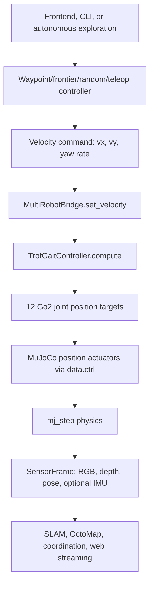
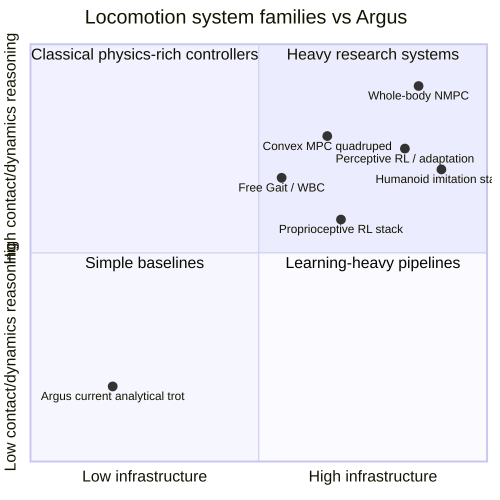

# Locomotion R&D Systems for Humanoids and Robot Dogs: Argus in Context

## Executive Summary

Argus currently implements a pragmatic simulation-first quadruped locomotion stack: high-level navigation produces planar velocity commands, a hand-authored Raibert-style trot gait converts `(vx, vy, yaw_rate)` into 12 Go2 joint-position targets, and MuJoCo position actuators track those targets. The code evidence is direct: `TrotGaitController` declares a velocity-commanded trot and diagonal leg pairing in `src/locomotion/gait_controller.py:1-11,19-41`; `MultiRobotBridge` writes gait outputs into `data.ctrl` before `mujoco.mj_step` in `src/bridge/multi_bridge.py:215-223,447-463`; and `xml_patcher.py` converts Go2 torque motors into MuJoCo `<position>` actuators so `ctrl[i] = desired_joint_angle` in `src/locomotion/xml_patcher.py:1-8,23-62`.

That places Argus in the **analytical gait + position-servo baseline** family: useful, inspectable, and good for flat-ground simulation demos, but far below the contact-aware and robustness-oriented systems used in current locomotion research. Classical/model-based systems add physics explicitly through whole-body control, centroidal dynamics, MPC, contact planning, and trajectory optimization. Learning-based systems add robustness through reinforcement learning, imitation, domain randomization, adaptation, and sim-to-real pipelines. Toolchain-wise, Argus sits in a lightweight MuJoCo/MJCF lane, not yet in an Isaac Lab GPU-RL lane, a ROS 2 hardware lane, or a Pinocchio/Crocoddyl/OCS2 model-based-control lane.

The recommended path is staged: first formalize Argus as a benchmarkable locomotion environment and keep the analytical trot as a baseline; second add a locomotion-controller abstraction and metrics; third choose a branch: MuJoCo MJX / MuJoCo Playground or Isaac Lab for learning, Pinocchio/OCS2/Crocoddyl for model-based control, or ROS 2/ros2_control for deployment architecture. Jumping directly to humanoid whole-body imitation or full nonlinear MPC would be possible but premature without state/contact instrumentation, action-space design, and repeatable evaluation.

## 1. Argus's Current Locomotion Method

### 1.1 Current control stack



**Figure 1 — Argus current locomotion/control flow.** Grounded in `src/control/waypoint_runner.py:65-141`, `src/bridge/multi_bridge.py:215-285,447-463`, `src/locomotion/gait_controller.py:39-86`, and `src/locomotion/xml_patcher.py:23-62`.

Argus has two distinct layers:

1. **Navigation/control intent:** autonomous exploration or user commands become `linear = [vx, vy]` and `angular = yaw_rate`. The waypoint follower uses pure-pursuit-like lookahead and proportional heading control, returning `np.array([linear_speed * heading_factor, 0.0])` plus a clipped angular velocity in `src/control/waypoint_runner.py:65-141`.
2. **Low-level gait generation:** `TrotGaitController.compute(vx, vy, omega, dt)` clamps inputs, advances a gait phase, alternates diagonal leg pairs, and emits 12 joint-position targets in actuator order in `src/locomotion/gait_controller.py:39-86`.

The gait is intentionally simple. It uses diagonal trot pairs FL+RR and FR+RL (`src/locomotion/gait_controller.py:31-34`), swing/stance phases (`src/locomotion/gait_controller.py:103-154`), and default parameters including 3 Hz gait frequency, 0.15 swing height, 0.4 stride length, and 1.0 m/s max speed (`src/locomotion/gait_params.py:17-42`). The Go2 model's upstream motor actuators are patched into MuJoCo position actuators with PD gains (`src/locomotion/xml_patcher.py:14-62`).

### 1.2 Classification

Argus is **not** currently:

- whole-body control,
- MPC,
- trajectory optimization,
- reinforcement learning,
- imitation learning,
- torque control,
- ROS 2 / hardware deployment,
- contact-aware locomotion planning.

It is closest to a **Raibert-inspired analytical gait generator with position-servo tracking**. Raibert-style thinking is a classical foundation for dynamic legged locomotion, but Argus uses it as a simplified kinematic gait heuristic rather than a full balance controller.

## 2. Classical and Model-Based Locomotion Families

Classical/model-based locomotion systems encode physics, contacts, and constraints explicitly. They are typically more interpretable than learned policies, but they demand better models, state estimation, contact estimation, and solver infrastructure.

| Family | Core idea | Strength | Cost / weakness | Argus distance |
|---|---|---|---|---|
| Analytical gait + IK | Phase machine or gait scheduler produces foot/joint targets. | Simple, deterministic, inspectable. | Weak contact-force and disturbance reasoning. | Current Argus family. |
| CPGs | Coupled oscillators generate rhythmic gait phases. | Smooth gait transitions, compact timing model. | Timing primitive, not a full balance/contact controller. | Nearby possible upgrade. |
| ZMP/LIPM/capture point | Reduced-order biped balance models. | Mature humanoid walking/recovery baseline. | Needs whole-body realization; limited on rough/multi-contact motion. | More relevant to humanoid future. |
| WBC / inverse dynamics | QP or hierarchical inverse dynamics satisfies body, foot, contact, torque constraints. | Coordinates all joints and contacts. | Needs dynamics model, contact state, torque/impedance interface. | Large gap due to position-servo stack. |
| Convex/centroidal MPC | Receding-horizon contact-force/body dynamics optimization. | Strong quadruped upgrade path. | Solver/model/contact schedule complexity. | Plausible medium-term branch. |
| Whole-body nonlinear MPC | Optimizes richer robot/contact dynamics. | High expressiveness. | High compute/tuning burden. | Premature without infrastructure. |
| Trajectory optimization | Plans feasible states, contacts, timings, forces. | Useful for references and offline planning. | Can be slow/numerically fragile. | Later research branch. |

Canonical humanoid examples include ZMP preview control by Kajita et al. for biped walking pattern generation ([DOI](https://doi.org/10.1109/ROBOT.2003.1241826)), capture point reasoning for push recovery by Pratt et al. ([DOI](https://doi.org/10.1109/ICHR.2006.321385)), momentum/hierarchical inverse dynamics for torque-controlled humanoids by Herzog et al. ([DOI](https://doi.org/10.1007/s10514-015-9476-6)), and the Atlas optimization-based locomotion stack by Kuindersma et al. ([DOI](https://doi.org/10.1007/s10514-015-9479-3)). These are important because they treat locomotion as a planning-estimation-control stack, not just joint target generation.

Representative quadruped/robot-dog examples include Free Gait's whole-body abstraction layer for legged robots ([paper DOI](https://doi.org/10.1109/HUMANOIDS.2016.7803401), [code/docs](https://github.com/leggedrobotics/free_gait)), MIT Cheetah 3 convex MPC for dynamic quadruped locomotion ([DOI](https://doi.org/10.1109/IROS.2018.8594448)), Mini Cheetah MPC plus whole-body impulse control ([arXiv](https://arxiv.org/abs/1909.06586)), and ANYmal perceptive nonlinear MPC over challenging terrain ([arXiv](https://arxiv.org/abs/2208.08373)). OCS2 is a representative optimal-control/MPC toolbox with legged-robot examples and ROS integration ([GitHub](https://github.com/leggedrobotics/ocs2)).

**Implication for Argus:** the first serious model-based upgrade should probably not be full nonlinear MPC. A more tractable ladder is: instrumentation → cleaner action abstraction → contact/foot metrics → centroidal or convex MPC stance-force planning → WBC/impedance realization → perceptive or nonlinear MPC.

## 3. Learning-Based Locomotion Families

Learning-based locomotion has matured quickly, especially for quadrupeds. The strongest systems are not “just PPO”; they are full R&D pipelines: simulator fidelity, actuator modeling, latency/noise modeling, domain randomization, terrain curricula, command curricula, reward design, policy architecture, evaluation, and deployment safety.

| Family | Pattern | What it buys | What it costs | Representative sources |
|---|---|---|---|---|
| Proprioceptive RL | Policy maps robot state/history + command to joint targets/torques. | Agile, robust behaviors without hand-coded footholds. | Reward/observation/randomization design burden. | Tan 2018, Hwangbo 2019, Lee 2020, Rudin 2021. |
| Reference/phase-conditioned RL | RL tracks or improves structured gait/reference motions. | Easier migration from analytical gait; better commandability. | Reference can limit behavior. | Xie 2018 Cassie, Siekmann 2020/2021 Cassie. |
| Teacher-student / distillation | Train privileged teachers or specialist policies, distill to deployable student. | Uses rich sim-only data while deploying realistic observations. | More training stages and failure modes. | RMA, HOVER/HumanPlus-style systems. |
| Online adaptation | Policy infers terrain/robot latent from recent history. | Handles friction, payload, wear, compliance shifts. | Adaptation can lag or fail under bad state estimates. | RMA, Rapid Locomotion, recent humanoid history policies. |
| Perceptive locomotion | Add exteroception/height/terrain features. | Anticipates obstacles/stairs/gaps. | Adds sensor, latency, calibration, distribution risk. | Miki 2022. |
| Humanoid imitation | Human motion/shadowing/retargeting plus RL/BC. | Natural whole-body skills. | Dataset and retargeting complexity. | HumanPlus 2024, HOVER, H1 imitation lines. |
| Residual/hybrid learning | Learn corrections around classical baseline. | Lower-risk migration from existing gait. | Can inherit baseline limitations. | Strong engineering fit for Argus, though less dominant in top-level exemplars. |

Verified quadruped examples include Tan et al.'s sim-to-real quadruped RL ([arXiv](https://arxiv.org/abs/1804.10332)), Hwangbo et al.'s ANYmal agile motor skills ([arXiv](https://arxiv.org/abs/1901.08652)), Lee et al.'s quadrupedal locomotion over challenging terrain ([arXiv](https://arxiv.org/abs/2010.11251)), Rudin et al.'s massively parallel legged RL ([arXiv](https://arxiv.org/abs/2109.11978)), RMA / Rapid Motor Adaptation on Unitree A1 ([arXiv](https://arxiv.org/abs/2107.04034)), and Miki et al.'s perceptive quadruped locomotion in the wild ([arXiv](https://arxiv.org/abs/2201.08117)).

Verified biped/humanoid examples include Cassie RL feedback control ([arXiv](https://arxiv.org/abs/1803.05580)), Cassie common bipedal gaits via periodic reward composition ([arXiv](https://arxiv.org/abs/2011.01387)), agile soccer skills for a small bipedal robot ([arXiv](https://arxiv.org/abs/2304.13653)), Humanoid-Gym zero-shot sim-to-real framework ([arXiv](https://arxiv.org/abs/2404.05695)), HumanPlus humanoid shadowing/imitation ([arXiv](https://arxiv.org/abs/2406.10454)), and learning humanoid locomotion over challenging terrain ([arXiv](https://arxiv.org/abs/2410.03654)).

**Implication for Argus:** keep the existing velocity-command interface. The lowest-risk learning upgrade is a command-conditioned residual or reference-conditioned policy that outputs joint-position offsets or gait-parameter corrections over the current trot. The higher-ceiling path is a direct proprioceptive RL policy that outputs PD targets, followed by online adaptation and eventually perception-conditioned locomotion.

## 4. R&D Systems and Toolchains

Control algorithms and R&D systems are separate decisions. A good locomotion project needs a simulator, model format, environment API, metrics, experiment tracking, training/control libraries, and eventually deployment middleware.

| Toolchain | Primary role | Fit for Argus | Main risk |
|---|---|---|---|
| Current MuJoCo Python loop | Lightweight simulation, perception integration, debugging. | Keep as baseline/evaluation harness. | Not high-throughput; position-servo abstraction hides contact control. |
| MuJoCo + Gymnasium + SB3/RLlib | Standard Env API and baseline RL. | Best first learning interface. | Python stepping may bottleneck. |
| MuJoCo MJX / MuJoCo Playground | MuJoCo-native GPU/batched robot learning. | Strong path if staying MJCF/MuJoCo-centered. | MJX feature/support caveats. |
| Isaac Lab + rsl_rl/skrl/rl_games | Large-scale GPU RL and sim-to-real workflows. | Best serious NVIDIA-centered RL path. | Heavy dependencies and asset conversion. |
| ROS 2 + ros2_control | Hardware-like control abstraction and deployment plumbing. | Required for real robot architecture. | Does not improve gait by itself. |
| Pinocchio + Crocoddyl/OCS2/CasADi/acados | Dynamics, trajectory optimization, MPC, WBC. | Needed for model-based research path. | High math/integration burden. |
| Gazebo | ROS-facing simulation/integration. | Later integration testing. | Not primary high-throughput training path. |
| RaiSim / Genesis | Alternative or emerging simulation ecosystems. | Watchlist unless reproducing specific work. | Ecosystem/maturity uncertainty for Argus. |

MuJoCo is well aligned with Argus today: its docs describe MJCF as the native model format, URDF support as available but more limited, and the runtime split between `mjModel`, `mjData`, and `mj_step` ([overview](https://mujoco.readthedocs.io/en/stable/overview.html), [modeling](https://mujoco.readthedocs.io/en/stable/modeling.html)). MuJoCo also documents position actuators with `kp`/`kv` attributes, matching Argus's actuator patching approach ([XML reference](https://mujoco.readthedocs.io/en/stable/XMLreference.html#actuator-position)).

For learning, Gymnasium provides the standard `reset`/`step` environment contract with `terminated` and `truncated` separation ([Gymnasium Env API](https://gymnasium.farama.org/api/env/)). MuJoCo MJX adds a JAX/XLA path for batched accelerator simulation but with feature/performance caveats ([MJX docs](https://mujoco.readthedocs.io/en/stable/mjx.html)). MuJoCo Playground is a DeepMind robot-learning suite using MuJoCo MJX/Warp with quadruped and biped locomotion tasks ([GitHub](https://github.com/google-deepmind/mujoco_playground)). Isaac Lab is the heavier GPU-RL route and supports multiple RL frameworks, while older `legged_gym` work has shifted toward Isaac Lab and now receives limited support ([Isaac Lab RL docs](https://isaac-sim.github.io/IsaacLab/main/source/overview/reinforcement-learning/index.html), [legged_gym](https://github.com/leggedrobotics/legged_gym)).

## 5. Where Argus Sits on the Map



**Figure 2 — Qualitative map of locomotion approaches.** Coordinates are lead-researcher synthesis, not measured data. They summarize implementation burden and degree of explicit/learned contact-dynamics handling from the surveyed classical, learning, and toolchain sources.

Argus is currently strong as a **robotics application simulator**: it combines MuJoCo, robot-dog visualization, SLAM, semantic mapping, exploration, perception, and a web frontend. Its locomotion layer, however, is intentionally baseline-level. That is not a criticism; it is a useful place to start. But it means that locomotion research claims should be modest unless the stack gains metrics, baselines, and stronger controllers.

The main gaps are:

- no locomotion-controller registry equivalent to the existing SLAM/perception registry pattern,
- no Gymnasium-style environment boundary,
- no standard action/observation spaces,
- no domain randomization or RL training harness,
- no contact/foot-slip/fall metric suite,
- no torque or impedance control interface,
- no dynamics library integration,
- no ROS 2/hardware abstraction.

## 6. Comparison Matrix: Argus vs Alternatives

| Method | What replaces/augments Argus trot? | Pros | Cons | Best Argus use |
|---|---|---|---|---|
| Tune current analytical gait | Same `TrotGaitController`, exposed params. | Very low complexity, immediate improvement loop. | Still brittle; limited novelty. | Baseline stabilization. |
| CPG/foot-trajectory controller | Phase/gait generator abstraction. | Smooth gait families, readable. | Still not contact-force control. | Cleaner analytical layer. |
| Free Gait-style action abstraction | Base/leg trajectory command layer. | Prepares WBC/MPC; improves modularity. | More architecture work. | Bridge from simple gait to serious controllers. |
| Convex/centroidal MPC | Stance-force planner under gait schedule. | Strong robot-dog research value. | Needs state/contact/dynamics and torque/impedance. | Best classical medium-term upgrade. |
| WBC/inverse dynamics | Lower-level QP/inverse dynamics controller. | Handles contacts/tasks/limits. | Position actuator patch is a mismatch. | Required for physics-rich stack. |
| Full nonlinear MPC | Rich whole-body receding-horizon optimizer. | High ceiling. | Heavy solver/tuning burden. | Later research branch. |
| Residual RL over trot | Learned offsets/corrections over existing gait. | Preserves baseline; lower-risk learning. | Bound by baseline; still needs training infra. | Best near-term learning upgrade. |
| Direct proprioceptive RL | Policy outputs PD targets. | High agility and robustness potential. | Requires Env API, rewards, randomization. | Main learning research path. |
| RMA/history adaptation | Policy infers latent dynamics from history. | Handles friction/payload/wear. | More complex training/evaluation. | Second learning milestone. |
| Perceptive RL/MPC | Controller uses terrain/height/vision. | Needed for stairs/gaps/rough terrain. | Sensor/data latency and distribution risk. | Later after proprioceptive locomotion works. |
| ROS 2/ros2_control | Hardware interface replaces direct MuJoCo writes. | Deployment realism. | No locomotion intelligence by itself. | Hardware-readiness branch. |

## 7. Recommended Argus Roadmap

### Stage 0 — Preserve and measure the baseline

Keep the current analytical trot as a regression baseline. Add metrics: command tracking error, fall rate, body roll/pitch, distance before failure, foot slip/contact timing proxies, action smoothness, joint-limit violations, and terrain success rate.

### Stage 1 — Add a locomotion environment boundary

Create a Gymnasium-style `ArgusGo2Env` around the MuJoCo bridge. Define observations, actions, reward components, termination/truncation, reset randomization, and `info` metrics. This enables SB3/RLlib experiments, custom evaluation, and later MJX/Isaac comparison.

### Stage 2 — Add controller plugin seams

Introduce a `LocomotionController` protocol:

```text
observation/state + command -> actuator target/action
```

Then implement adapters for:

- current analytical trot,
- tuned analytical/CPG gait,
- residual policy over trot,
- direct learned policy,
- future MPC/WBC controller.

This mirrors the registry/plugin style already used elsewhere in Argus and avoids hard-coding locomotion forever inside `MultiRobotBridge._velocity_to_ctrl()`.

### Stage 3A — Learning branch

Start with residual or reference-conditioned RL over the analytical trot. Then move to direct proprioceptive RL with domain randomization. Use MuJoCo MJX / MuJoCo Playground if staying close to MJCF matters; use Isaac Lab if large-scale GPU sim-to-real learning becomes the primary goal.

### Stage 3B — Model-based branch

Add state/contact instrumentation, then Pinocchio/OCS2/Crocoddyl or CasADi/acados depending on whether the target is WBC, trajectory optimization, or MPC. Start with centroidal/convex MPC before attempting full-body nonlinear MPC.

### Stage 3C — Deployment branch

If hardware matters, add URDF/xacro, ROS 2 nodes, ros2_control interfaces, watchdogs, timing discipline, fall detection, and emergency stop behavior. Treat this as a deployment architecture project, not as a locomotion-quality upgrade by itself.

## 8. Open Questions and Caveats

1. **Publisher-gated classical sources:** Several IEEE/Springer DOI links redirected correctly but publisher pages blocked direct content fetches. The final report uses those for canonical positioning, but detailed algorithmic claims should be checked in full PDFs before implementation.
2. **Residual-learning literature:** The broad pass found strong evidence for full RL, reference-conditioned RL, adaptation, and perceptive locomotion. A focused residual-RL-for-legged-locomotion pass would be useful if Argus chooses that path.
3. **No local benchmarking performed:** This report did not run Argus, measure MuJoCo speed, or train policies. Complexity rankings are architectural synthesis, not empirical runtime measurements.
4. **Humanoid and quadruped difficulty differ:** Humanoid results should inform Argus's long-term architecture, but robot-dog control is the nearer fit for the current Go2/MuJoCo stack.
5. **Position-servo abstraction matters:** Many WBC/MPC and torque-policy claims assume torque or impedance control. Argus currently patches to position actuators, so those methods are not drop-in replacements.

## 9. Bottom Line

Argus's current method is a clean, useful baseline: velocity command → analytical trot gait → joint-position targets → MuJoCo position actuators. In the broader locomotion R&D landscape, that is the starting corner, not the frontier. The most productive next move is not to pick “MPC vs RL” immediately; it is to create the missing research harness: metrics, Gymnasium-style environment boundary, controller plugin interface, reproducible terrain/randomization tests, and baseline comparisons.

Once that harness exists, the strongest near-term research path is **residual or reference-conditioned learning over the existing trot**. The strongest model-based path is **centroidal/convex MPC plus a more realistic actuator/control interface**. The strongest deployment path is **ROS 2/ros2_control**, but only after the controller abstraction is clear.
